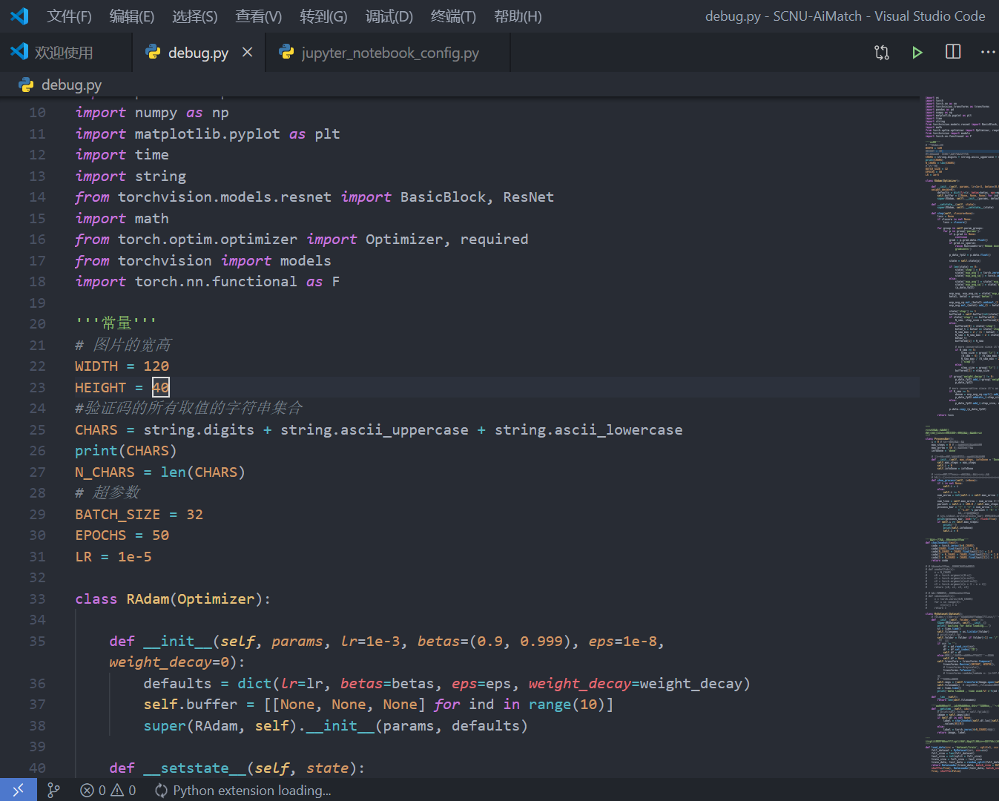

## 使用工具
- docsify
- mathjax
- Typora

## 内容组成
此次博客将会专注于内容本身,为了节约大家的时间,作者会划分模块, 分为教程专区，水文专区,传送门专区,经验专区, 思维导图专区,科普专区,文献笔记专区,安利专区,总结专区等几大模块,供各个看官自行选择查阅.

## 未来展望
现在暂时只更新文章,日后有时间再对前端UI进行魔改.

## markdown测试

### 通过相对路径加载子文件夹的图片

### 通过mathjax渲染latex公式

**行内公式:**

$\rho(X,Y) = 0$ $\Leftrightarrow Cov(X,Y) = 0$ $\Leftrightarrow E(X,Y) = E(X)E(Y)$ $\Leftrightarrow D(X + Y) = D(X) + D(Y)$ $\Leftrightarrow  D(X - Y) = D(X) + D(Y)$

**行间公式:**
$$
\frac{1}{\sigma^{2}}\sum_{i = 1}^{n}{{(X_{i} - \mu)}^{2}\sim\chi^{2}(n)}
$$

## 参考资料

[docsify手册](https://docsify.js.org/#/zh-cn/write-a-plugin)

[mathjax调用教程](https://www.cnblogs.com/bobofuns/p/6829920.html)