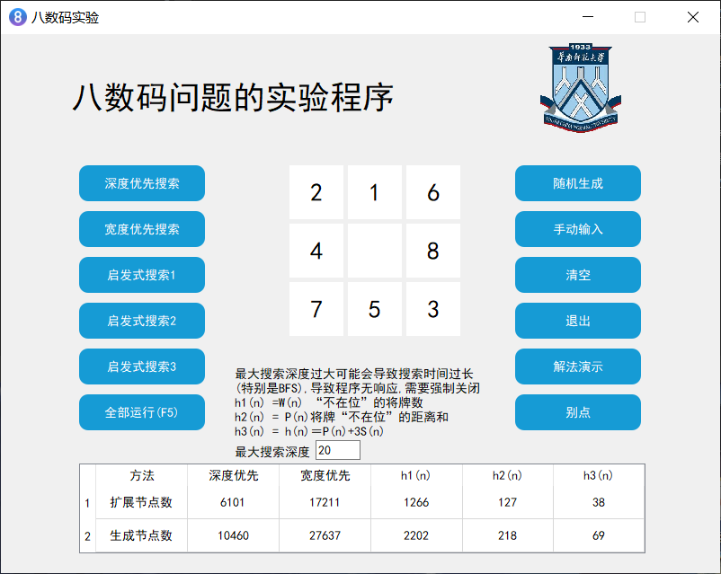
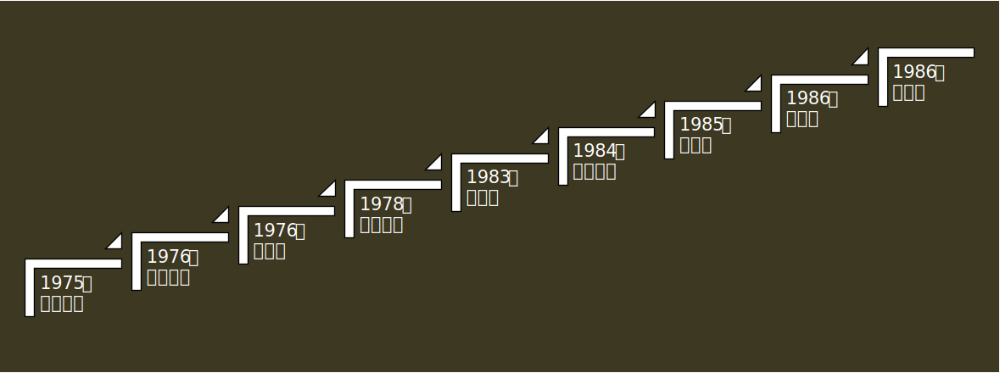
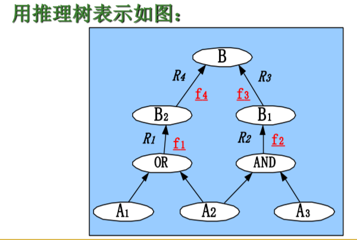
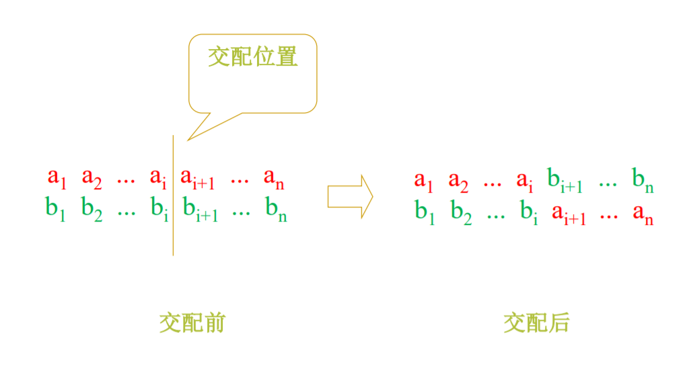
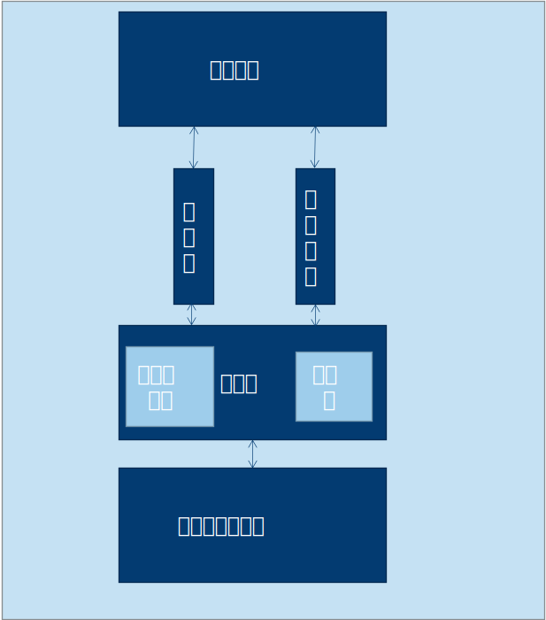

# 人工智能总结

## 八数码搜索问题

找出还原八数码位置的最佳方案

启发式搜索1：h1 (n) = W(n):不在位的将牌数

启发式搜索2：h2(n)=P(n):将牌不在位的距离和

启发式搜索3：h3(n)=h(n)=P(n)+3S(n)

其中S(n)是对结点n中将牌排列顺序的记分值，规定对非中心位置的将牌，顺某一方向检查，若某一将牌后面跟的后继者和目标状态相应将牌的顺序不一致是，该牌计分为2；一致时估分为0；对中心位置有将牌时估分为1.

影响算法A的启发能力的3个重要因素是：

1. 路径的耗散值
2. 求解路径时所扩展的结点数
3. 计算h所需的工作量

## 搜索策略

### 求解任意解路的搜索策略

- 回溯法backtracking
- 深度优先法depth-first
- 爬山法hill climbing
- 限定范围搜索法beam search
- 宽度优先法breadth-first
- 最佳优先法best-first

### 求最佳解路的搜索策略

- 大英博物馆法British Museum
- 动态规划法dynamic programming
- 分支限界法branch and bound
- 最佳图搜索法A*

### 求与或关系解图的搜索法

- 一般与或图搜索法AO*
- $\alpha $-$\beta$ 剪枝法alpha-beta pruning
- 极小极大法minimax
- 启发式剪枝法heuristic pruning

### 一般图搜索算法描述

1. 设置open表（初始只有初始结点s）和close表（初始为空）
2. 如果open表为空，则返会false，算法结束
3. 从open表按某种规则取出一个结点n，称为当前结点（每个节点包含父结点的指针）
4. 如果n是目标结点，得到n到s的路径，将路径反向即为解路，返回true，算法结束
5. 扩展结点n，将n的后继结点 $m_i$（不能是n的父节点）添加到图中
6. 标记 $m_i$到n的指针，如果未出现在open表和close表中，则将 $m_i$添加到open表中，转9
7. 如果 $m_i$是已出现在open表中的结点，则将指针修改到具有较小耗费的路径上，转9
8. 如果 $m_i$是出现在close表的结点，将指针修改到具有较小耗费的路径上，如果指针发生了变化则把 $m_i$添加到open表中，转9
9. 将结点n放入close表中，转3

按n的取法有以下情形：

1. 优先取最晚加入open表的结点：深度优先
2. 优先取最早加入open表的结点：宽度优先
3. 优先取评价函数 $f(n) = g(n)+h(n)$ 最低的结点：A算法

### 爬山法算法描述

1. 初始 n:=初始结点s
2. 如果n为目标结点，则返回true，算法结束
3. 扩展结点n，计算后继结点 $m_i$ 的启发函数 $h(m_i)$，找到启发函数最小的结点nextn
4. 如果 $h(n) \lt h(nextn)$，则返回false，算法结束
5. n:=nextn, 转2

### 分支限界法算法描述

1. 初始队列que只有路径s-s
2. 如果que为空，则返回false
3. 队首path出队，记path尾结点为n
4. 如果n为目标结点，返回true
5. 对n的后继结点 $m_i$, 路径s-$m_i$入队
6. 令耗费值最小的路径在队首，转2

### 动态规划法算法描述

1. 初始队列que只有路径s-s
2. 如果que为空，则返回false
3. 队首path出队，记path尾结点为n
4. 如果n为目标结点，返回true
5. 对n的后继结点 $m_i$, 路径s-$m_i$入队
6. 如果存在多条到达同一结点的路径，仅保留耗费值最小的路径，其余删除
7. 耗费值最小的路径放在队首，转2

## A算法

### 相关定义和定理

$g^*(n)$表示从初始结点s到结点n的最短路径的耗费值

$h^*(n)$表示从结点n到目标结点t的最短路径耗费

$f^*(n) = g^*(n)+h^*(n)$表示从初始结点s经过结点n到达目标结点t的最短路径的耗费,特别的，$f^*(s)$是从s到t的最短路径的耗费

g(n)，h(n)，f(n)表示对以上3个函数的估计值

如果 $h(n)\le h^*(n)$，则A算法为$A^*$算法

可采纳性：对任意一个图，如果解路存在，搜索算法总是在最佳解路上结束，则该算法是可采纳的

$A^*$算法具有可采纳性

定理：对有限图，如果解路存在，则A算法一定成功结束

引理：对无限图，如果解路存在，如果$A^*$算法一直不结束，则open表中的任意结点的f值将增加到无限大

引理2：$A^*$结束前，open表一定存在 $f(n)\le f^*(s)$（结点n是在最佳路径上的结点）

定理2：对无限图，如果解路存在，则 $A^*$算法一定成功结束

定理3：对无限图，如果解路存在，则 $A^*$算法一定在找到最佳解后结束

定理4：对 $A^*$算法 $A_1$和 $A_2$,如果 $A_2$比 $A_1$ 具有较多的启发信息（即对非目标结点均有 $h_2(n) \gt h_1(n)$），则在具有解路的隐含图中，$A_2$扩展的节点数不超过 $A_1$扩展的节点数

单调限制：对所有的结点 $n_i$及其子结点 $n_j$,都有 $h(n_i) \le h(n_j)+C(n_i, n_j)$

定理5：如果h(n)满足单调限制条件，则 $A^*$算法扩展了结点n后，就找到了到达结点n的最佳路径，即 $g(n) = g^*(n)$

定理6：如果满足单调限制，则有 $A^*$所扩展的节点序列，其f值是非递减的

### $A^*$ 算法的改进

方案1：令h满足单调限制

方案2：将当前扩展过的结点中的f值的最大值记为 $f_m$，如果在open表中存在比 $f_m$小的结点，则在比 $f_m$小的结点中选择**g值**最小的结点进行扩展，否则依旧选open表中f值最小的结点进行扩展

## 与或图搜索问题

###  $AO^*$算法描述

1. 初始搜索图G:=s,计算 $q(s) = h(s)$，如果s是终结点，标记s为能解结点
2. 重复以下操作直到s被标记为能解结点
3. 根据指针找出一个待扩展的局部解图G’
4. 选一个非终结点作为当前结点n
5. 扩展结点n，生成子节点集 $\{n_j\}$, 计算 $q(n_j)=h(n_j)$，其中 $n_j \notin G$
6. 将 $n_j$加到G中，如果 $n_j$是终结点，则标记 $n_j$为能解结点
7. 建立只含有n的结点集S
8. 对S中的结点m，如果子节点不在S中，则将m从S中移除
9. 对m指向子节点集的每一个连接符i分别计算 $q_i$，取计算值最小的耗散值作为q(m)
10. 添加或修改指针，令指针从m指向耗散值最小的连接符
11. 如果该连接符的所有子节点都是能解的，则m标记能解
12. 如果m能解或m的耗费值发生变化时，把m的所有祖先结点添加到S
13. 如果S不为空，重复8

### minmax算法描述

1. 初始博弈树T只有标记为MAX的初始结点s，open表只有s， close表为空
2. 如果open表不为空，从open表取出一个结点n放入close表；否则转7
3. 如果n可以直接判断输、赢或平局，则f(n)赋值为 $-\infin$, $\infin$或0，转2
4. 扩展n，将n的后继结点 $\{n_i \} $ 加到T中
5. 如果 $n_i $的深度没有达到k，则将 $n_i$ 加到open表中；否则计算各个端结点的f值
6. 转2
7. 重复下面操作知道close表为空
    1. 从close表中取出一个结点 $n_p$（但不从close表中移除），如果 $n_p$是max结点，且孩子结点 $n_c$的 $f(n_c)$存在，则 $f(n_p)=\max \{f(n_c)\}$，$n_p$从close表中移除，同理如果 $n_p$是min结点，则 $f(n_p)=\min \{f(n_c)\}$，$n_p$从close表中移除
8. 如果 $f(s)$有值,则标记走步或结束
9. 对于我方走步,对方进行相应,再次轮到我方时,以当前结点为s,重复上述过程,直到对局结束

### $\alpha$-$\beta$算法描述

进行有界深度搜索,达到指定深度时立即计算f值,如果父节点是max结点,则更新父节点的 $\alpha$,如果父节点是min结点,则更新父节点的 $\beta$值,如果存在祖先节点的 $\alpha$大于等于当前结点的 $\beta$,则可以停止当前结点的生长,这个过程成为 $\alpha - \beta$剪枝

最佳 $\alpha$-$\beta$剪枝技术生成的深度为D端节点数约等于不用 $\alpha$-$\beta$搜索技术生成的深度为D/2的端节点数

## 谓词逻辑与归结原理

概念：命题、命题公式、命题公式的解释，真值表，等值演算，基本等值式，联结词、置换规则，范式、范式存在定理、命题逻辑、推理规则，演绎推理、归谬法，命题逻辑的归结，归结原理，子句集，归结式，谓词逻辑的归结，个体词，谓词，个体常量，个体变量，个体域，谓词常量，谓词变量，n元谓词，一元谓词，任意量词，存在量词，一阶谓词逻辑，原子公式，谓词公式，指导变量，辖域，约束出现，自由出现，换名规则，替代规则，谓词公式的解释，谓词演算公式，前束范式，谓词推理，谓词知识表示，谓词逻辑规范表达式，skolem标准型，skolem定理，文字，子句，置换与合一，最一般合一

### 谓词逻辑归结过程

1. 写出谓词关系公式
2. 用反演法写出谓词表达式
3. 化为Skolem标准型
4. 求取子句集S
5. 对S中可归结的子句做归结
6. 归结式仍放入S,反复进行归结直到得到空子句
7. 命题得证

### 归结过程控制策略

1. 删除策略
2. 采用支撑集策略
3. 语义归结策略
4. 线性归结策略
5. 单元归结策略
6. 输入归结策略

## 知识表示

知识库观点：知识是人类对于客观世界的认识的表达，是以某种结构化的方式表示的概念、事件和过程

知识表示是研究用计算机表示知识的可行性、有效 性的一般方法。

知识表示方法：谓词逻辑、产生式规则、语义网络、框架, 脚本表示

语义网络知识求解系统不完善,由语义网络构成的知识库和用于问题求解的推理机构组成.推理过程主要有继承和匹配两种.

语义网络的优点是可以通过与某一节点的连接的弧找出相关信息,不必搜索整个知识库,可以有效避免搜索的组合爆炸问题

框架表示:一个框架是由槽构成的,槽可以有槽值或若干个侧面,侧面可以有多个侧面值.槽值和侧面值也可以是其他框架. 其实就是用层层嵌套的层次结构表示知识,缺乏形式理论,没有明确的推理机制保证问题求解的可行性

脚本表示:由开场条件,角色,道具,场景,尾声等几部分组成,结构呆板,知识表达范围窄,但是对于事先构思好的特定知识非常有效

## 产生式系统

产生式系统的组成:数据库,规则库,推理机

推理方式:正向推理(数据驱动),反向推理(目标驱动),双向推理

语义网络由结点和结点间的语义关系构成

基本的语义关系有:

1. is-a和part-of关系
2. 属性关系
3. 时间关系
4. 位置关系
5. 相近关系

## 不确定性推理方法

不确定性推理的3个问题

- 不确定性知识的表示问题
- 不确定性信息的计算问题
- 不确定性表示和计算的语义解释问题

### 不确定性的传播与更新

规则 A → B, 可信度表示为CF(B, A)
$$
CF(B,A)=\begin{cases}\frac{P(B|A)-P(B)}{1-P(B)},& \textrm{if }P(B|A) \ge P(B)\\
\frac{P(B|A)-P(B)}{P(B)},& \textrm{if}P(B|A) \lt P(B)\end{cases}
$$
结论：$-1\le CF(B,A) \le 1$

 CF(B, A) = 1, 前提真, 结论必真 

 CF(B, A) = -1, 前提真, 结论必假 

 CF(B, A) = 0 , 前提真假与结论无关

实际应用中CF(B, A)的值由专家确定, 并不是 由P(B|A), P(B)计算得到的。

与:$CF(A1 \wedge  A2 ) = \min \{ CF(A1 ), CF(A2 )\}$

或:$CF(A1 \vee A2 ) = \max \{ CF(A1), CF(A2)\}$

非:$CF(\sim A ) = -CF(A )$

假言推理: $CF(B) = \max \{0, CF(A)) \times CF(B,A\}$

合成:
$$
CF(B)=
\begin{cases}
CF_1(B)CF_2(B)-CF_1(B)CF_2(B),&CF_1(B)\ge 0, CF_2(B) \ge 0\\
CF_1(B)CF_2(B)+CF_1(B)CF_2(B),&CF_1(B)\lt 0, CF_2(B) \lt 0\\
\dfrac{CF_1(B) + CF_2(B)}{1 - \min\{|CF_1(B)|, |CF_2(B)|\}}, & CF_1(B)\texttt{与}CF_2(B)\texttt{符号不同}
\end{cases}
$$
更新:
$$
CF(B|A) = 
\begin{cases}
CF(B)+CF(A)\times CF(B,A)(1-CF(B)), & CF(B)\ge 0, CF(B,A) \ge 0 \\
CF(B)+CF(A)\times CF(B,A)(1+CF(B)), & CF(B)\lt 0, CF(B,A) \lt 0 \\
\dfrac{CF(B) + CF(A) \times CF(B|A)}{1 - \min\{|CF(B)|, |CF(A) \times CF(B|A)|\}}, & CF_1(B)\texttt{与}CF_2(B)\texttt{符号不同}
\end{cases}
$$

## 机器学习

概念：研究获得对于输入的数据进行分类的能力和获得解决问题、行为计划和行为控制的能力

意义：使未来的计算机将有自动获取知识的能力, 它们直接由书本学习, 通过与人谈话学习, 通过观察学习。

分类：

- 机械式学习
- 示教学习
- 演绎学习
- 归纳学习
- 类比学习
- 基于解释的学习
- 连接学习

### 决策树

一种描述概念空间的有效的归纳推理办法。

斜超平面分割的多变决策树(Multi-Variance Decision Tree, MDT)算法,

将遗传算法、神经元网络和C4.5相结合的GA-NN-C4.5 算法

SVM决策树算法

判定树通过深度优先搜索转变成产生式规则

构造决策树要解决的四个问题：

1. 收集待分类的数据
2. 设计分类原则
3. 分类原则的选择
4. 设计分类停止条件

shannon信息熵

自信息量 $l(a_i) = -\log p(a_i)$

信息熵 $H(X) = - \sum_{i=1}^r p(a_i)\log p(a_i)$

信息熵反映了每发出一个符号所提供的平均信息量

条件熵 $H(X|Y)=-\sum_{i=1}^{r}\sum_{j=1}^{s}p(a_ib_j)\log p(a_i|b_j)$

平均互信息量：信号Y所能提供的关于$X$的信息量的大小， 用$I(X,Y)$来表示， $I(X,Y) = H(X) - H(X|Y)$

信息增益：$Gain(S, A)= Entropy(S)- \frac{|S_v|}{|S|}\sum_{v\in values(A)}Entropy(S_v)$

## 遗传算法

| 生物进化中的概念 | 遗传算法中的作用                   |
| ---------------- | ---------------------------------- |
| 环境             | 适应函数                           |
| 适应性           | 适应值函数                         |
| 适者生存         | 适应函数值最大的解被保留的概率最大 |
| 个体             | 问题的一个解                       |
| 染色体           | 解的编码                           |
| 基因             | 编码的元素                         |
| 群体             | 被选定的一组解                     |
| 种群             | 根据适应函数选择的一组解           |
| 交配             | 以一定的方式由双亲产生后代的过程   |
| 变异             | 编码的某些分量发生变化的过程       |

### 选择

“轮盘赌”法 ： 设群体的规模为N，F(xi )(i=1, ..., N)是其中N个 染色体的适应值。则第i个染色体被选中的概率 由下式给出：
$$
p(x_i) = \frac{F(x_i)}{\sum_{j=1}^N F(x_j)}
$$
模拟“轮盘赌”算法：

(1)r=random(0, 1)，s=0，i=0；

(2)如果s≥r，则转(4)；

(3)s=s+p(xi )，i=i+1, 转(2)

(4)xi即为被选中的染色体，输出i 

(5)结束。

“确定性”法：对于规模为N的群体，一个选择概率为p(xi )的染 色体xi被选择次数的期望值e(xi )：
$$
e(x_i) = p(x_i)N
$$
对于群体中的每一个$x_i$，首先选择$\lfloor e(xi ) \rfloor$次。这 样共得到$\sum \lfloor e(x_i ) \rfloor$ 个染色体。然后按照$e(x_i )- \lfloor e(x_i )\rfloor$ 从大到小对染色体排序，依次取出$N- \lfloor e(x_i) \rfloor $ 个染色体，这样就得到了$N$个染色体

交配

变异

变异发生在染色体的某一个基因上，当以二进 制编码时，变异的基因由0变成1，或者由1变 成0。

遗传算法

(1)给定群体规模$N$，交配概率$p_c$和变异概率$p_m$， $t＝0$； 

(2)随机生成$N$个染色体作为初始群体； 

(3)对于群体中的每一个染色体$x_i$分别计算其适应值$F(x_i)$ ； 

(4)如果算法满足停止准则，则转(10)； 

(5)对群体中的每一个染色体$x_i$计算概率； 

(6)依据计算得到的概率值，从群体中随机的选取 $N$个染色体，得到种群

(7)依据交配概率$p_c$从种群中选择染色体进行交配， 其子代进入新的群体，种群中未进行交配的染色体，直接复制到新群体中； 

(8)依据变异概率$p_m $ 从新群体中选择染色体进行变异，用变异后的染色体代替新群体中的原染色体； 

(9)用新群体代替旧群体，$t=t+1$，转(3)； 

(10)进化过程中适应值最大的染色体，经解码后作为最优解输出； 

(11)结束。

收敛性定理：如果在代的进化过程中，遗传算法每次保留到目前为止的最好解，并且算法以交配和变异为其随机化操作，则对于一个全局最优化问题，当进化代数趋于无穷时，遗传算法找到最优解的概率为1。

### 遗传算法的评价

当前最好法：记录得到的最好解，通过最好解的变化，了解算法的变化趋势

在线最好法：用当前代中染色体的平均指标函数值来刻画算法的变化趋势

离线最好法：用进化过程中每代最好解的指标函数值的平均值，来评价算法的进化过程

### 适应函数

非线性加速适应函数
$$
f'(x)=
\begin{cases}
\frac{1}{f_{max} - f(x)}, \textrm{if } f(x) < f_{max}\\
M, \textrm{others}
\end{cases}
$$
线性加速适应函数
$$
f'(x) = \alpha f(x)+\beta\\
\begin{cases}
\alpha \frac{\sum_{i=1}^m f(x_i)}{m} + \beta = \frac{\sum_{i=1}^m f(x_i)}{m}\\
\alpha \max_{1 \le i \le m}\{f(x_i)\} + \beta = M \frac{\sum_{i=1}^m f(x_i)}{m}
\end{cases}
$$
上式中的第一个方程表示变换前后的平均值不变，第 二个方程表示将当前的最优值放大为平均值的M倍。

### 交配规则

二进制编码的交配规则

双亲双子法

变化交配法

多交配位法

整数编码的交配规则

常规交配法：随机选取一个交配位，子代1交配位之前的基因选自 父代1交配位之间的基因，交配位之后的基因，从父 代2中按顺序选取那些没有出现过的基因。

 基于次序的交配法

基于位置的交配法

基于部分映射的交配法

### 变异规则

二进制变异：当问题以二进制编码形式表示时，随机的 产生一个变异位，被选中的基因由“0”变 为“1”，或者由“1”变为“0”。

整数编码变异

基于位置的变异：随机的产生两个变异位，然后将第二个变 异位上的基因移动到第一变异位之前。

基于次序的变异：随机的产生两个变异位，然后交换这两个 变异位上的基因。

打乱变异：随机选取染色体上的一段，然后打乱在该 段内的基因次序。

## 专家系统

概念：像人类专家 一样解决困难、复杂的实际问题的计算机系统

靠知识和推理解决问题

强调知识和推理的分离

具有解释功能（可以对输出或过程做出解释）

具有“学习”能力

要素：

- 应用某个领域
- 拥有专家知识
- 能模拟专家的思维和推理
- 能达到专家级水平

利用产生式规则构建一个简单的专家系统，[参考实验文档](https://wenku.baidu.com/view/2ae86848e45c3b3567ec8b8f.html)

解释专家系统：是通过对已知信息和数据的分析与解释，确定它们的涵义

预测专家系统：通过对过去和现在已知状况的 分析，推断未来可能发生的情况。

诊断专家系统：根据观察到的情况(数据)来推断出某个对象 机能失常(即故障)的原因。

设计专家系统：根据设计要求，求出满足设计问题约束的目标配置

规划专家系统：寻找出某个能够达到给定目标的动作序列或步骤

监视专家系统：对系统、对象或过程的行为 进行不断观察，并把观察到的行为与其应当具有的行 为进行比较，以发现异常情况，发出警报

控制专家系统：自适应地管理一个受控对象或客体的全面行为，使之满足预期要求。

调试专家系统：对失灵的对象给出处理意见和方法

教学专家系统：根据学生的特点、弱点 和基础知识，以最适当的教案和教学方法对学生进行教学和辅导

修理专家系统：是对发生故障的对象(系 统或设备)进行处理，使其恢复正常工作

决策专家系统：根据数据给出建议

咨询专家系统：对提出的问题作出解答
