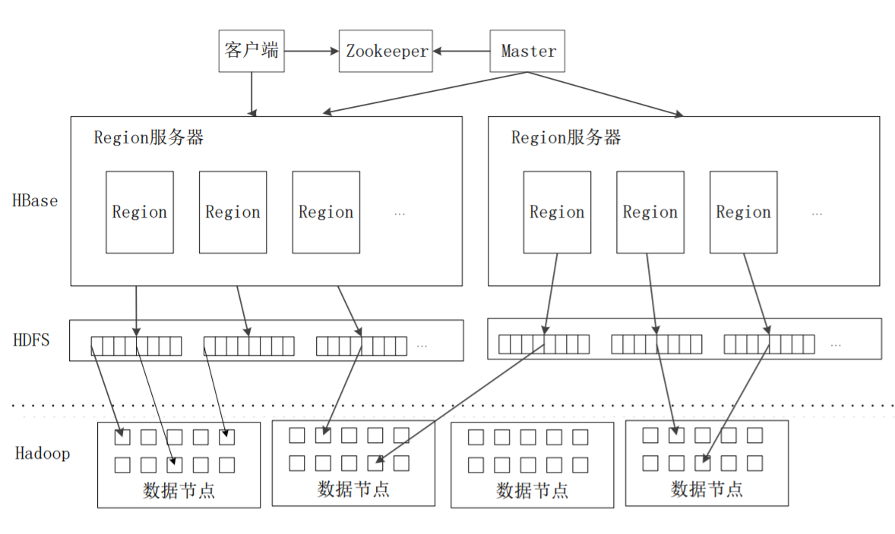
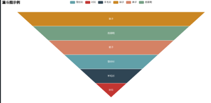

# 大数据软件工程总结

文中图片基本来自网络或教材ppt

## 概论

### （1）了解大数据技术产生的历史必然；

- 数据产生方式的变革促成大数据时代的来临（运营式系统阶段->用户原创阶段->感知式系统阶段）
- 云计算是大数据产生的前提和必要条件

### （2）理解大数据的特征；

大数据指在一定时间范围内无法用常规工具捕捉和处理的数据集合

具有4V特性：Velocity（实时处理），Variety（多数据类型交叉分析），Volume（PB级数据处理），Value（海量数据挖掘）

### （3）理解大数据生命周期；

采集->存储->分析->解释->应用


### （4）理解大数据、云计算、物联网之间的相互关系；

- 大数据为物联网提供数据分析支撑，物联网是大数据重要的数据来源
- 物联网为云计算提供应用空间，云计算为物联网提供海量存储能力
- 云计算是大数据的技术基础，大数据体现了云计算的应用价值


### （5）了解大数据的变革

有8个重要变革

1. 决策方式：目标驱动->数据驱动
2. 方法论：基于知识->基于数据
3. 计算方式：复杂->简单
4. 管理方式：业务数据化->数据业务化
5. 研究范式：第三范式->第四范式
6. 数据的属性：数据是资源->数据是资产
7. 数据处理模式：小众参与->大众协同
8. 思维方式：整体思维+相关思维+容错思维

## 大数据生态系统

### （1）掌握HDFS分布式文件系统的结构；


1. HDFS=1个NameNode+1个Secondary NameNode+多个DataNode；
2. NameNode称为名称节点、命名空间、主节点、元数据节点，主要存放元数据 （meta）；账本。
3.  Secondary NameNode称为从元数据节点，是命名空间的冷备份（Namenode秘 书），高可用（HA）解决方案，HDFS2.0采用另外一种机制。
4.  DataNode称为数据节点，是存放数据的物理空间，以块（block）为基本单位； 
5.  NameNode和DataNode是主从结构； 
6. 块是HDFS操作最小单位，一般为128M；
7. 元数据(meta)=文件目录结构信息(catalogue)+操作日志信息(log)，数据的描述信息
8.  NameNode只存放catalogue，和Secondary NameNode之间只相差3秒的catalogue；
9.  DataNode按机架（rack）进行组织，如上图有两个机架；
10. 客户端只能同NameNode交互；

### （2）掌握HDFS存储原理；

读数据过程如下：

1. 访问NameNode
2. 返回MetaData
3. 访问DataNode
4. 读数据

写数据策略 

- 第一个副本放置在上传文件的数据节点；如果是集群外提交，则随机挑选一 台磁盘不太满、CPU不太忙的节点。

- 第二个副本放置在与第一个副本不同的机架的节点上。
-  第三个副本与第一个副本相同机架的其他节点上。 
- 更多副本随机节点

### （3）掌握HDFS读写操作；

读操作

1. 打开文件
2. 获取数据块信息
3. 发出读取请求
4. 读取数据
5. 获取数据块信息（可能发生）
6. 读取数据（可能发生）
7. 关闭 文件

实验代码如下：

```java
import java.io.BufferedReader;
import java.io.InputStreamReader;
import org.apache.hadoop.conf.Configuration;
import org.apache.hadoop.fs.FileSystem;
import org.apache.hadoop.fs.Path;
import org.apache.hadoop.fs.FSDataInputStream;
public class Chapter3 {
 public static void main(String[] args) {
 try {
 Configuration conf = new Configuration();
 conf.set("fs.defaultFS","hdfs://localhost:9000");
conf.set("fs.hdfs.impl","org.apache.hadoop.hdfs.DistributedFileSystem");
 FileSystem fs = FileSystem.get(conf);
 Path file = new Path("test");
 FSDataInputStream getIt = fs.open(file);
 BufferedReader d = new BufferedReader(new InputStreamReader(getIt));
 String content = d.readLine(); //读取文件一行
 System.out.println(content);
 d.close(); //关闭文件
 fs.close(); //关闭hdfs
 } catch (Exception e) { e.printStackTrace(); }
 }}}
```

写操作

1. 创建文件请求
2. 创建文件元数据
3. 写入数据
4. 写入数据包
5. 接受确认包
6. 关闭文件
7. 写操作完成

实验代码如下：

```java
import org.apache.hadoop.conf.Configuration;
import org.apache.hadoop.fs.FileSystem;
import org.apache.hadoop.fs.FSDataOutputStream;
import org.apache.hadoop.fs.Path;
public class Chapter3 {
 public static void main(String[] args) {
 try {
 Configuration conf = new Configuration();
conf.set("fs.defaultFS","hdfs://localhost:9000");
conf.set("fs.hdfs.impl","org.apache.hadoop.hdfs.DistributedFileSystem");
 FileSystem fs = FileSystem.get(conf);
 byte[] buff = "Hello world".getBytes(); // 要写入的内容
 String filename = "test"; //要写入的文件名
 FSDataOutputStream os = fs.create(new Path(filename));
 os.write(buff,0,buff.length);
 System.out.println("Create:"+ filename);
 os.close();
 fs.close();
 } catch (Exception e) { e.printStackTrace(); } 
```


### （4）掌握MapReduce编程框架


1. **Client**：用户编写的MapReduce程序通过Client提交到JobTracker
2. **JobTracker**:
    -  负责资源监控和作业调度；
    - 监控TaskTracker与Job的健康情况，如果发现失败，则将任务转移到其他节点
    - 跟踪资源使用量、执行进度信息，报告给TaskScheduler

3. **TaskTracker**：
    - 周期地通过“心跳”将使用情况和执行进度报告给Job Tracker
    - 接受Job Tracker发出的命令并执行操作
    - 将cpu，内存等资源划分成“slot”，分为 map slot和reduce slot两种。一个task获得了slot才能运行

4. **Task**:分为Map Task和Reduce Task，由Task Tracker启动
5. **Task Scheduler**：将各个Task Tracker的空闲slot分配给task使用

### （5）理解Map原理；

1. 将小批数据集进一步解析成一批`<key, value>`对，输入map函数进行处理

2. 每一个 `<key, value>`会输出一批 `<k2,v2>`，这是计算的中间结果，用作reduce函数的输入，reduce函数输出最终结果

### （6）理解MapReduce原理；

所有的数据交换都是通过MapReduce框架自身取完成


1. 从分布式文件系统加载文件

    1. 根据自定义的规则将数据划分成多个split（逻辑的划分），理想的分片大小是一个hdfs块

2. 每个split创建一个map任务，将数据处理成一批键值对

3. 进行shuffle

    map的shuffle

    1. Map任务的输出写入缓存
    2. 进行溢写（分区、排序、合并）
    3. 文件归并

    （合并（Combine）和归并（Merge）的区别： 两个键值对<“a”,1>和<“a”,1>，如果合并，会得到<“a”,2>，如果归并，会得到<“a”,<1,1>>）

    reduce的shuffle

    1. 向JobTracker询问map任务是否完成，若完成，则领取数据
    2. 数据放入缓存，来自不同map任务的，先归并，再合并，写入磁盘（如果数据很少，则不写入磁盘，直接在缓存中归并，输出给reduce，跳过3
    3. 多个溢写文件归并成一个或多个大文件，文件的键值是排序的

4. 中间结果输入到reduce函数，处理得到最终结果，最终结果写入到分布式文件系统（如HDFS）。reduce任务的个数一般设成比reduce任务槽（slot）数目稍小

### demo：wordcount程序

mapper

```java
public class WordCountMapper extends Mapper<LongWritable,Text,Text,IntWritable> {
 //对数据进行打散
 @Override
 protected void map(LongWritable key, Text value, Context context) throws
IOException, InterruptedException {
 //1.接入数据 hello reba hello mimi
 String line = value.toString();
 //2.对数据进行切分
 String[] words = line.split(" ");
 //3.写出以<hello,1>
 for(String w:words){
 //写出reducer端
 context.write(new Text(w),new IntWritable(1));
 }
 }
}
```

reducer

```java
public class WordCountReducer extends
Reducer<Text,IntWritable,Text,IntWritable> {
 //key->单词 values->次数 1 1 1 1 1
 @Override
 protected void reduce(Text key, Iterable<IntWritable> values, Context
context) throws IOException, InterruptedException {
 //1.记录出现的次数
 int sum = 0;
 for(IntWritable v:values){
 sum += v.get();
 }
 //2.累加求和输出
 context.write(key,new IntWritable(sum));
 }
}

```

main

```java
public class WordCountDriver {
 public static void main(String[] args) throws IOException, ClassNotFoundException, InterruptedException
{
 Configuration conf = new Configuration();
 Job job = Job.getInstance(conf); //1.创建job任务
 job.setJarByClass(WordCountDriver.class); //2.指定jar包位置
 job.setMapperClass(WordCountMapper.class); //3.关联使用的Mapper类
 job.setReducerClass(WordCountReducer.class); //4.关联使用的Reducer类
 job.setMapOutputKeyClass(Text.class); //5.设置mapper阶段输出的数据类型
 job.setMapOutputValueClass(IntWritable.class);
 job.setOutputKeyClass(Text.class); //6.设置reducer阶段输出的数据类型
 job.setOutputValueClass(IntWritable.class);
 FileInputFormat.setInputPaths(job,new Path(args[0])); //7.设置数据输入的路径
 FileOutputFormat.setOutputPath(job,new Path(args[1])); //8.设置数据输出的路径
 boolean rs = job.waitForCompletion(true); //9.提交任务
 System.exit(rs?0:1);
 }
}
```


### （7）了解zookeeper架构和工作原理


Zookeeper的核心是原子广播，这个机制保证了各个server之间的同步。 

 实现这个机制的协议叫做Zab协议。 

Zab协议有两种模式，它们分别是恢复模式和广播模式。

当服务启动或者在领导者崩溃后，Zab就进入了恢复模式，当领导者被选举出来，且大多数server的完成 了和leader的状态同步以后，恢复模式就结束了。 

状态同步保证了leader和server具有相同的系统状态。

## 大数据采集与预处理

### （1）理解数据及其分类；

数据是对研究现象的属性和特征的具体描述

分类：

1. 按结构化程度分：结构化，半结构化，非结构化
2. 按数据加工程度分：裸数据，专家数据，信息，价值
3. 价值角度分：流动数据，静态数据

### （2）了解数据采集方法和工具；

采集方法

1. 数据抓取
2. 数据导入
3. 物联网传感设备自动信息采集

日志系统采集工具：chukwa、flume、scribe、kafka

### （3）掌握数据清洗的任务和作用；

任务是发现并纠正数据文件中可识别的错误，包括对数据一致性的检查，无效值和缺失值得处理。 

数据清洗的作用是将脏数据转化为满足数据质量要求的数据

### （4）掌握数据变换的种类和过程；

数据变换：将多维数据压缩成较少维的数据，消除时间、空间、属性及精度等特征表现的差异

**中心化变换**

 $x_{ij}^* = x_{ij} - \bar x_j, i=1,2,\cdots, n, j=1,2,\cdots, m$

$S^* = S = (s_{ij})_{m\times m}$

其中 $s_{ij} = \frac{1}{n-1}\sum_{t=1}^n (x^*_{ti}x^*_{tj})$

**作用**：变换之后均值为0，协方差阵不变，可以用来方便地计算样本协方差阵。

**标准化变换**

$x_{ij}^* = \frac{x_{ij} - \bar x_j}{s_{j}}, i=1,2,\cdots, n, j = 1,2,\cdots, m$

**作用**：变换之后每个变量均值为0，标准差为1，变换后的数据与变量的量纲无关。

**极差标准化变换**

$x_{ij}^* = \frac{x_{ij} - \bar x_j}{R_{j}}, i=1,2,\cdots, n, j = 1,2,\cdots, m$

其中 $R_j= \max_{1\le t \le n}x_{tj} - \min_{1\le t \le n}x_{tj} $

**作用**：变换后每个变量样本均值为0，极差为1，变换后数据绝对值数据在(-1,1) 中，能减少分析计算中的误差，无量纲。

**极差正规化变换**

$x_{ij}^* = \frac{x_{ij} - \min_{1 \le t \le n} x_{tj} }{R_j}, i=1,2,\cdots, n, j = 1,2,\cdots, m$

其中$R_j= \max_{1\le t \le n}x_{tj} - \min_{1\le t \le n}x_{tj} $

**作用**：变换后数据在[0,1]之间；极差为1，无量纲

**对数变换**

$x^*_{ij} = \ln x_{ij}, x_{ij} \gt 0,  i=1,2,\cdots, n, j = 1,2,\cdots, m$

**作用**：将具有指数特征的数据结构变换为现行数据结构


## 大数据库

### （1）理解NoSQL与NewSQL；

NoSQL = Not-Only-SQL

1. **不需要预定义模式**：数据中的每条记录都可能有不同的属性和格式。
2. **无共享架构**：相对于将所有数据存储到服务中，达到数据共享。存在 的问题是访问数据需要带宽。NoSQL将数据划分后存储在各个本地服务器 上。
3. **弹性可扩展**：可以在系统运行的时候，动态增加或者删除节点。不需 要停机维护，数据可以自动迁移。
4. **分区**：NoSQL数据库需要将数据进行分区，将记录分散在多个节点 上面。这样既提高了并行性能，又能保证没有单点失效的问题。 
5. **异步复制**：和RAID存储系统不同的是，NoSQL中的复制，往往是基于日志的异步复制。优点是不会因网络传输引起迟延。缺点是并不总是能保 证一致性，这样的方式在出现故障的时候，可能会丢失少量的数据。

NoSQL分类如下


> NewSQL是对各种新的可扩展/高性能数据库的简称，这类数据库不仅具有NoSQL对海量数据的存储管理能力，还保持了传统数据库支持ACID和SQL等特性。	

### （2）理解批量处理技术；

批处理技术包含以下特征：

有界：批处理数据集代表数据的有限集合
持久：数据通常始终存储在某种类型的持久存储位置中
大量：批处理操作通常是处理极为海量数据集的唯一方法

> 需要处理大量数据的任务通常最适合用批处理操作进行处理。无论直接从持久存储设备处理数据集，或首先将数据集载入内存，批处理系统在设计过程中就充分考虑了数据的量，可提供充足的处理资源。由于批处理在应对大量持久数据方面的表现极为出色，因此经常被用于对历史数据进行分析。
>
> 大量数据的处理需要付出大量时间，因此批处理不适合对处理时间要求较高的场合。

hadoop的MapReduce引擎提供了批处理技术

### （3）了解流计算原理；

流处理不对整个数据集处理，而是对系统传输的每个数据项执行操作

> 完整数据集只能代表截至目前已经进入到系统中的数据总量。 
>
> 工作数据集在特定时间只能代表某个单一数据项。 
>
> 处理工作是基于事件的，除非明确停止否则没有“尽头”。
>
> 处理结果立刻可用，并会随着新数据的抵达继续更新。

Apache Samza是一种流处理框架

### （4）了解图计算原理；

> Pregel作为分布式图计算的计算框架,主要用于图遍历、最短路径、PageRank计算等等。

图计算以有向图作为输入，包含顶点和边，顶点有String类型的ID，顶点和有向边都有一个用户定义的值与之关联

> Pregel的计算过程是由一系列被称为“超步”的迭代组成的。
>
> 在每个超步中，每个顶点上面都会并行执行用户自定义的函数，该函数描述了一个顶点V在一个超步S中需要执行的操作。
>
> 该函数可以读取前一个超步(S-1)中其他顶点发送给顶点V的消息，执行相应计算后，修改顶点V及其出射边的状态，然后沿着顶点V的出射边发送消息给其他顶点，而且，一个消息可能经过多条边的传递后被发送到任意已知ID的目标顶点上去。
>
> 这些消息将会在下一个超步(S+1)中被目标顶点接收，然后像上述过程一样开始下一个超步(S+1)的迭代过程。
>
> 在Pregel计算过程中，一个算法什么时候可以结束，是由所有顶点的状态决定的。
> ------------------------------------------------
> 版权声明：本文为CSDN博主「曹世宏的博客」的原创文章，遵循CC 4.0 BY-SA版权协议，转载请附上原文出处链接及本声明。
> 原文链接：https://blog.csdn.net/qq_38265137/article/details/80547763

### （5）了解查询分析计算原理；

hadoop的hive实现了查询分析计算。对数据仓库的数据，使用类似sql语句的方法进行查询分析

### （6）掌握HBASE模型


 HBase中需要根据行键、列族、列限定符和时间戳来确定一个单元格， 因此，可以视为一个“四维坐标”，即[行键, 列族, 列限定符, 时间戳]

特点

1. 数据类型：HBase 则把数据存储为未经解释的字符串
2. 数据操作：操作则只有简单的插入、查询、 删除、清空等
3. 存储模式：HBase 是基于列存储的，每个列族都由几个文件保存，不同列族的 文件是分离的；
4. 数据索引：HBase只有一个索引— —行键
5. 数据维护：HBase中执行更新操作时，并不会删除数据旧的版本，而是 生成一个新的版本，旧有的版本仍然保留。
6. 可伸缩性：HBase就是为了实现灵活的水平 扩展而开发的，能够轻易地在集群中实现性能的伸缩。

hbase系统架构



## 大数据分析

### （1）了解数据分析的原则、特点；

原则

1. 分析需要有明确的目标
2. 需要针对可能的原因追踪分析
3. 需要用测试数据验证模型的准确性

特点

1. 大数据分析是可视化分析
2. 理论核心是数据挖掘算法
3. 重要应用是预测性分析
4. 广泛用于网络数据挖掘
5. 重视数据质量和数据管理

### （2）掌握大数据分析流程； 

业务理解->数据认知->特征工程->数据建模->评估与解释

### （3）理解大数据分析技术、难点 ；


难点：

- 可扩展性 
- 可用性 
- 领域知识的结合 
- 结果的检验

### （4）理解数据认知的基本方法；

数据预处理

概率分析：$\mu$检验，t检验，F检验，卡方检验


对比分析：同比、环比、定基比

细分分析

交叉分析

相关分析

### （5）掌握特征工程的作用和基本方法；

作用：设计指标或提取关键特征来代表整个对象

基本方法：

1. PCA(主成分分析)
2. FA（因子分析）

指标设计技巧

1. 时间戳处理
2. 分解类别变量
3. 分箱/分区
4. 交叉特征

### （6）掌握数据建模的常用方法

- 决策树
- 关联分析
- 回归分析
- 聚类分析

### （7）了解通用计算引擎Spark

Spark使用Scala语言进行实现

(1)运行速度快 (2)易用性好 (3)通用性强 (4)支持多种数据源


Spark把中间数据放到内存中，迭代运算效率高。		

Spark 容错性高

Spark提供的数据集操作类型有很多种。大致分为 ： Transformations和Actions两大类

需要反复操作的次数越多，所需读取的数据量越大，受益越大，

不适合增量修改的应用模型

满足数据量不是特别大的实时统计分析需求

### （8）掌握hive的数据分析方法；

> Hive是建立在 Hadoop 上的数据仓库基础构架。它提供了一系列的工具， 可以用来进行数据提取转化加载（ETL），这是一种可以存储、查询和分析 存储在 Hadoop 中的大规模数据的机制。Hive 定义了简单的类 SQL 查询语 言，称为 HQL。
>
> 支持索引，加快数据查询。 
>
> 支持不同的存储类型，例如，纯文本文件、HBase中的文件。 将元数据保存在关系数据库中，大大减少了在查询过程中执行语义检查 的时间。 
>
> 可以直接使用存储在Hadoop文件系统中的数据。
>
>  内置大量用户函数UDF来操作时间、字符串和其他的数据挖掘工具，支 持用户扩展UDF 函数来完成内置函数无法实现的操作。
>
>  类SQL 的查询方式，将SQL 查询转换为MapReduce 的job在Hadoop集群 上执行。


## 大数据可视化技术

### （1）了解数据可视化概念和作用

**概念**：数据可视化主要是借助于图形化手段，清晰有效地传达信息

**作用**：

1. 帮助人类消化大量信息
2. 清晰展现数据背后的意义
3. 辅助决策
4. 给人强大的视觉冲击

### （2）理解可视化建议；


### （3）了解图表的作用；

**直方图**：表示定量变量在各个区间的分布规律


**饼图**：表示一个定性变量的各个取值的比例


**柱状图**：表示两个定性变量的各个取值的数量对比


**堆积柱状图**：表示一个定性变量A的各个取值的数量，同时表示定性变量B的取值在每个A的取值中的比例


**折线图**：表示一个定量变量在时间上的变化


**散点图**：表示两个定量变量的关系


**气泡图**：在散点图的基础上用气泡的大小表示第三个定量变量的取值，从而表示三个变量的关系


**风玫瑰图**：花瓣的大小表示定性变量A的数量，在一个花瓣上的每个分层表示定性变量B在A的某个取值的比例


**相关系数图**：表示多个定量变量的线性相关关系。


**箱形图**：表示定量变量的五个分位数（min,max, 25%,median, 75%),描述变量的分布，用于发现异常值


**雷达图**：表示若干个记录在多个属性上的对比


**词云图**：突出表示定性变量的高频取值


**漏斗图**：表示一个定性变量的数量从多到少的一个排列



### （4）熟练掌握基本统计的绘制方法；

可选工具有：Excel， SPSS, Tableau， R语言

绘制方法略（以后再专门写一篇用excel绘制统计图的文章）

### （5）理解ggplot2图层绘图的基本思想；

ggplot2作图过程中最重要的三个概念：映射、图层和几何对象

映射将数据集的属性关联到图形属性上

图层是图形绘制的区域，多个图层可以穿透叠加在同一个画布上

几何对象执行图形的实际渲染，控制生成的图标类型

## 大数据应用

### （1）理解医疗大数据分析过程；

1. 移动医疗
2. 基因测序

### （2）理解交通大数据分析过程；

1. 收集交通大数据
2. 定义拥堵程度
3. 绘制拥堵地图
4. 分析城市拥堵模式
5. 分析交通政策实施前后的变化
6. 分析天气、路面、阳光等对交通事故的影响
7. 预测航班起飞时间

1. 购物篮分析 
2. 物流分析

## 大数据安全

### （1）了解大数据安全的意义和面临的挑战；

1. 大数据成为网络攻击的显著目标
2. 大数据加大隐私泄露风险
3. 大数据对现有的存储和安防措施提出挑战
4. 大数据技术被应用到攻击手段
5. 大数据成为高级可持续攻击的载体

### （2）理解安全威胁的种类和特征；

1. 大数据基础设施安全威胁
2. 大数据存储安全威胁
3. 大数据的隐私泄露
4. 网络化社会使大数据极易成为攻击目标
5. 过度相信和沉迷于数据

### （3）了解大数据与网络攻击监测；

大数据时代下传统安全手段难以满足业务需要

传统安全应急响应，无法解决大数据时代下面临的察觉晚、数据已损失的问题

### （4）掌握大数据安全分析的基本方法；


基本方法

1. 检测威胁：实时检测来自内部与外部的攻击
2. 事件还原：通过诸多数据来源，还原安全事件真相
3. 事件追溯：解读攻击者 的真实身份、 背景、动机
4. 漏洞分析：出具漏洞修补方案，抵 御二次攻击

### （5）了解大数据安全标准。


## 参考文献

[大数据的流处理和批处理及其框架](https://blog.csdn.net/weixin_43093501/article/details/95225833)