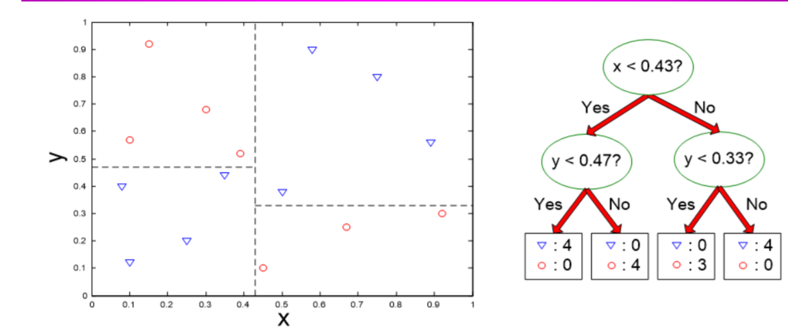
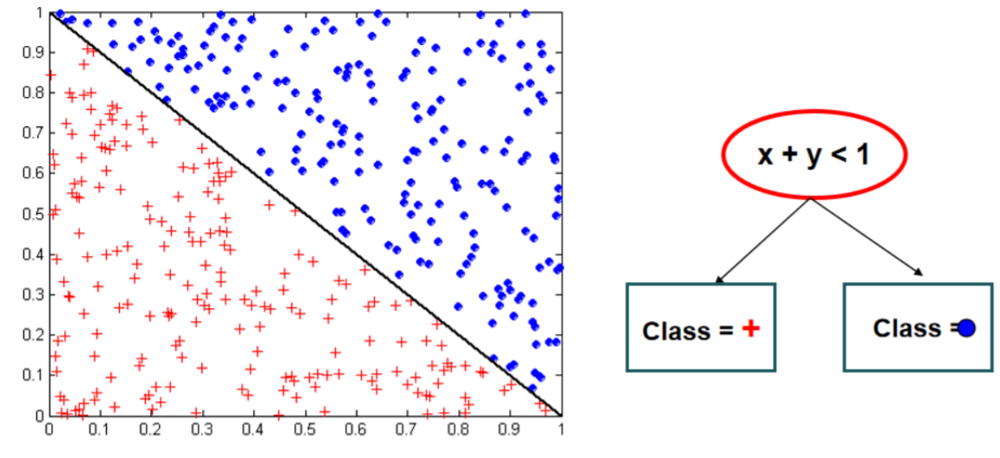
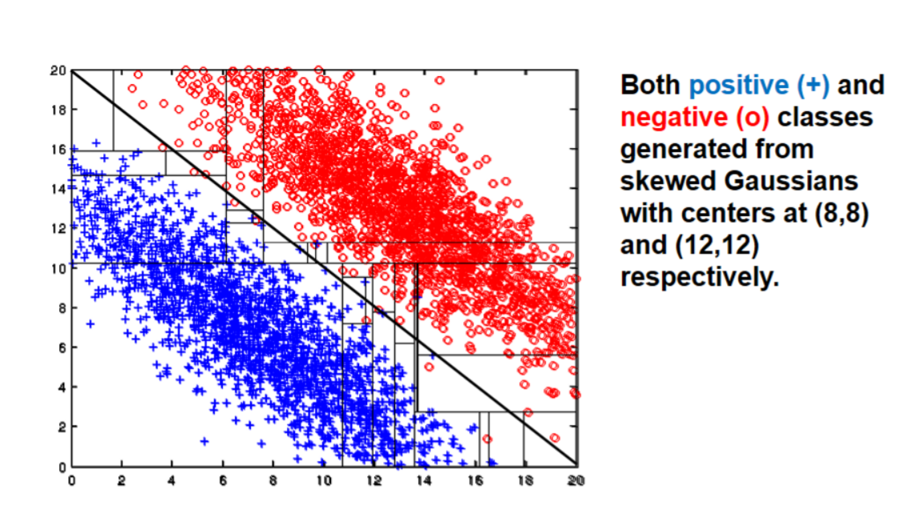
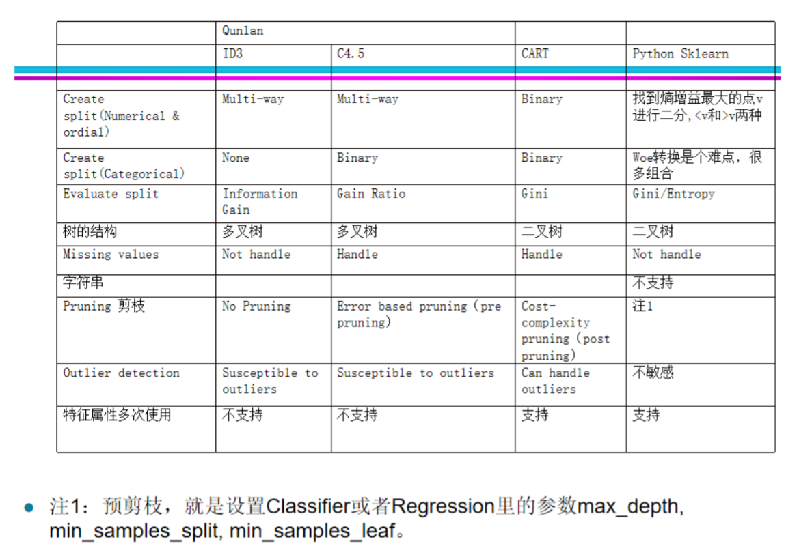
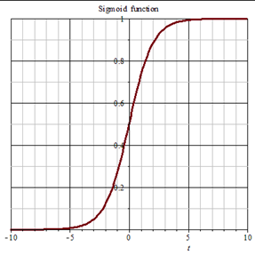
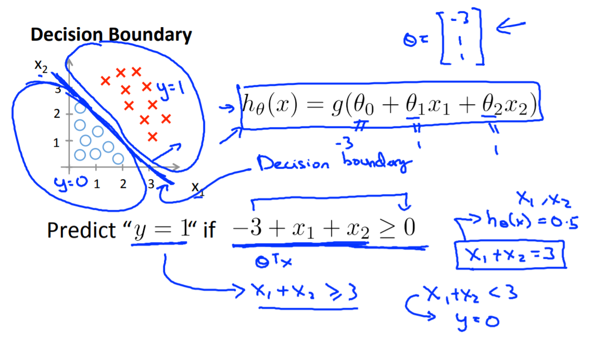
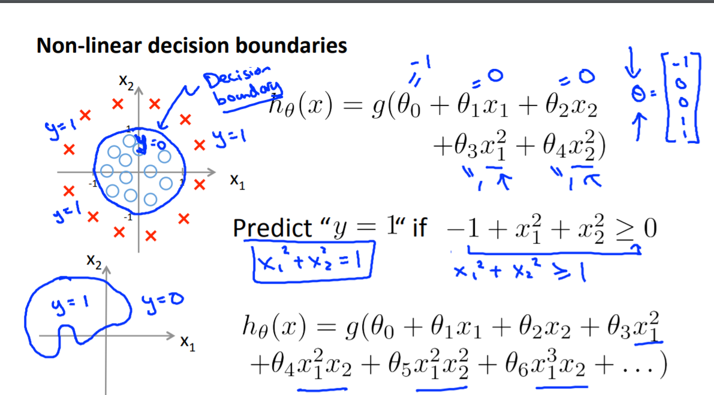
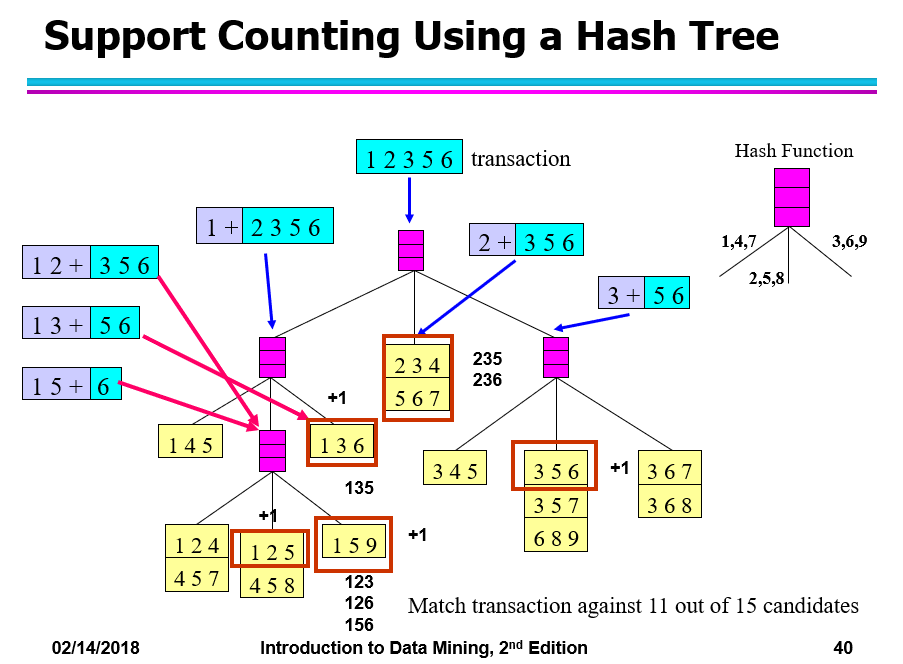
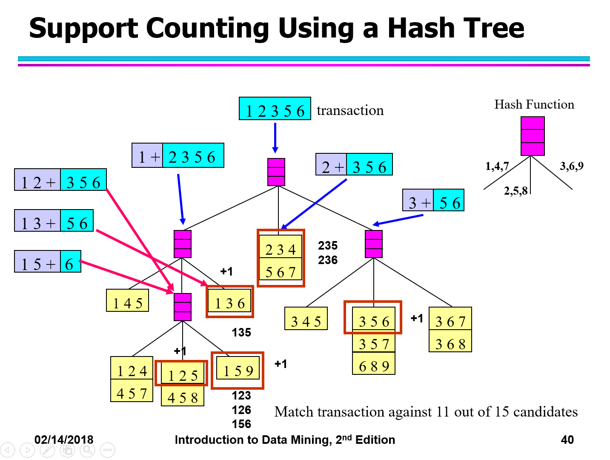
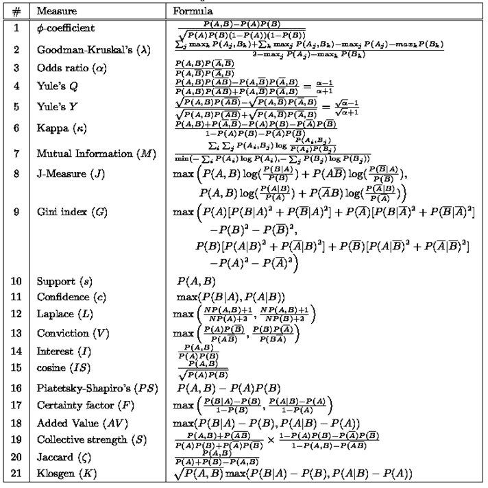

# 数据挖掘总结

##  对数据挖掘有个基本认识，能分辨哪些是数据挖掘的任务，哪些不是？

 分类（客户伙伴预测，医学诊断），聚类（市场调研，图像分割，社交网络分析），关联规则分析（购物篮分析），回归拟合（房价预测）。对于事实上不存在潜在规律的数据进行的分析不是数据挖掘任务（比如彩票中奖号码预测）

##  数据库与数据仓库的不同

数据库是面向应用的，一次操作处理量小，实时可更新的，支持管理的，保持事务处理的当前状态

数据仓库是面向分析的，一次操作处理量大，在一定周期内不更新的，支持决策的，包括历史数据

##  olap与oltp的不同

olap是专门用于支持复杂的支持决策分析操作，对多个数据库综合进行计算，要求快速灵活地进行大数据处理，以一种直观的方式提供查询结果；oltp处理数据高度结构化，事务处理内容简单且重复率高，以快速响应和和频繁修改为特征。事务处理量大，通常要求多个并行处理

## 数据仓库的概念

 数据仓库是面向主题的、集成的、稳定的，不同时间的数据集合，用于支持经营管理中决策制定过程。

##  数据ETL的流程

 分为抽取，转换，加载三个过程。只提取分析所必须的数据，进行数据清洗，汇总到数据仓库中

##  四种数据类型的区别、可以做的运算；和离散、连续变量的关系；

| 数据类型                                | 可以做的运算                                 | 与离散、连续变量的关系                        |
| --------------------------------------- | -------------------------------------------- | --------------------------------------------- |
| 标称（Nominal）                         | 求众数，计算熵，列联相关，卡方测试           | 离散，如果关心数值的变化，则可以当连续量使用  |
| 序数（Ordinal）                         | 中位数，百分位数，秩相关，等级检定，连检定法 | 离散，同上                                    |
| 区间（Interval）（值的加减是有意义的）  | 均值，标准差，皮尔逊相关系数，t检验和F检验   | 连续，连续量如果划分区间，则可以当Ordinal使用 |
| 比率（Ratio）（值的加减和比值是有意义的 | 几何平均，调和平均数， 百分点变化            | 连续，同上                                    |

## 二元变量的对称变量与非对称变量

对称变量：取1和取0的地位是一样的

非对称变量：只有1是重要的，0表示无

##  数据质量中存在的几个问题

- 不完整
- 噪声
- 不一致
- 冗余
- 数据集不平衡
- 数据类型不合适

##  数据预处理（了解每个阶段是做什么的）

### data cleaning：各类质量问题的处理方法

- 删除异常值
- 做变量变换，如取对数
- 分箱（中值平滑、平均值平滑，边界值平滑）
- 将异常值和非异常值分开处理
- 用众数，中位数，回归拟合估算缺失值或异常值
- 聚类、箱线图、正态分布 $3\sigma$原则找出离群点
- 去重

### 	data integration

对不同数据源的数据集成在一个一致的库，包括集成数据库的schema，解决数据冲突，删除冗余

### 	data transformtion

**Aggregation**

做聚集运算，如求均值标准差中位数，四分位数，最值，众数等

**Feature creation**

- 特征提取
- 将数据映射到新空间
- 构造新特征

​	**Attribute Transformation**

​		为什么使用对数变换？

- 对数变换不会改变数据的相对大小，但压缩了数据的尺度，自变量越小，函数值变化越快
- 取对数后可以将乘法运算转成加法运算
- 缩小数据的绝对值，方便计算

### normalization（归一化）和standardlization（标准化）的区别

标准化是将正态分布的数据转成标准正态分布的数据

归一化是将数据映射到 $[0,1]$或 $[-1,1]$ 区间，统一量纲。常用方法有0-均值法，最小-最大值法，小数定标规格化

基于参数或基于距离的模型需要归一化

基于树的方法不需要归一化，如随机森林，bagging 和 boosting等

### Binarization & discretization的区别

二元化是将连续属性或离散属性转成1个或多个二值属性

离散化是将连续属性转成分类属性

### 有序数据和无序数据的Binarization

有序数据按次序标号 $0,1,\cdots, n$，使用标号的二进制表示，作为二元化的结果

无序数据使用onehot编码，每个分类就是一个二元属性

### 相似度相异度计算

曼哈顿距离 $dist(\vec x, \vec y) = \sum_{k=1}^n |x_k - y_k|$

欧几里得距离$dist(\vec x, \vec y) = \sqrt{\sum_{k=1}^n(x_k-y_k)^2}$

闵可夫斯基距离 $dist(\vec x, \vec y) = (\sum_{k=1}^n(x_k - y_k)^r)^{\frac{1}{r}}$

马氏距离 $dist(\vec x, \vec y) = \sqrt{(\vec x - \vec y)^T\sum^{-1}(\vec x - \vec y)}$,其中 $\sum$是 $\vec x$和 $\vec y$ 的 协方差矩阵

## 决策树

分类的3个步骤

1. 模型建立
2. 模型评估
3. 使用模型

给出数据，能根据数据进行计算，逐步建立决策树

计算步骤：

1. 确定分类属性和划分准则
2. 计算划分准则，选择划分准则的值最小的属性进行划分，每个取值对应一个子树
3. 如果没有其他属性可划分或划分后为空集，则用叶结点代替该子树，使用根节点数据集中出现次数最多的分类作为叶结点的标签
4. 如果结点只有一种分类，则停止生长；否则重复以上步骤

决策树的decision boundry

决策边界是两个相邻的不同类区域的边界线，有以下可能：

- 平行坐标轴：一次只有一个属性参与分类
- 
- 斜边界：一次有多个属性参与分类
- 
- 基于单属性的特殊边界
- 

### 模型的评估

### overfitting和underfitting

overfitting是指由于模型过于复杂（对噪声敏感），导致在训练集上误差小但在测试集上误差大

underfitting是指模型过于简单，导致在训练集和测试集上的误差都很大

### 训练误差、测试误差、泛化误差

训练误差是指在训练集上分类出错的情况

测试误差是指在测试集上分类出错的情况

泛化误差表示在样本数据中得到的规则在新的数据上的适应能力

### 模型评估指标

|              | Predicted Positive | Predicted Negative |      |
| ------------ | ------------------ | ------------------ | ---- |
| Actual True  | TP                 | FN                 |      |
| Actual False | FP                 | TN                 |      |
|              |                    |                    |      |

accuracy = $\frac{TP+TN}{TP+FN+FP+TN}$

precision = $\frac{TP}{TP+FP}$

recall= $\frac{TP}{TP+FN}$

F-mesure = $\frac{2precison \cdot recall}{precision+recall}$

ROC曲线是受试者特征曲线，描述了不同阈值下TPR和FPR的取值情况，划分阳性和阴性的阈值从最小值到最大值移动，FPR从0向1移动，TPR也会取不同的值，每个值就是一个点。以FPR为横坐标，TPR为纵坐标，按FPR从小到大的顺序依次连接所有点，可以得到一个曲线，这个就是ROC曲线。注意曲线上所有的点的threshold一定是不相同的。

AUC就是在ROC曲线下方的面积，理想面积是1，低于0.5的没有应用价值

各个算法的比较

### 贝叶斯

### 会根据给出的数据和简单贝叶斯的模型，计算已知X的情况下y的分类

 $target = argmax_{y_i \in y}P(y_i)\prod_j P(x_j|y_i)$

### 如何做拉普拉斯平滑和m-估计？

拉普拉斯平滑： $P(a_{jk} | w_i) = \frac{n(a_j = a_{jk} \and w = w_i) + 1}{n(a_j)+n(w_{i})}$，为了避免结果为0，分子加上1，为了保证概率和为1，分母加上 $n(a_j)$

m估计：$P(c) = \frac{n_c+mp}{n+m}$. 其中 $n_c$ 为该类别中的样本数量，n 为总样本数量，m为等效样本大小的常量, p为将要确定的概率的先验估计（可以取 $\frac{1}{m}$)。在文本分类中, m取 $ |Vocabulary|$  ， $P(k) =\frac{n_k + 1}{n + |Vocabulary|}$

### logistic函数即sigmod函数

sigmod函数的特性:将数据的取值压缩到(0,1)区间，连续可导	

具体的logistic函数表达式$S(x) = \frac{1}{1+e^{-x}}$

值域为$(0,1)$

导数 $S'(x)=S(x)(1-S(x))$

导数值域为 $(0,0.25]$

### 求分类的decision boundry

多元线性回归

多元非线性回归

## ann

### 一个简单神经元的原理

也叫单层感知机，感知机模型为：$Y = sign(\sum_{i=0}^{d}\omega_i x_i)$, 其中 $\omega_0 =-$t，$x_0=1$ ，$\omega_0$也可称为偏置（bias），用于线性决策边界不经过原点的简单分类任务。

1. 仅包含一层输入结点和输出结点
2. 模型由互连结点和权重连接组成
3. 输出结点根据权重对输入结点求和
4. 将输出结点的值和阈值比较

### ann的计算过程

1. 初始化权重（表示零层）
2. 对于每个例子 $(x_i, y_i)$
3. 计算输出 $f(w^{(k)}, x_i)$
4. 更新权重。$w_j^{k+1} = w_j^k - \lambda \frac{\partial E}{\partial w_j}$。其中$w_j^{(k+1)}$指第k+1次迭代后第j个输入链的权重值
5. 重复2到4步骤，直到停止条件出现

l理论证明，两层神经网络可以无限逼近任意连续函数。

## 关联分析

### x→y的含义

存在x的情况下，很可能会同时出现y

### 挖掘关联分析规则的两个步骤

1. 产生频繁项集，每个频繁项集的支持度大于等于给定的threshold
2. 产生关联规则，从频繁项集产生高置信度的规则，每个规则都是一个频繁项集的二元划分

### apriori原理

如果一个项集是频繁项集，那它的子集也是频繁项集；如果一个项集不是频繁项集，那它的超集也不是频繁项集

### 算法的优化——剪枝

如果一个频繁项集的支持度小于threshold，则不产生以该项集为子集的项集；

如果新产生的项集的支持度小于threshold，则舍弃

### 计算如何生成频繁项集

1. k=1
2. 产生所有频繁1-项集的集合 $F_1$
3. 从频繁k-项集的集合 $F_k$ 中产生所有k+1-候选频繁项集的集合 $L_{k+1}$
4. 如果某候选项集的长度为k的子集不是频繁项集，则该项从 $L_{k+1}$中被剔除
5. 计算每个候选项的支持度，没有达到阈值的候选项集被剔除，剩余的候选项集组成频繁k+1-项集的集合 $F_{k+1}$
6. 重复以上步骤直到频繁项集F为空

### 没有重复的k-项候选集是如何产生的

方法1：合并 $F_{k-1}$和 $F_1$项集： 候选项按照字典序排列，只合并 $F_{k-1}$项和字典序在自己之后的 $F_1$项

方法2：合并 $F_{k-1}$和 $F_{k-1}$项集：每个项集的项按字母序排列，如果两个 $F_{k-1}$项集的前 $k-2$个项相同，则合并这两个项集

方法3：合并 $F_{k-1}$和 $F_{k-1}$项集：每个项集的项按字母序排列，如果一个 $F_{k-1}$项集的前 $k-2$个项和另一个 $F_{k-1}$项集的后$k-2$个项 相同，则合并这两个项集

### 剪枝

每个候选k-项集的k-1子集如果不是频繁项集，则剪枝

### 计数

如果直接在transaction记录中与候选项一一比对，代价很高。为了减少比较的次数，将候选项存储在hash结构中，每个transaction与hash桶中的候选项集匹配

1. 构建hash tree

    hash函数：1,4,7映射到第一个节点，2,5,8映射到第二个节点名，3,6,9映射到第3个节点

    叶结点的最大规格：如果一个叶节点的项集个数超过最大值，则分裂该节点。第k层按项集的第k项进行hash

https://blog.csdn.net/owengbs/article/details/7626009

### 频繁k-项集

剩余的就是频繁k-项集，它们的支持度都大于threshold

### 关联分析规则的评估指标

提升度$Lift = \frac{P(Y|X)}{P(Y)}$ 用于规则

兴趣度$Interest=\frac{P(X,Y)}{P(X)P(Y)}$ 用于项集

$PS = P(X,Y)- P(X)(Y)$

$\phi-coefficent = \frac{P(X,Y)-P(X)P(Y)}{\sqrt{P(X)(1-P(x))P(Y)(1-P(Y))}}$

## 聚类

会根据k-mean算法来进行无监督聚类

1. 确定聚类数目k
2. 随机产生k个聚类中心
3. 计算每个点到每个聚类中心的距离，把这个点分配给最近的聚类
4. 每个聚类计算所有点的重心（每个分量取均值），得到的重心作为新的聚类中心
5. 重复步骤3-4，直到没有聚类中心不再变化，返回这k个聚类中心