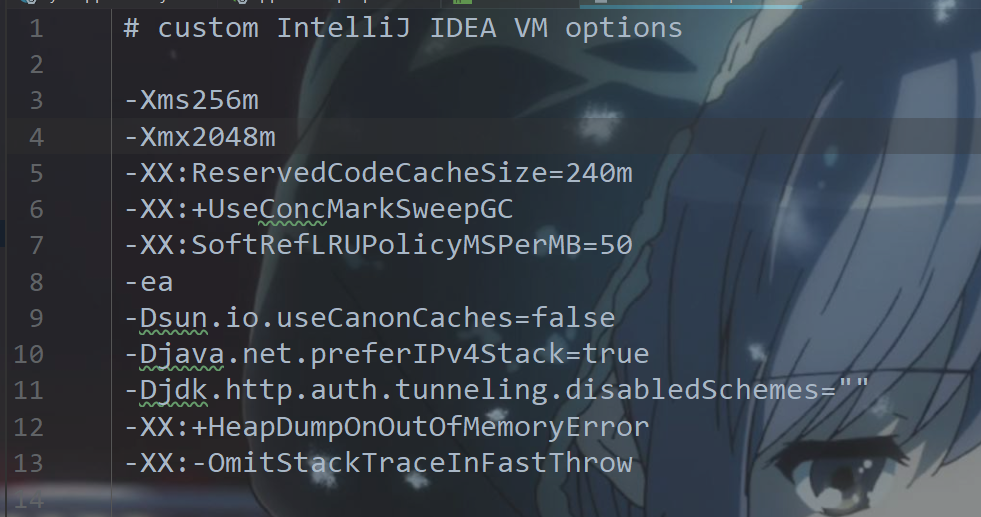

## 环境变量的配置

1. JAVA_HOME:值为jdk的安装目录,java可以通过这个变量找到里面的jre
2. CLASSPATH:classpath作用是告诉java去哪里搜索class文件，有必要添加到classpath的一般是自行下载的第三方jar包
3. Path:追加 `%JAVA_HOME%\bin`路径,以便可以通过命令行运行java,命令

## 设置idea的vm option

idea运行卡可以增大idea的堆内存大小：打开idea->help->edit custom vm options->设置 `-Xmx`参数

例如`-Xmx2048m`表示运行idea的jvm的最大堆内存为2048m,如果你的电脑的内存足够,可以适当增大这个值换取更好的运行速度



## maven配置

版本3.5.4以上

配置文件:`安装目录\conf\settings.xml`

下面的配置达成的目的有:

1. 设置镜像仓库,通过使用国内服务器的镜像仓库代替国外服务器的资源解决网络延迟的问题
2. 指定jdk的版本,确保不会发生下载的jar包的编译版本与本地jdk一致

```xml
<?xml version="1.0" encoding="UTF-8"?>
<settings xmlns="http://maven.apache.org/SETTINGS/1.0.0"
          xmlns:xsi="http://www.w3.org/2001/XMLSchema-instance"
          xsi:schemaLocation="http://maven.apache.org/SETTINGS/1.0.0 http://maven.apache.org/xsd/settings-1.0.0.xsd">
        <!--省略无关部分...-->
     <localRepository>E:\apache-maven-3.5.4\repo</localRepository> <!--请替换成你自己定义的依赖包保存位置-->
    <mirrors>
        <mirror>
            <id>nexus-aliyun</id>
            <name>Nexus aliyun</name>
            <url>http://maven.aliyun.com/nexus/content/groups/public/</url>
            <mirrorOf>central</mirrorOf>
        </mirror>
    </mirrors>  

    <profiles>
        <profile>
            <id>jdk-1.8</id>

            <activation>
                <activeByDefault>true</activeByDefault>
                <jdk>1.8</jdk>
            </activation>

            <properties>
                <maven.compiler.source>1.8</maven.compiler.source>
                <maven.compiler.target>1.8</maven.compiler.target>
                <maven.compiler.compilerVersion>1.8</maven.compiler.compilerVersion>
            </properties>
        </profile>
    </profiles>
     <!--省略无关部分...-->
</setting>
```

## idea指定maven工具(可选)

- 配置maven home directory

- 指定配置文件
- 指定本地仓库路径(maven下载的依赖保存在本地仓库中)


## 创建springboot工程

file->new->project->spring initializer->next->配置group和artifact(随便起名也行)->next->web->勾选spring web->给project起名->finish


其余图略

## 配置springboot项目

配置文件 `application.properties`

配置运行时服务器端口(springboot内置tomcat容器)

``` 
server.port = 23333
```

也可以使用yaml文件配置,在resources文件夹创建 `application.yml`文件,编辑内容如下:

```
server:
	port: 23333
```

## resources目录结构

`static`:存放js,css,image文件

`templates`:存放页面模板文件

## 设置file encoding

file->settings->editor->file encodings

global encoding: utf8

project encoding:utf8

Default encoding for properties files:utf8

勾选transparent native-to-ascii conversion