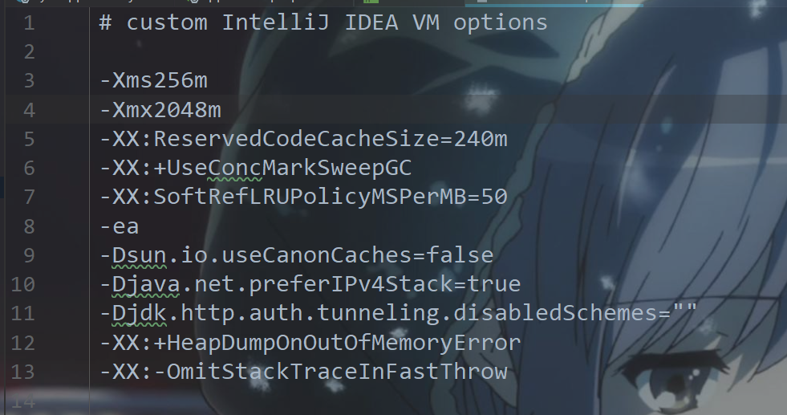
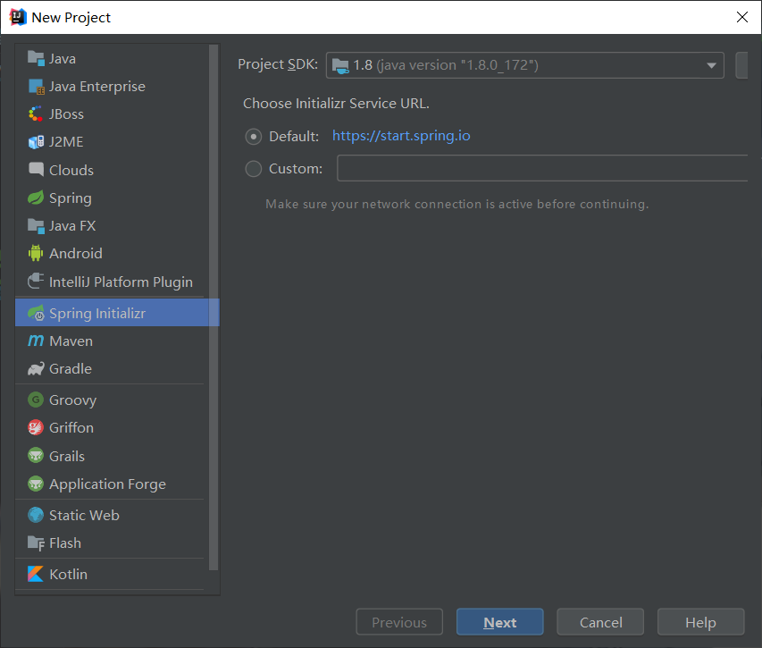

# springboot进行web开发总结

---


## 开发环境清单

1. java: jdk1.8.0_172以上
2. IDE: intellj idea(可以创建springboot工程)
3. 项目依赖构建工具: maven3以上
4. 数据库: mysql5.7
5. 前端框架: bootstrap4+jquery3

## 框架使用手册

- 后端框架
    - [springboot2.3.1.RELEASE](https://docs.spring.io/spring-boot/docs/2.3.1.RELEASE/reference/html/)：是为了简化spring配置而出现的框架

- 持久层框架
    - [mymatis](https://mybatis.org/mybatis-3/zh/getting-started.html) ：通过手撕SQL语句与接口方法映射，可以做到更灵活的查询，在联合多表查询比较有优势

- 网页模板渲染引擎
    - [thymleaf3](https://www.thymeleaf.org/doc/tutorials/3.0/thymeleafspring.pdf)

- 日志框架

    - 接口层：[slf4j](http://slf4j.org/manual.html)

    - 实现层：[logback](http://logback.qos.ch/manual/introduction.html)

- 前端框架
    - [bootstrap](https://getbootstrap.com/docs/4.3/content/typography/):负责快速搭建界面
    - [jquery](https://jquery.cuishifeng.cn/index.html):负责ajax请求,操作dom结点等 

## java环境变量的配置

1. **JAVA_HOME:**值为jdk的安装目录,java可以通过这个变量找到里面的jre
2. **CLASSPATH:**以前网上的java教程总会让人设置classpath变量. classpath作用是告诉java去哪里搜索class文件,不设置时也会默认在当前目录查找. 主流IDE均支持导入第三方库的classpath路径, 因此不再推荐使用classpath环境变量
3. **Path:**追加 `%JAVA_HOME%\bin`路径,以便可以通过命令行运行java命令

## 配置Intellij idea

### 设置file encoding

file->settings->editor->file encodings

global encoding: utf8

project encoding:utf8

Default encoding for properties files:utf8

勾选transparent native-to-ascii conversion

### 设置vm options

打开idea->help->edit custom vm options->设置 `-Xmx`参数



虽然你的电脑配置很高,但是运行idea仍然感觉很卡,这是因为idea默认运行的最大堆内存(-Xmx)默认是750m,你可以把这个参数调的更大

例如`-Xmx2048m`表示运行idea的jvm的最大堆内存为2048m,如果你的电脑的内存足够,可以调的更大以换取更好的性能

## maven配置

默认用户配置文件: `用户目录\.m2\settings.xml`，如果没有可以自行创建，增加以下配置：

```xml
<?xml version="1.0" encoding="UTF-8"?>
<settings xmlns="http://maven.apache.org/SETTINGS/1.0.0"
          xmlns:xsi="http://www.w3.org/2001/XMLSchema-instance"
          xsi:schemaLocation="http://maven.apache.org/SETTINGS/1.0.0 http://maven.apache.org/xsd/settings-1.0.0.xsd">
        <!--省略无关部分...-->
     <localRepository>E:\apache-maven-3.5.4\repo</localRepository> <!--请替换成你自己定义的依赖包保存位置-->
    <mirrors>
        <mirror>
            <id>nexus-aliyun</id>
            <name>Nexus aliyun</name>
            <url>http://maven.aliyun.com/nexus/content/groups/public/</url>
            <mirrorOf>central</mirrorOf>
        </mirror>
    </mirrors>  

    <profiles>
        <profile>
            <id>jdk-1.8</id>

            <activation>
                <activeByDefault>true</activeByDefault>
                <jdk>1.8</jdk>
            </activation>

            <properties>
                <maven.compiler.source>1.8</maven.compiler.source>
                <maven.compiler.target>1.8</maven.compiler.target>
                <maven.compiler.compilerVersion>1.8</maven.compiler.compilerVersion>
            </properties>
        </profile>
    </profiles>
     <!--省略无关部分...-->
</setting>
```

以上配置作用：

1. 设置本地仓库路径。maven下载的jar包都会保存到本地仓库。默认下载位置时 `用户目录\.m2\repository`，如果你和我一样c盘空间严重不足（剩余容量不到20G），强烈建议更改到其他盘
2. 设置镜像仓库,通过使用国内服务器的镜像仓库代替国外服务器的资源解决网络延迟的问题
3. 指定jdk的版本,确保不会发生下载的jar包的编译版本与本地jdk一致

## mysql配置

以root身份登录到mysql

### 设置数据库时区

```mysql
set global time_zone='+8:00';# 设置时区为东八区
show variables like '%time_zone%';# 查看时区
```

### 创建数据库

```mysql
CREATE DATABASE bylw;# 创建bylw数据库
USE bylw;
#source bylw.sql;# 导入数据文件,bylw.sql应替换成具体的路径,路径不能出现中文。也可以通过springboot配置导入
```

### 创建用户和授予权限

``` mysql
CREATE USER `developer`@`127.0.0.1` IDENTIFIED BY '123456';# 创建开发者用户,密码为123456,仅对本地运行有效
GRANT ALL PRIVILEGES ON `bylw`.* TO `developer`@`127.0.0.1`;# 给developer用户授予在bylw数据库上的所有权限

```

## 创建springboot工程

idea自带spring initializr，可以直接通过idea创建springboot工程

### 通过该方式创建工程的作用：

1. 建立springboot的最简目录结构
2. 定制pom.xml（选择maven构建）

### 创建过程

1. 新建工程，选择spring initializer，下一步

2. 配置项目元数据

    - group和artifact一般对应包名和web app名
    - 类型选择maven project
    - 语言是java
    - 打包方式在开发时选择jar（这些设置都可以在后面的pom.xml轻易修改），下一步
    - 勾选需要的依赖
        - springboot选择2.3.1
        - deveoper tools全选
        - web选择spring web
        - template engines选择thymeleaf
        - SQL选择mybatis framework和mysql driver
    - 给project起名，完成

    勾选的组件会在 `pom.xml`被声明，你可以根据需要修改pom.xml进行依赖的增加或删除



其余图略

springboot开发工具支持热重启，但不是说改了java源码就可以在浏览器上体现出来，依旧需要重新编译，但是再次编译生成的速度会比关闭热重启时快很多

```xml
        <dependency>
            <groupId>org.springframework.boot</groupId>
            <artifactId>spring-boot-devtools</artifactId>
            <scope>runtime</scope>
            <optional>true</optional>
        </dependency>
```

### 项目目录架构（自行创建）

```
src/main/java/yourpackage
├─bean：存放实体类
├─controller：存放控制器，用于绑定路由和调用service
├─service：业务逻辑接口
│  └─impl：业务逻辑接口的实现
├─mapper：mybatis自定义接口，做sql语句与CURD方法的绑定
├─constant：存放全局常量，如果不需要可以省略
├─config：存放配置类
└─util：存放实用的辅助类

```

```
resources：资源文件夹，该目录下的application.properties和application.yml是配置文件，作用于整个项目
├─sql：存放sql文件，通过配置可以使mysql运行sql文件
├─public：存放可以通过url访问到的资源，如用户上传的文件
├─static：存放静态资源
│  ├─images
│  ├─css
│  └─js
└─templates：存放页面模板文件（html文件）
    └─errors：存放页面出错页模板文件（文件命名为状态码.html, 如4xx.html可以匹配所有状态码以4开头的错误)
```

### 配置文件

在resources文件夹创建`application.yml`

``` yaml
spring:
  profiles:
#    开发调试时用develop,部署时应切换到product
    active: develop
logging:
  file:
    path: log
---
#开发环境
server:
  port: 80
spring:
  profiles:
    profile: develop

  datasource:
    username: developer
    password: 123456

    url: jdbc:mysql://127.0.0.1:3306/bylw?serverTimezone=GMT%2B8
#    driver-class-name: com.mysql.cj.jdbc.Driver
#    schema:
#      - classpath:sql/bylw.sql
    initialization-mode: always

  thymeleaf:
    cache: false
---
#生产环境
spring:
     profiles:
       profile: product
# 需要根据实际生产环境配置，此处略
```

### html页面要求

为了能在idea中使用thymeleaf的代码提示，需要在html标签中添加xml命名空间

```html
<!DOCTYPE html>
<html lang="en" xmlns:th = "http://www.thymeleaf.org">。。。</html>
```


## 测试

1. 用户权限测试（是否出现越权访问资源等情况）
2. 常见安全漏洞测试，xss，csrf，sql注入等
3. 检查用户密码是否经过加密处理：密文=md5(明文+salt值)
4. 业务流程测试（使用自动化测试工具如python的selenium模拟浏览器操作检查响应是否符合预期）
5. 错误页测试（对不同的错误状态码是否返回合理的页面）

## 部署注意事项

1. application.yml里的profile应从develop切换至product
2. 检查product profile的datasource，thymeleaf，server等是否正确配置
3. 支持https

## 前后端分离/不分离

前后端不分离，就是使用页面模板渲染引擎，html页面模板会包含一些特殊变量，启动web服务器交给程序渲染后变量会被替换成数据，生成真正的html返回给浏览器。优点：对于前后端都是一个人搞的小项目该方式比较简单，通过模板渲染引擎的布局和继承等功能可以让html的代码量大大减少，且由于返回的html都是填好数据的页面，对静态爬虫友好。缺点：前后端强行分开很麻烦，效率不高，仅适合分模块后前后端一起弄的团队，且需要团队有人熟练掌握模板渲染引擎的用法。

前后端分离，不用模板渲染引擎，成功的核心是接口规范的统一，前端专心做界面，通过js获取restful接口数据并填充到指定的dom结点，vue.js等框架可以很好做到这一点。后端专心写restful接口，后端只负责返回数据（大多时候是json文件）。优点：前后端可以完全独立，低耦合，后端做的东西也能被其他app使用。缺点：数据是异步加载的，对静态爬虫不友好，如果前后端本就是一个人做，依旧搞分离会增加工作量。