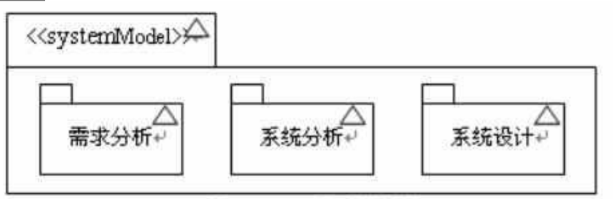
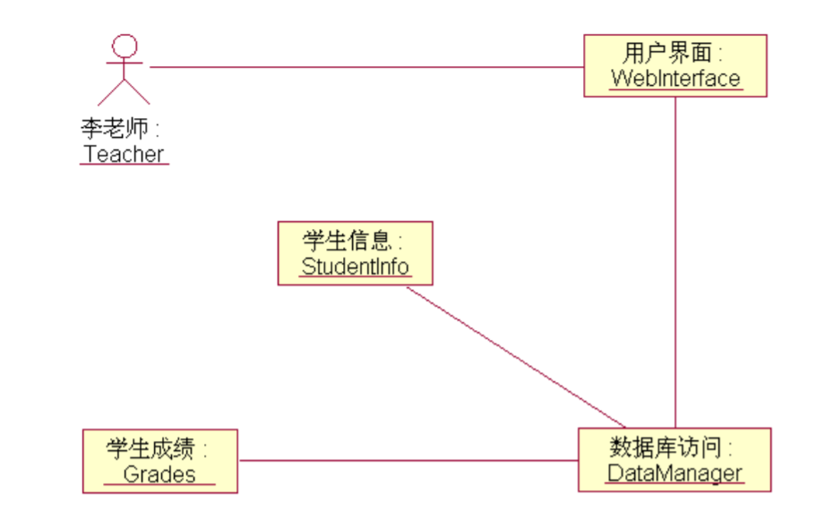
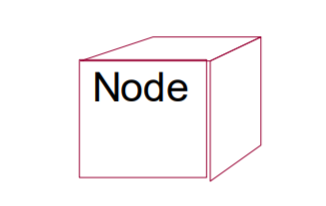

# uml软件建模总结

## 了解软件的发展和软件工程的概念。
软件发展的四个阶段：
1. 程序设计阶段（1950-1960）个人
2. 软件设计阶段（1960-1970）小组合作
3. 软件工程阶段（1970-1980）软件开发过程管理，重视文档管理
4. 分布式软件工程阶段（1980-现在）组件复用

软件工程的概念：由目标、活动和原则三方面组成的关于软件生产的工程学科。
- 目标：可用性、正确性、合算性
- 活动：需求、设计、实现、确认、支持
- 原则：开发范型、设计方法、支持过程、管理过程

## 了解软件开发的常用方法。
1. 结构化方法，以数据流图为工具
2. 面向对象方法

## 重点掌握面向对象技术的基本概念和开发过程。
面向对象技术是运用对象、类、继承、封装、聚合、信息传递、多态性等概念构造系统的软件开发技术

开发过程包括面向对象分析（OOA）、面向对象设计（OOD)、面向对象实现（OOP）、面向对象测试（OOT）、和面向对象维护（OOM）五个方面
## 了解几种典型的面向对象开发方法。
- Coad Yourdon方法。OOA把系统横向划分五个层次，OOD把系统纵向划分四个部分，形成一个清晰系统模型。适用小型系统的开发。
- Booch方法。 规定开发面向对象系统应遵循一些技术和原则。
- OMT方法。适合数据密集型信息系统开发。
- OOSE方法。能够较好地描述系统的需求，适合于商务处理方面的应用开发
- RUP方法。用例驱动，体系结构为核心，迭代和增量，是一种重量级过程，特别适用于大型软件团队开发大型项目，“统一过程”使用的是“统一建模语言”。

## 了解可行性研究方法。
1. 系统调查和分析
2. 提出新系统开发方案
3. 进行可行性分析
4. 编写可行性分析报告
5. 评阅和审批可行性分析报告
6. 若项目可行，则制定初步的项目开发计划，并签署合同

## 掌握可行性分析报告的书写格式。
1. 引言
2. 可行性分析的前提
3. 对现有系统的分析
4. 建议的系统
5. 可选择的其他方案
6. 投资及效益分析
7. 社会因素方面的可行性
8. 结论

## 了解UML的发展历史及应用。
- 1994年10月诞生
- 1996年正式命名
- 1997年被OMG收纳
UML统一标准、面向对象、可视化、表达能力强，在需求分析，系统分析、总体设计、测试用例设计等方面都有重要应用
## 了解UML的体系结构。

UML分为构造块、公共机制、架构三个部分。

架构包括用例视图、逻辑视图、进程视图、实现视图、部署视图

构造块包括物件、关系、图

物件包括结构物件、行为物件、分组物件和注解物件

关系包括关联、泛化、依赖、实现

图包括用例图、活动图、状态图、协作图、顺序图、部署图、构件图、对象图、类图

公共机制包括规格说明、修饰、通用划分、扩展机制
## 掌握UML的视图、图以及图和视图的关系。

### 视图

视图是表达系统某一方面特征的uml建模构件的子集

用例视图：描述系统的功能需求，找出用例和参与者

逻辑视图：描述如何实现系统内部的功能

构件视图：描述系统代码构件组织和模型实现，以及它们的依赖关系

进程视图：描述系统的并发性，并处理这些线程间的通信以及同步

配置视图：描述系统的物理设备配置，如计算机、硬件设备以及它们相互间的连接

## 图

用例图：帮助开发团队理解系统的功能需求，包括基于流程的“角色”关系，以及系统内用例之间的关系

类图：显示系统的静态结构，表示不同实体是如何关联的

对象图：表示某一时刻类的静态结构

序列图：显示一个具体用例的详细流程

协作图：表示一组对象的关系以及交互活动

状态图：表示某个类的不同状态以及状态的转换过程

活动图/泳道图：表示两个或多个对象在处理某个活动时的过程控制流程

构件图：指出功能实际存放位置，根据代码构件显示整个系统的代码结构

部署图：表示系统的物理运行环境以及不同环境间如何通信

包图：系统模型组织的描述

## 掌握UML模型元素及符号的使用。

模型元素包括事物和关系

事物是模型中最具有代表性的成分的抽象，分为结构事物、行为事物、分组事物和注释事物

**结构事物**

- 类（class）和对象（object） 
-  接口（interface） 
- 用例（use case） 
- 协作（collaboration） 
- 构件（component） 
- 节点（node）

**行为事物**

- 状态机
- 交互
- 状态

**分组事物**

对其他事物进行分组

**注释事物**

对uml模型进行解释

**关系**

- 依赖：一个事物的变化会影响另一个事物的语义关系
- 泛化：事物的特殊/一般关系
- 关联：表示事物之间的关联度（一对多、多对多、一对一），按生命周期分还有聚合和组合
- 实现：表示操作的规约与操作的具体实现的语义关系

具体的符号略（TODO)

## 掌握UML的系统模型。

- uml基本元素

- 规则说明

- 修饰

- 通用划分

- 构造型

- 标记值

- 约束

## 掌握客户需求分析的要点及需求分析规格说明报告的书写格式。

1. 分析系统的参与者
2. 识别用例
3. 结果值要由系统生成
4. 业务语言而非技术语言
5. 用户观点而非系统观点

## 通过绘制用例图及其正文描述来完成客户需求分析的方法。

用例与其参与者之间的关联关系用带箭头的直线表示。

任何用例都不能在缺少参与者的情况下存在

任何参与者也必须要有 用例间的关联关系 与之关联的用例。

用例除了与其参与者发生关联外，用例之间具有多种关系，这 些关系包括包含关系、扩展关系和泛化关系等。

## 掌握UML的用例模型建模方法。

1. 获取原始需求
2. 开发可理解的需求
    1. 找出参与者
    2. 识别用例
    3. 绘制用例图
3. 详细描述需求（添加用例约束）
4. 重构用例模型
    1. 识别用例间的关系
    2. 对用例进行组织和分包

## 掌握活动图的绘制方法，并且能够绘制活动图

活动图描述活动的顺序关系，表现的是系统的行为而非具体的处理过程，可以表示并发活动

组成元素：

- 初始状态。实心圆

- 终止状态，实心圆外加空心圆环

- 动作状态（Action State） 瞬时行为，不可中断。圆角矩形表示

- 活动状态（Activity State） ，非原子，可以有入口动作和出口动作，内部可以用另一个活动图表示。圆角矩形表示

- 动作流（Action Flow）动作之间的转换流，用带箭头的直线表示

- 分支（Branch）与合并（Merge）用一个菱形表现条件分支开始或结束，菱形的出转换需要标明监护条件

    

- 分叉（Fork）与汇合（Join） 表示并发运行的分支。用加粗的水平线或竖直线表示并发活动的开始或结束。汇合要求分叉上的所有并发活动都完成才能触发下一个活动

- 泳道（Swimlane）按职责将活动分组。用垂直实线分割成不同平面区域，即泳道，每个泳道上方标明一个泳道名，一般是参与者的名字或系统，表示该泳道的所有活动从属于该泳道名

-  对象流（Object Flow）同一对象可以在活动图中出现多次，表示同一对象在生命周期不同时间点的情况。用矩形表示对象，用带箭头的虚线表示对象和活动间的顺序关系

### 活动图的建模步骤

1. 确定工作流的初始状态和终止状态
2. 状态建模。找出随时间发生的动作和活动，将它们表示为动作状态或活动状态。
3. 动作流建模。可以首先处理顺序动作，接着处理分支与合并等条件行为，然后处理分叉与汇合等并发行为。
4. 对象流建模。找出与工作流相关的重要对象，并将其连接到相应的动作状态和活动状态。
5. 对建立的模型进行精化和细化。即添加约束条件和为关键活动绘制子活动图

## 掌握面向对象系统分析的过程

建立分析模型，描述计算机软件，以满足客户定义的需求

使用类图和交互图描述对象以及交互

## 掌握系统用例模型的设计方法

### 从需求中识别参与者和用例

### 构建用例图

### 进行用例阐述

1. 简要说明:对用例作用和目的的简要描述。 
2.  事件流:事件流包括基本流和备选流。基本流描述的是用例的基本 流程，是指用例“正常”运行时的场景。 
3.  用例场景:同一个用例在实际执行的时候会有很多不同的情况发生， 称之为用例场景，也可以说用例场景就是用例的实例。
4.  特殊需求: 特殊需求指的是一个用例的非功能性需求和设计约束。 特殊需求通常是非功能性需求，包括可靠性、性能、可用性和可扩展性 等。例如法律或法规方面的需求、应用程序标准和所构建系统的质量属 性等。 
5.  前置条件: 执行用例之前系统必须所处的状态。例如，前置条件 是要求用户有访问的权限或是要求某个用例必须已经执行完。
6. 后置条件:用例执行完毕后系统可能处于的一组状态。例如，要求 在某个用例执行完后，必须执行另一个用例。

### 识别用例关系

### 分类和分包

一个开发周期要被指派一个到多个用例，如果完全 版本的用例在一个开发周期中处理起来太复杂的话， 那就采用简化版本的用例

在开发过程中，尤其是在递增开发过程中，最好按照 实现的优先级给系统需求分级，然后给每个用例打分，表 示紧急程度。

**红绿灯打分技术**

绿色的用例必须在当前的开发过程中实现，否则就 意味着项目没有达到其最低目标；

黄色的用例在当前的开发过程中是可选的，只有在完成了绿色的用例后才能完成它；

红色的用例即使时间允许，也不在当前的开发过程中实现

**分包方式**

- 按参与者分包 
- 按主题分包
- 按开发团队分包
- 按发布情况分包

## 了解类和对象的概念、类与对象的关系等

类是对一组具有相同属性、操作、关系和语义的对象的抽象，包括名称、属性、和操作

对象代表一个单独的、可确认的物体、单元或实体，在问题域里有确切定义的角色

### 类和对象的关系

对象是一个存在于时间和空间中的具体实体，而类仅代 表一个抽象，抽象出对象的“本质” 

 类是共享一个公用结构和一个公共行为对象集合 

类是静态的，对象是动态的 

类是一般化，对象是个性化

类是定义，对象是实例

类是抽象、对象是具体

## 对象图设计

类图在某一时刻的实例，描述系统在某一时刻的静态结构

用对象和链组成

对象名：首字母小写。对象是一个类的实例，因此其名 称的格式是“对象名：类名”，类名是可选的，但如果 是包含了类名，则必须加上“：”，另外为了和类名区 分，还必须加上下划线。

属性：由于对象是一个具体的事物，因此所有的属性值 都已经确定，因此通常会在属性的后面列出其值。

多对象

链是两个或多个对象之间的独立连接，它是关联的实例。

## 对象图建模

1. 确定参与交互的各对象的类，参照类图和交互图 

2. 确定对象之间的关系 

3. 针对交互在特定时刻各个对象的状态，使用对象图建模

## 类图设计

**属性**

1. 可见性
2. 属性名称
3. 属性类型
4. 初始值
5. 属性字符串（指定关于属性的一些附加信息）

**操作**

1. 可见性

2. 操作名称

3. 参数列表

4. 返回类型

5. 属性字符串

    

**关系**

- 依赖

    

- 泛化

    

- 关联（聚合和组合）

    - 名称
    - 角色
    - 多重性

    

- 实现

    

## 类图与对象图的区别

## 类图建模

1. 发现备选类
2. 筛选得到候选类
3. 关系分析（关联、泛化、依赖、实现）和多重性分析（关联度）
4. 职责分析（增加操作和属性）
5. 添加约束与限定符

## 掌握交互图和状态机图的表示方法。

交互图包括序列图和通信图

### 序列图

序列图强调对象之间的时间关系

序列图元素

1. 对象。交互的发起者，也叫主角。可以是参与者，也可以是系统的对象。系统对象用矩形符号表示，对象及其类的名称带有下划线，二者用冒号隔开，使用 “对象名 ：类名”的形式。置于序列图的顶部

    

2. 生命线。垂直的虚线。表示对象在一段时间内的存在

3. 激活。激活在序列图中用一个细长的矩形框表示，矩形框称为激活条或控制期。对象在激活条顶部被激活，在底部被去激活

4. 信息。由发送者对象的生命线指向接受者对象的生命线

递归调用：自己指向自己的实现箭头表示

操作：实线箭头

返回信息：虚线箭头

过程调用（同步信息）：实心箭头，必须有返回信息

异步信息：半箭头

### 序列图的图符

### 通信图

对象：与对象图的表示方法相同

信息：每个信息包括顺序号和消息名称，顺序号从整数1开始，嵌套信息使用点表示法。一般还要加上箭头表示信息流动方向。信息在链上绘制

链：使用实线表示对象间的关联。即对象的通信路径

### 协作图图符

## 掌握顺序图和通信图的区别和联系。

**联系**

- 都是交互图，描述对象之间的交互 

- 都包含一系列消息集合 

**区别**

- 时序图强调消息传送的时间先后顺序 
- 协作图中描述了该协作所有对象组成的网络结构以及相互发送消息的整体形为

### 状态图

- 初始状态，有且只有一个初始状态

- 终止状态，可选，可能有多个终止状态

- 状态

    - 名称

    - 入口动作 `entry/action`

    - 状态中持续动作 `do/action`

    - 出口动作 `exit/action`

        
        
    - 内部转换

    - 嵌套状态图

- 状态转换。表示从一个状态进入另一个状态的关系

    - 源状态
    - 目标状态
    - 事件触发
    - 监护条件（只有条件为真才触发）
    - 判定，用空心菱形表示，和监护条件搭配使用
- 动作（转换发生时不可中断的行为）
    
    
    
    
    
    组合状态包括顺序子状态和并发子状态
    
    顺序子状态中各个状态间的转换是有一定先后顺 序的，即需要按步骤执行。 
    
    并发子状态在同一层次给出两个或多个顺序子状 态，对象处于同一层次中来自每个并发子状态的 一个时序状态中。 并发子状态可以用于对并发线程的状态进行建模。 
    
    并发子状态是从不同的角度描述一个状态

## 掌握顺序图、通信图、状态图的建模步骤。

### 顺序图建模

1. 确定工作流程，如果存在分支则使用备选过程描述（多个顺序图）
2. 确定对象
3. 确定信息

### 通信图建模

1. 确定通信图的元素
2. 确定元素之间的关系
3. 细化协作图

### 状态图建模

1. 标识建模实体

2. 标识实体的各种状态

3. 标识相关事件并创建状态图 

4. 确定转换激活时，相应执行的动作——动作建模对建模结果进行精化和细化 

    

    

## 清楚在实际的建模中什么时候该使用顺序图、通信图和状态机图等。

基本原则：越简单，价值越大

突出执行时序用顺序图

突出对象的静态连接关系用通信图

行为简单是用交互图（顺序图、通信图），行为复杂用活动图

描述单个对象跨越多个用例的行为，用状态图

描述跨越多个线程的复杂行为用活动图

## 了解软、硬件系统体系结构模型的建模方法与步骤。

## 掌握UML中构件、构件接口和构件模型图的描述方法。

构件的3C指导模型

1. 概念（concept）
2. 内容（content）
3. 上下文（context）

## 掌握UML中部署图的描述方法。

使用结点、构件、接口和构件实例以及关系（实现、依赖、关联）来描述应用的具体部署结构

## 掌握部署图中结点、构件和对象之间的关系。

结点是物理资源，构件是提供服务的软件资源，对象是运行时的一个实例

## 软件构件技术的发展历史

略

## 软件构件技术的发展现状

略

## 软件架构的目标

- 可靠性（Reliable） 
- 安全性（Secure） 
- 可扩展性（Scalable） 
- 可定制化（Customizable）
-  可扩展性（Extensible）
-  可维护性（Maintainable）
-  客户体验（Customer Experience） 
- 市场时机（Time to Market） 

## 软件架构的种类

1. 逻辑架构
2. 物理架构
3. 系统架构

## 软件的部署

开发得到的软件系统，必须部署在某些硬件上执行

硬件系统体系结构模型由部署图建模

## 掌握软件部署图设计

每个模型只有一个部署图

节点是运行时代表计算资源的物理元素， 在uml中用一个立方体表示

**节点的确定**从能力（如计算能力、内存等）和使用该系统的物理位置两方面考虑

uml也可以用附加栏或标记值加以修饰

建模过程中，节点可以分为处理器和设备两种	

关联关系表示各个结点之间的通信路径，用一条实线表示，使用构造型如 `<<以太网>>`、`<<TCP>>`等

