# latex论文快速入坑

## 选定一个latex模板


一般使用latex写论文时不会自己从头调整排版样式，而是使用刊物提供的latex模板。本文将以Lecture Notes in Computer Science (LNCS)的latex模板为例。

lncs的tex模板可以从[springer官网](https://www.springer.com/cn/computer-science/lncs/conference-proceedings-guidelines)下载，springer同时把模板上传到了overleaf，用户也可以注册后直接使用[overleaf](https://www.overleaf.com/latex/templates/springer-lecture-notes-in-computer-science/kzwwpvhwnvfj#.WtR5Hy5ua71)在线编辑

本文以在本地使用[TeXstudio](http://texstudio.sourceforge.net/)编辑器编写科技论文为例展开说明。如果你发现有些命令本该导入宏包我却没导入，那可能是我用的这个模板已经提前导入了这个宏包

lncs的tex模板解压后的的重要文件目录结构如下：

```
llncs2e
 ├─llncs.cls 样式文件，定义整个论文的排版格式和自定义命令
 ├─splncs04.bst 论文的参考文献格式文件，定义参考文献的书写格式
 └─。。。其他不重要
```


## 工具

- OS: win 10
- latex环境：Miktex，只要把 `安装目录\miktex\bin\x64` 添加到环境变量path中，TeXstudio即可正确调用需要的latex编译命令
- 编辑器：TeXstudio（专为latex设计的编辑器，对比自带的texworks，vscode的latex workshop，eclipse的texlipse，目前这个编辑体验最佳，但打开模板）

## 自定义TeXstudio设置

**设置TeXstudio界面中文显示和调整字号**

打开TeXstudio -> 按<kbd>alt+o</kbd> -> 选择 `Configure TeXstudio` -> `General` -> `Language` -> `zh_CN`

从这里开始,后面的设置都以中文界面为准

打开TeXstudio -> 按<kbd>alt+o</kbd> -> 选择 `设置TeXstudio` -> `常规`

字体设为 `微软雅黑`，字号 设为 12

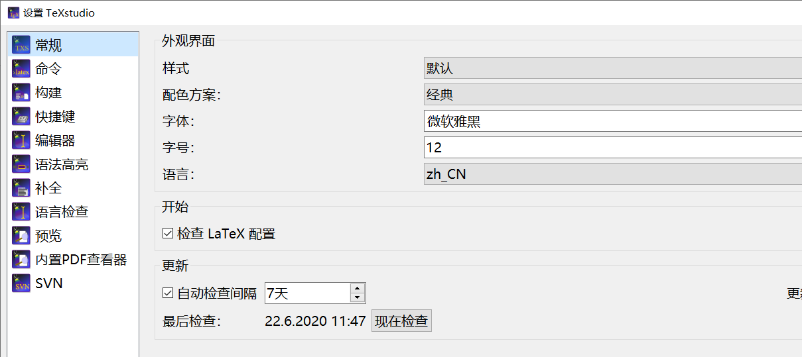

至于代码区的字号可以通过<kbd>ctrl+鼠标滚轮</kbd>调整

## 修改默认的编译器

打开TeXstudio -> 按<kbd>alt+o</kbd> -> 选择 `设置TeXstudio` -> `构建` -> `默认编译器` -> `XeLaTeX`（因为XeLaTeX对中文有良好的支持，如果你的论文完全不考虑中文的显示和排版，则不需要改这个）。设置了默认的编译器后，可以

## 自定义快捷键

为了提高写作效率，我会修改一些快捷键。

打开TeXstudio -> 按<kbd>alt+o</kbd> -> 选择 `设置TeXstudio` -> `快捷键`

1. `命令 -> 章节`, 其中节，小节，子小节的快捷键依次设置为<kbd>ctrl+1</kbd>,<kbd>ctrl+2</kbd>,<kbd>ctrl+3</kbd>,这三个快捷键原来是绑定在书签上的，更改后可以用这三个快捷键设置一级标题h1，二级标题h2，三级标题h3
2. `表格操作->添加行`， <kbd>ctrl+alt+a</kbd>
3. `向导->插入图片`, <kbd>ctrl+shift+i</kbd>
4. `罗列环境->\item`, <kbd>ctrl+\`</kbd>
5. `Idefix->注释或取消注释`: <kbd>ctrl+/</kbd>
6. `LaTex->\usepackage`：<kbd>ctrl+u</kbd>，注意宏包的使用声明必须在正文（`\begin{document}`）之前
7. `向导->插入表格`: <kbd>ctrl+t</kbd>
8. `向导->插入图片`: <kbd>ctrl+shift+i</kbd>
9. `向导->矩阵`:<kbd>ctrl+m</kbd>
10. `LaTex->罗列环境->\item`: <kbd>ctrl+\`</kbd>
11. `帮助->LaTex引用...`:<kbd>ctrl+h</kbd>
12. `编辑->行操作->上移行`:<kbd>alt+up</kbd>
13. `编辑->行操作->下移行`:<kbd>alt+down</kbd>
14. `编辑->行操作->复制行`:<kbd>alt+shift+down</kbd>

## 迷惑error的处理

编译tex文件会在同级目录下生成 `*.log,*.aux, *.bbl, *.blg, *.out,*.synctex.gz`之类的辅助文件,这些文件的存在可以加速你的再编译,同时可能导致你修改了正文某些内容(比如添加新宏包)后出现难以理解的bug。

清理掉这些文件再编译可能会有所帮助

## 多文件写作

正文可以用一个tex文件编写,也可以按照章节划分成多个子文件分开编写。

在正文里添加 `\include{subfilename(不需要后缀)}`，则会在编译时会把 main.tex同级目录下 `subfilename.tex`导入到 include位置后再进行渲染输出

快捷创建子文件的小技巧：可以先在主文件里include了，再按住 <kbd>ctrl</kbd>点击被include的文件名，如果文件不存在，则会提醒你是否创建该文件，确定后在同级目录生成该文件的 `.tex`文件

拆分成多文件来写作的使用场景一般是论文多人协作或写书

## 利用bib文件引用文献

在tex文件同级目录创建 `.bib`后缀的文件，习惯上以`ref.bib`命名。

实际上一般不会直接手打bib内容，而是使用文件检索网站的导出功能，直接导出bib文件

搜索参考文献可以使用百度学术，登录百度学术后搜索论文。对所有所需论文点击批量引用，点击右下角浮动按钮会出现一个引用文献列表，点击 `导出至`，选择 `BibTex(.bib)`直接生成bib文件

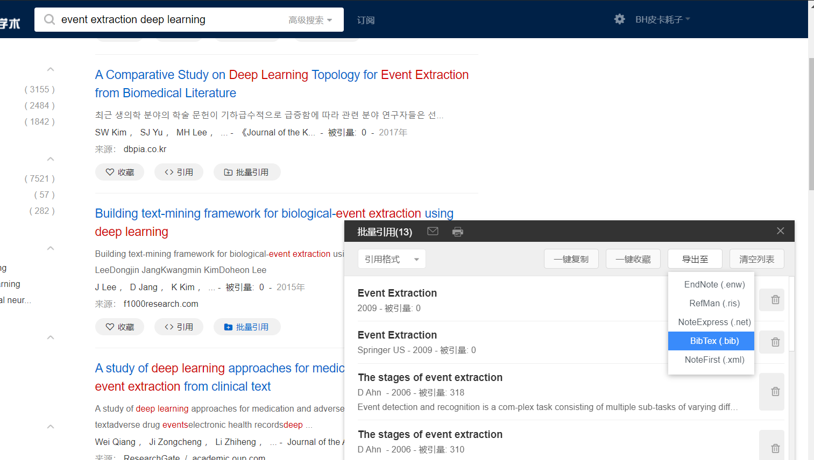

也可以对单篇论文点击引用，弹出的对话框选择导入链接： `BibTeX`

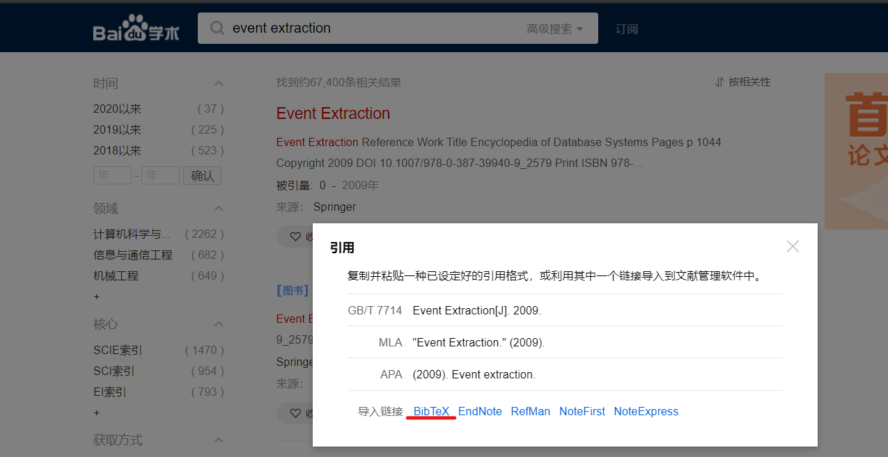

会返回bib格式的引文信息如下，把它粘贴到bib文件内即可

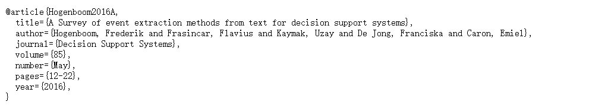

大括号里的第一个字段`Hogenboom2016A`是你引用文献的ID，你可以随意修改这个名字（建议改短一点），只要保证在bib文件中的所有ID不出现重复即可。

**引用文献的方法**：在正文引用位置添加 `\cite{ID}`，

**编译前正文中必要的操作**：

- 指定文献格式：` \bibliographystyle{splncs04}`，splncs04是从springer下载的lncs latex模板自带的bst文件，规定了文献列表的格式
- 指定bib文件：在要放置参考文献的位置添加 `\bibliography{ref}`。（`ref`是同级目录下的`.bib`文件的名字）。编译后参考文献列表在该位置生成

## 常用快捷键

-  <kbd>ctrl+b</kbd> :加粗
-  <kbd>ctrl+i</kbd> :斜体
-  <kbd>ctrl+e</kbd> : 添加环境，即插入`\begin{name}content\end{name}`文本
-  <kbd>ctrl+shift+m</kbd>:插入行内数学公式
-  <kbd>ctrl+shift+n</kbd>:添加带自动标号的数学公式
-  <kbd>ctrl+k</kbd>:删除行
-  需要在数学公式环境内使用的快捷键
    -  <kbd>ctrl+shift+d</kbd>:下标
	-  <kbd>ctrl+shift+u</kbd>:上标
	-  <kbd>ctrl+shift+f</kbd>:分数
	-  <kbd>ctrl+shift+q</kbd>:根号
	-  <kbd>ctrl+shift+l</kbd>:\left
	-  <kbd>ctrl+shift+r</kbd>:\right

## 打印空格和新行

打印空格：`\quad`

打印新行，段落间存在一行以上的空行才会在输出结果中换行

## 数学公式环境

`$ $`:行内数学模式

`$$ $$`或 `\[ \]`:行间数学公式

`\begin{equation}\label{key}\end{equation}`:带序号的数学公式

矩阵环境：按快捷键 `ctrl + m`(前面自定义的)，启用矩阵向导来操作比较方便

一组公式：一般使用array环境或align环境，加星号表示不标号，环境内 通过 `&`对齐，通过 `\\`换行

[多行公式对齐](https://blog.csdn.net/weixin_44378835/article/details/104201567)

[公式符号大全](https://blog.csdn.net/garfielder007/article/details/51646604)

## 插入图片

导入宏包：`\usepackage{graphicx}`

使用自定义的快捷键<kbd>ctrl+shift+i</kbd>启动插入图片向导

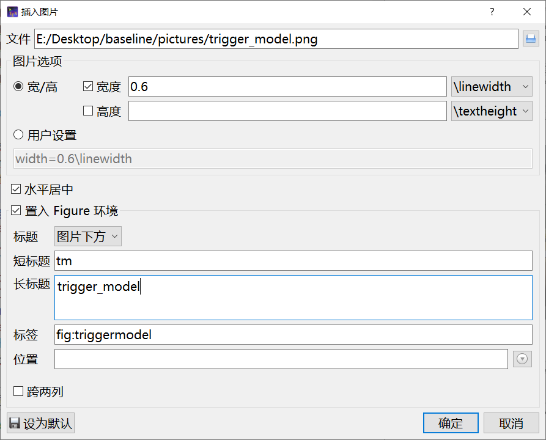

这里长标题加了个下划线，这不是我想要的，因为latex会把下划线+字母解释成下标，后面我把下划线改成空格了

请注意检查标题名是否出现了latex的特殊字符

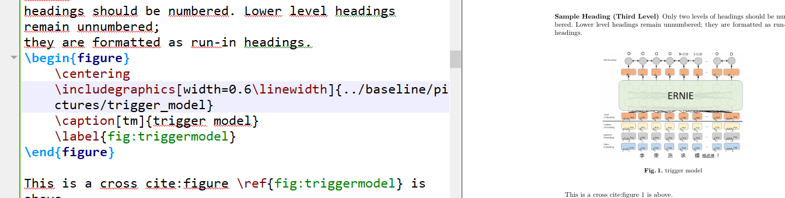

生成的代码如下：

```latex
\begin{figure}
	\centering
	\includegraphics[width=0.6\linewidth]{../baseline/pictures/trigger_model}
	\caption[tm]{trigger model}
	\label{fig:triggermodel}
\end{figure}
```

`\centering`表示图片居中显示

`\caption`是图片的标题，如果这个东西在 `\includegraphics`上面，则标题生成在图片上方，反之在下方

`\label{fig:xxx}`用于交叉引用

交叉引用图片的命令：`\ref{label名}`，会在引用处生成该图片的序号

## 插入表格

使用自定义快捷键 `ctrl+t`启用表格向导

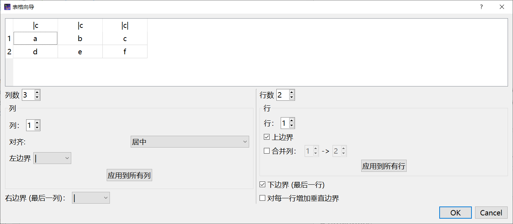

这个向导生成的代码是酱紫的

```
\begin{tabular}{|c|c|c|}
	\hline 
	a & b & c \\ 
	\hline 
	d & e & f \\ 
	\hline 
\end{tabular} 
```

连个table环境都不给我 = __=|||

个人更喜欢直接敲代码模板生成三线表,效果如下

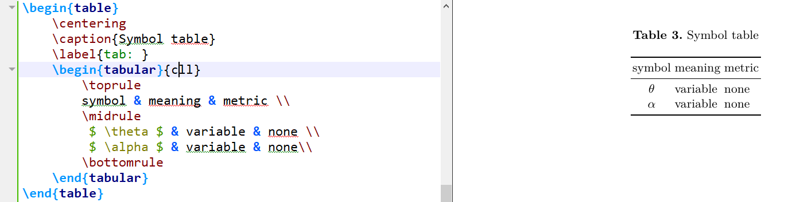

首先导入宏包 ：`\usepackage{booktabs}`，代码如下

```latex
\begin{table}
    \centering
    \caption{}
    \label{tab: }
    \begin{tabular}{cll}
        \toprule
            &  &  \\ 
        \midrule
        & &  \\ 
        \bottomrule
    \end{tabular} 
\end{table}
```

与插入图片类似，`\centering`居中，`\caption`表格标题，`\label`用来交叉引用，引用方法依然是 `\ref{label name}`

 \`toprule`,`\midrule`, \`bottomrule`分别就是三线表的顶部、第二行，底部三条线，必须要导入booktabs宏包才能通过编译

然后，把上面的代码手打一遍是很麻烦的，所以我编了一个宏，只需要在编辑时按快捷键 `shift+f1`即可生成上面的代码

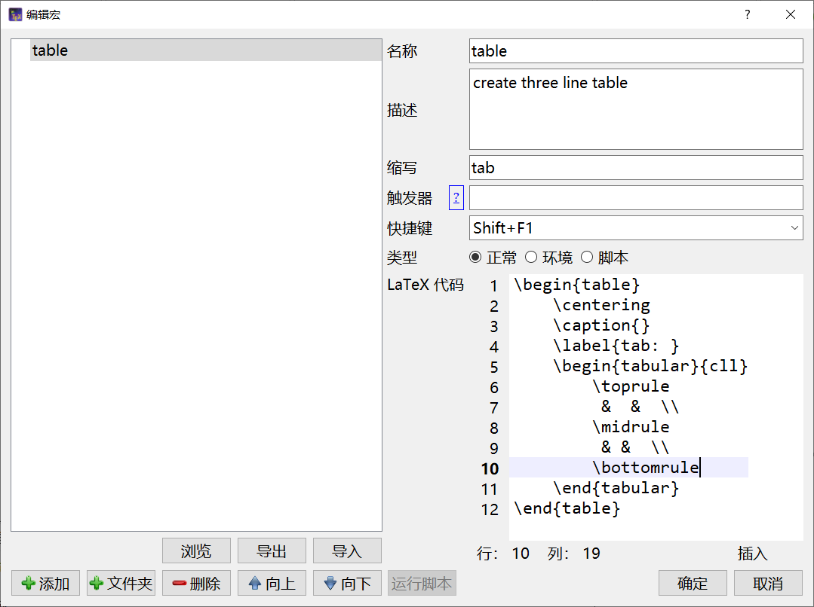

## 设置中文显示

1. 编译器设置为XeLaTex
2. 导入ctex宏包：`\usepackage{ctex}`

为了在tex文件中显示指定编码和编译器，可以在tex头部加入以下两行魔法注释

```tex
% !Mode:: "TeX:UTF-8"
% !TEX program  = xelatex
```


## 代码插入

对源代码进行高亮显示，使用lstings宏包 `\usepackage{listings}`

```tex
\begin{lstlisting}[language=python]
python code...
\end{lstlisting}
```

想要自定义高亮格式，使用xcolor宏包 `\usepackage{xcolor}`,并添加如下声明

```latex
\lstset{
    %backgroundcolor=\color{red!50!green!50!blue!50},%代码块背景色为浅灰色
    rulesepcolor= \color{gray}, %代码块边框颜色
    breaklines=true,  %代码过长则换行
    numbers=left, %行号在左侧显示
    numberstyle= \small,%行号字体
    keywordstyle= \color{blue},%关键字颜色
    commentstyle=\color{gray}, %注释颜色
    frame=shadowbox%用方框框住代码块
    }
```

效果如下：

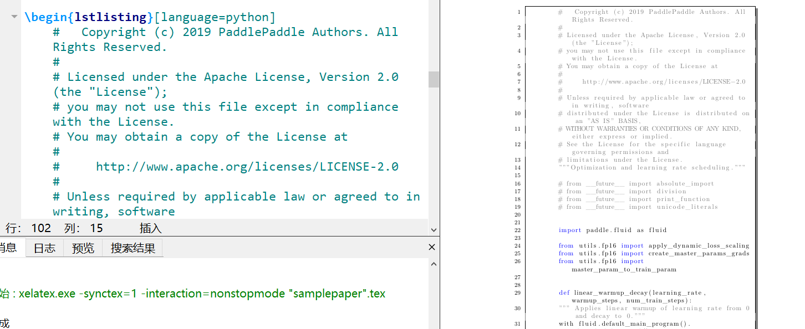

## 辅助工具

[mathpix公式图片转latex](https://mathpix.com/)

[在线公式编辑器](http://latex.codecogs.com/eqneditor/editor.php)

## 资深玩家专区

以下的内容仅适合闲的蛋疼想自己制作排版格式的人，赶着写论文的人可以跳过此节。

### 设置字体与字号

（以后再说）

[字体设置](https://blog.csdn.net/weixin_44537194/article/details/87720878)

[修改字体字号大小](https://blog.csdn.net/yq_forever/article/details/84023896?utm_medium=distribute.pc_relevant_t0.none-task-blog-BlogCommendFromMachineLearnPai2-1.nonecase&depth_1-utm_source=distribute.pc_relevant_t0.none-task-blog-BlogCommendFromMachineLearnPai2-1.nonecase)

### 设置自定义命令

[LaTeX自定义命令和环境](https://blog.csdn.net/sdu_hao/article/details/101392629)

```tex
\newcommand<命令名称>[<参数个数>][<首参数默认值>]{<具体定义>}
\renewcommand<命令名称>[<参数个数>][<首参数默认值>]{<具体定义>}
\newenvironment{<环境名称>}[<参数个数>][<首参数默认值>]{<环境前定义>}{<环境后定义>}
\renewenvironment{<环境名称>}[<参数个数>][<首参数默认值>]{<环境前定义>}{<环境后定义>}
```


### 左对齐、右对齐、居中对齐

```tex
\begin{flushleft}
	left aligned
\end{flushleft}
\begin{flushright}
	right aligned
\end{flushright}
\begin{center}
	center aligned
\end{center}
```

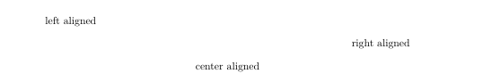


## 参考资料

https://blog.csdn.net/da_kao_la/article/details/83105948

https://blog.csdn.net/yq_forever/article/details/84023896?utm_medium=distribute.pc_relevant_t0.none-task-blog-BlogCommendFromMachineLearnPai2-1.nonecase&depth_1-utm_source=distribute.pc_relevant_t0.none-task-blog-BlogCommendFromMachineLearnPai2-1.nonecase

https://blog.csdn.net/weixin_44378835/article/details/104201567

https://blog.csdn.net/garfielder007/article/details/51646604