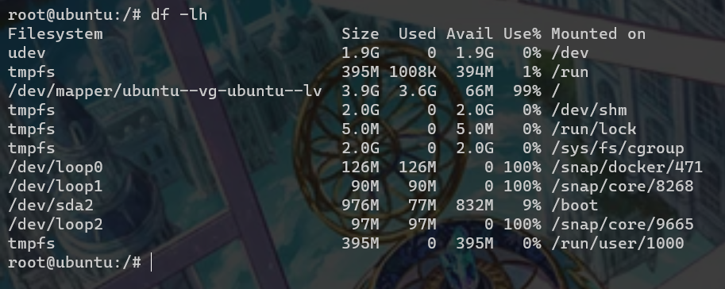
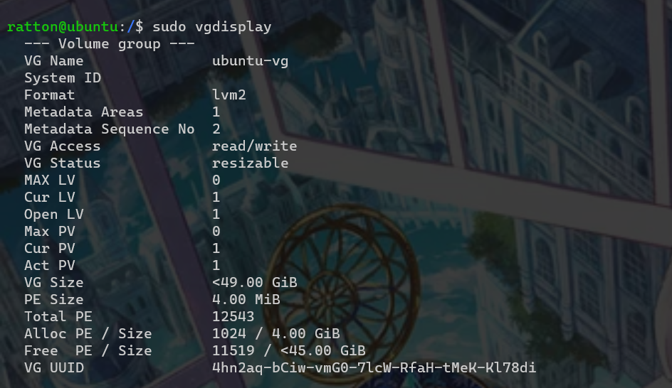
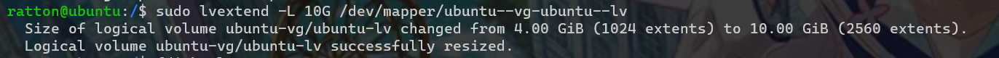

# 安装linux实验环境

1. 安装virtual box

2. 安装ubuntu18.04,用户名为ratton

    mirrors：https://mirrors.tuna.tsinghua.edu.cn/ubuntu/

3. 配置网络

    注意连接方式为桥接网卡，如果是连wifi上网，则选中带有wireless的；如果是插网线的，则选中controller

    

4. 设置静态路由

    ```
     sudo vi /etc/netplan/50-cloud-init.yaml
    ```

    ```
    network:
        ethernets:
            enp0s3:
                dhcp4: false
                addresses:
                    - 192.168.0.233/24
                gateway4: 192.168.0.1
                nameservers:
                    addresses: [192.168.0.1]
    
        version: 2
    ```

    使应用生效

    ```
    sudo netplan apply
    ```

    

5. 修改宿主机hosts

    添加到`C:\Windows\System32\drivers\etc\hosts`文件行尾

    ```
    192.168.0.233 ubuntu
    ```

    

6. windows terminal远程登录

```
ssh ratton@ubuntu
```


7. 设置时区

```
timedatectl set-timezone Asia/Shanghai
```


8. 给Linux扩容

    ```bash
    fdisk -l#查看物理磁盘使用情况
    du -lh#查看逻辑卷使用情况
    ```

    

    

     `/dev/mapper/ubuntu--vg-ubuntu--lv`这玩意空间不足了，为啥，因为lv只分配了4G实际上，你还有几十G的空闲磁盘没有被使用，所以接下来要做的就是把空闲的磁盘挂载到lv上

    ```bash
     sudo vgdisplay	
    ```

    

    可以看到有45G左右的空闲磁盘可以用于扩容

    扩容命令

    ```bash
    sudo lvextend -L 10G /dev/mapper/ubuntu--vg-ubuntu--lv#给lv扩容10G
    ```

    

    也可以将空闲磁盘全部用于扩容

    ```bash
    sudo lvextend -l +100%FREE /dev/mapper/ubuntu--vg-ubuntu--lv	
    ```

    此时使用`df -h`发现并没有变化，我们需要手动执行重新计算磁盘大小的命令

    ```bash
    sudo resize2fs /dev/mapper/ubuntu--vg-ubuntu--lv
    ```

    

    可以看到lv的size从原来的3.9G扩容到了现在的9.8G

    

9. 配置ssh公钥实现免密登录

    在宿主机上生成公钥
    
    ```bash
    ssh-keygen
    ```
    
    
    
    ```bash
    cat .ssh/id_rsa.pub
    ```
    
    将打印的内容复制下来，添加到远程主机的`~/.ssh/authorized_keys`中，如果不存在则自己新建一个，理论上应该可以远程登录了
    
10. 安装docker

    添加 Docker 的官方 GPG 密钥：

```
curl -fsSL https://mirrors.tuna.tsinghua.edu.cn/docker-ce/linux/ubuntu/gpg | sudo apt-key add -
```

​	使用以下指令设置稳定版仓库

```
sudo add-apt-repository "deb [arch=amd64] https://mirrors.tuna.tsinghua.edu.cn/docker-ce/linux/ubuntu/ $(lsb_release -cs) stable"
```


更新索引

```
sudo apt update
```

安装docker

```
sudo apt install docker-ce docker-ce-cli containerd.io
```

启动docker

```
service docker start
```

开机自启动docker

```
 systemctl enable docker
```

测试是否正常

```
sudo docker run hello-world
```


非root用户使用docker

```
sudo usermod -aG docker ratton
```

搜索镜像

```
docker search <image-name>
```

可以在[官网](https://hub.docker.com/)搜索镜像，查看所有的版本号，确定想要下载的镜像

下载mysql

```
docker pull mysql
```

默认下载最新的，可以指定版本号下载

```
docker pull mysql:5.7
```

下载tomcat

```
docker pull tomcat
```

| 操作             | 命令示例                                        | 说明                                                         |
| ---------------- | ----------------------------------------------- | ------------------------------------------------------------ |
| 查看本地镜像     | docker images                                   |                                                              |
| 启动一个容器     | docker run --name myredis -d redis -p 6379:6379 | 后台运行redis容器，容器定义为myredis，-p参数表示端口映射，如果不确定映射的端口号可以先不加-p，运行后通过docker ps查看端口号 -p 8888:8080表示容器的8080端口映射到虚拟机的8888 |
| 删除镜像         | docker rmi 容器id                               |                                                              |
| 查看容器日志     | docker logs 容器名或容器id                      |                                                              |
| 查看运行中的容器 | docker ps                                       |                                                              |
| 停止容器         | docker stop < image-id >                        | 如果无法停止，尝试`sudo aa-remove-unknown`                   |
| 删除容器         | docker rm < image-id>                           | 删除前需要停止容器                                           |

~~如果还是访问不了tomcat，尝试关闭linux防火墙~~

### 创建mysql容器

去官网[dockerhub](https://hub.docker.com/s)查mysql的使用说明，发现运行容器需要指定密码

```bash
docker run --name mysql-5.7 -p 3306:3306 -v /home/ratton/mysql/data:/var/lib/mysql  -v /home/ratton/mysql/conf:/etc/mysql/conf.d -v /home/ratton/mysql/logs:/var/log -e MYSQL_ROOT_PASSWORD=YWRtaW4yMzM= -d mysql:5.7 --character-set-server=utf8mb4 --collation-server=utf8mb4_unicode_ci
```

进入mysql-client

```
 docker exec -it mysql-5.7 mysql -uroot -pYWRtaW4yMzM=
```

创建用户

```mysql
CREATE USER 'developer'@'%';
# 创建一个账号，用来进行远程访问；
# '%'代表的是所有IP，如果可以尽量设置指定 IP 或 IP 段
GRANT ALL ON *.* TO 'developer'@'%';
# 赋予所有权限给之前创建的账号
FLUSH PRIVILEGES;
# 刷新权限
```


### 创建tomcat容器

```bash
 docker run -d -p 8080:8080 --name tomcat tomcat
```

将docker的8080端口映射到了虚拟机的8080端口，所以要注意了，在宿主机上的localhost和虚拟机ip是不一致的，如果按照思维惯性在宿主机敲localhost加端口号是没有用的

### 创建redis容器

```bash
 docker run --name redis -p 6379:6379 -d redis redis-server --appendonly yes
```

本地目录和docker目录文件传输

```
docker cp 虚拟机目录 容器id/目录 
docker cp  容器id/目录  虚拟机目录
```

下载消息中间件

```
docker pull rabbitmq
```

下载全文检索

```
docker pull itzg/elasticsearch
```

# 配置springboot数据源

引入maven依赖

```xml
<dependency>
    <groupId>com.alibaba</groupId>
    <artifactId>druid</artifactId>
    <version>1.1.23</version>
</dependency>
```

springboot2.3.1.RELEASE默认数据源

```
class com.zaxxer.hikari.HikariDataSource
```

使用druid数据源

```
spring:
	datasource:
		type: com.alibaba.druid.pool.DruidDataSource
```

## 服务器服务一键启动脚本

```mysql
docker start mysql
docker start tomcat
docker start redis
```

## 