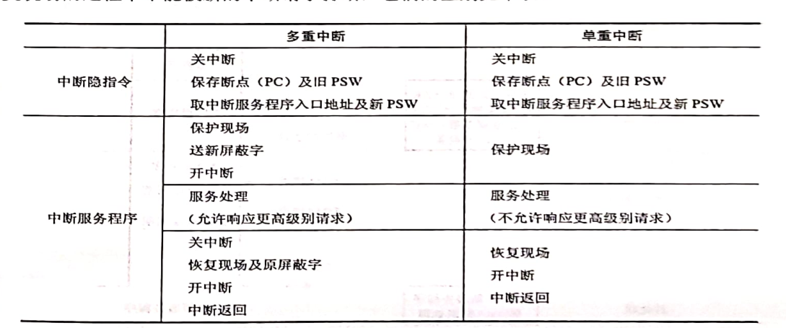

# 知识点总结

author: ratton

> [toc]

 

## 政治

1.  充分吸收人类一切文明成果属于探索*符合本国国情（不是未来）*的社会主义发展道路

2.  在重要领域和关键环节改革上更多自主权的具体方式是清单批量授权

3.  全心全意为人民服务是革命道德和剥削阶级道德的*根本*区别，是贯穿中国革命道德始终的一根红线

4.  事物发展的*源泉和动力*是对立统一规律，*形式和状态*是量变质变规律，*方向和道路*是否定之否定规律，*结构和功能*是系统论

5.  党的领导是中特社最本质的特征*不*是由宪法决定的

6.  《中华人民共和国香港特别行政区维护国家安全法》是在十三届全国人大常委会第*二十*次而不是第三次会议zz [zou]通过的

7.  

8.  采用和平赎买政策*不*是*始终*坚持四马分肥

9.  西迁精神与创业无关

10.  劳动者是国家的主人

11.  直接教育党员、管理党员、监督党员的*不*是党中央，而是党支部

12.  1949人民政协第一届会议和1945重庆政治协商会议都有多党派参加，不同点在于前者共产党处于领导地位

13.  讲好中国故事*不*是掌握互联网战场主动权的重中之重，重中之重是理直气壮地唱响网上主旋律，巩固壮大主流思想舆论

14.  中特社新时代还*没有*站在世界舞台中央，只是日益走向中央

15.  揭示了私有制条件下商品经济的基本矛盾的*不是*剩余价值理论，而是劳动价值论

16.  当代资本主义发生的变化没有改变经济危机周期性发生

17.  价值评价的正确性依赖于价值选择的合理性是*错的*， 只有先做出评价才能有合理的价值选择

18.  市场手段比计划手段对经济活动的调节更有优势是*错*的，他们各有优势

19.  社会劳动生产率提高导致单位时间的价值量下降而*不*是提高

20.  重大的历史进步都是在一些重大的灾难之后，体现了矛盾双方相互转化，蕴含相同哲理的有塞翁失🐴，焉知非福

21.  不经一事，不长一智*不*体现矛盾双方相互转化，而是体现实践是认识的来源

22.  从一次商品交换来看， 市场价格和其价值大多是*不*一致的

23.  “国民党正在堕落中死亡，因此要救活它， 就需要新鲜血液”。新鲜血液是指以党内合作方式以共产党合作

24.  法制体系的*重点*是实施， *前提*是规范

25.  ###### 英雄造时势是*错*的，夸大了杰出人物的历史作用		

26.  

27.  不成功的实践也可以推动人们的认识

28.  国家资本主义的产生*缓和*了社会矛盾

29.  党的成立改变了世界发展的格局

30.  妇女在依法治国总的主体地位得到尊重和保障是*错*的，妇女不是依法治国的主体

31.  法律上的男女平等意味着*人人*既充分享有法律规定的各项权利，有切实履行法律规定的各项义务 

32.  确保高质量完成脱贫攻坚目标任务作出的重大部署*不*包括明显提升贫困群众“两不愁”质量水平，集中解决“三保障”突出问题， 这是成果不是部署

33.  尊重市场经济一般规律，必须做到最大限度减少而*不*是取消对市场资源的*直接*配置，也*不*能杜绝政府对微观经济活动的干预

34.  劳动过程和价值形成的统一对应普通商品生产， 劳动过程和价值增殖对应资本主义生产

35.  为社会成员的发展创造条件，强调的*不*是权利公平，而是机会公平

36.  严格规范公正文明执法，提高司法公信力是维护民法典权威的有效手段

37.  不再将民族资产阶级称为中间阶级是在民主革命遗留任务完成时提出的， 而是社会主义改造完成后

38.  科技*不*是社会变革中的*自主性*力量，只有人才是自主性力量

39.  推进五位一体总布局中，推动高质量发展*不*是根本动力，而是主题，改革创新才是根本动力

40.  党建*根本方针*是“坚持党要管党，全面从严治党”，*鲜明品格*是“勇于自我革命，从严管党治党”，*宗旨*是全心全意为人民服务

41.  矛盾双方相互依存又互相转化，但不能说矛盾的同一性和斗争性相互依存又相互转化

42.  *失败*证明了党的*正确*领导是红色政权存在的重要条件

43.  洋务运动的*指导*思想*不*是自强、求富，而是中体西用；自强求富是洋务运动的*主张和目标*，师夷长技以制夷是洋务运动的*初衷、目的*

44.  抗日战争胜利的*决定*因素是民族精神，*关键*是党的中流砥柱作用

45.  放手发动人民群众主要是农民群众*不*是争取中间势力的做法，而是发展进步势力的做法

46.  人民军队的*核心*是能打胜仗，*灵魂*是听党指挥，*保证*是作风优良

47.  超额利润永远*不会*消失

48.  不能将房地产作为短期刺激经济的手段， 不能重回强刺激的老路

49.  利润转化为平均利润的过程，同时也是生产*要素*在不同部门之间流动的过程，是资本家集团重新瓜分剩余价值的过程，是*价值*转化为生产价格的过程

50.  人民日益增长的物质文化需要同落后的社会生产之间的矛盾*不*是中共八大提出来的

51.  构建人类命运共同体是*外交*的目标，与高质量发展*无关*

52.  加快资本周转速度*不*能提高利润率

53.  保障粮食安全必须摆在突出位置上

54.  加强顶层设计和摸着石头过河是符合中国的国情的改革

55.  治大国，若烹小鲜，体现了要坚持适度原则

56.  中国精神是“扭动定”， 且是中华民族赖以长久生存的灵魂

57.  国民党撕毁了政协协议，所以不存在强迫国民党统治集团履行了政协协议

58.  中国共产党的初心和使命只有谋幸福和谋复兴，*不*包括为解放人类而奋斗、为全体人民谋福利

59.  马克思主义方法论原则包括立足于揭示*未来*社会的一般特征，而不可能对各种细节做具体描绘

60.  社会再生产顺利进行的基本条件*不*包括资本的三种职能形式在空间上并存、时间上继起，而是包括实际生产过程中所耗费的生产资料和消费资料得到*实物*的替换，*两大部类*内部各个产业部门之间和两大部类之间保持一定的比例关系，生产中所耗费的资本在价值上得到补偿

61.  衡量社会意识是否先进，*不*在于xxx的发展水平，而是在于是否有利于社会生产力的发展

62.  救济公平*不*包括权利救济，而是包括社会、行政、司法

63.  中国对特别行政区有*全面*管治权，*没有*行政指导权

64.  以军事斗争作为党的工作重心*不*是在遵义会议上提出的，而是在八七会议上提出的

65.  1938《论新阶段》提出了“马克思主义中国化”的命题

66.  要实现党对被领导阶级、阶层、政党和人民团体的领导，必须具备的条件*只有*2个：1. 带领同盟者同敌人斗争并取得胜利；2. 给同盟给予物质福利，至少不损害其利益，同时给予政治教育

67.  1939《中国革命和中国共产党》*第一次*提出了新民主主义革命的科学*概念*和新民主主义*总路线*的内容

68.  1948《在晋绥干部会议上的讲话》第一次*完整*表述了新民主主义革命*总路线*的内容：无产阶级领导、人民大众的、反帝反封建反官资

69.  1936《中国革命战争的战略问题》*系统*说明有关中国革命战争战略方面的各种问题

70.  共产主义的旗帜在中国大地上树立起来的标志*不*是中共一大的召开，而是《共产党》（月刊）的创办

71.  人与自然相处的*首要*态度是尊重自然，*基本*原则是顺应自然

72.  党建的*主线*是加强党的长期执政能力建设、先进性和纯洁性建设，*统领*是政治建设，*根基*是坚定理想信念宗旨，*着力点*是调动全党积极性、主动性、创造性，*基础性建设*是思想建设

73.  国家安全的*根本*是政治安全，*宗旨*是人民安全，*准则*是国家利益至上，*基础*是经济安全，*依托*是国际安全，*保障*是军事、文化、社会安全

74.  *单位*时间内生产的商品的*总价值量*与劳动生产率的变化没有关系

75.  生产*资料*的价值是借助于生产者的*具体*劳动转移到新产品中

76.  网络*语言*是思维的物质外壳

77.  辩证唯物主义认识论和唯心主义认识论、旧唯物主义认识论的根本区别在于十分承认社会*实践*是认识的基础

78.  中国特色社会主义制度*不*坚持把我国基本国情和国际局势变化结合起来，因为中国的社会制度不会因为国际局势的变化而改变

79.  我国的社会主义基本经济制度包括社会主义市场经济体制，公有制为主体，多种所有制经济共同发展，按劳分配为主体，多种分配方式并存，*不*包括现代化经济体系

80.  抗日战争的胜利*没有*确立实现中华民族伟大复兴的*政治前提*，新中国的成立才是其政治前提

81.  抗日民族统一战线的*新*政策是在1935年瓦窑堡会议提出的，*不*是在1938年的《论持久战》提出的

82.  林永升是甲午战争时牺牲的

83.  新发展理念的指导意义*不*是*初步*科学回答了“实现怎么样的发展、怎样发展”的问题，而是对该问题的*进一步*回答

84.  《共产党人发刊词》指出资产阶级民主革命的基本特点是统一战线（无产阶级同*资产阶级*建立统一战线）和武装斗争

85.  利润转化为平均利润的过程*不*是资本有机构成提高的过程，而是资本在不同部门之间发生转移的过程，是价值转化为生产价格的过程

86.  *列宁*提出的社会主义的新构想包括采用*合作社*形式和进行*文化革命*

87.  马克思主义认识论与旧唯物主义认识论的区别*不*在于是否承认客观事物是认识的对象，而在于是否承认社会实践是否是认识的基础，是否承认认识发展的辩证过程

88.  法律运行的关键环节*不*是立法，是法律*制定*

89.  社会主义道德的核心是为人民服务，原则是*集体主义*

90.  驱除鞑虏，恢复中华是*民族*革命内容；创建民国是*政治*革命内容；平均地权是*社会*革命内容

91.  事物的发展是从量变到质变再到新的量变的*循环往复*的上升过程

92.  台儿庄在山东枣庄市，太原在山西，百团大战在华北（主要在山西、河北），枣宜会战是在湖北枣阳和宜昌地区，鲁南是指山西南部

93.  四个伟大*不*是活的灵魂,而是党的历史使命

94.  深化供给侧改革的总要求是巩固、增强、提升、畅通

95.  实践与认识*不*是合一的， 只能是辩证统一的；*意识*活动与其他*物质*形式具有*同一*性

96.  全面建成小康社会被升华为全面建设社会主义现代化国家

97.  《在晋绥干部会议上的讲话》完整地表述了新民主主义革命*总路线*的内容，所谓“完整”，是指加上了*反对官僚资本主义*

98.  形成商品价值量的劳动*不*是以抽象劳动为尺度计算的，而是以*简单劳动*为尺度计算的

99.  实践与认识的统一需要不断提升主体素质

100.  整个上层建筑中处于核心的*不*是政治上层建筑，而是国家政权

101.  道德的主要功能*不*包括沟通功能

102.  如果既有好的一面，又有坏的一面，这可以说明事物包含着对立统一的两个方面

103.  革命道路*不*属于总路线的内容

104.  中华共和国是1933年成立的，只维持了50多天，*不*等同于中华人民共和国

105.  新事物之所以为新，是因为其有新的要素、结构和功能

106.  辩证的否定*不*是事物发展的动力，事物的矛盾运动才是

107.  提高劳动生产率*不*是*绝对*剩余价值的生产方式，而是*相对*剩余价值的生产方式3

108.  法治体系，*实施*是重点

109.  民族团结主线是*铸牢中华民族共同体意识*

110.  形而上学唯物主义物质观割裂了自然界与人类社会的*物质统一性*

111.  创建合众政府是在成立兴中会时提出来的；

112.  *新民主主义理论*的形成是在全面抗日时期

113.  事物的性质*不*是由事物内部矛盾运动决定的，而是由矛盾的*主要方面*决定的

114.  辩证发展*不*是马哲和唯心主义哲学的区别，因为唯心主义者黑格尔也是讲辩证法的

115.  *计划订货*是私营*工业*采取的社会主义萌芽的国家资本主义形式

116.  xxx是社会主义*市场*经济的重要组成部分

117.  军委主席负责制*不*是党领导军队的根本制度，根本制度应该是*首长分工负责制*

118.  共享---社会公平主义；开放--发展内外联动问题；创新--发展动力问题；协调--发展不平衡问题

119.  民营经济是我国经济制度的内在*要素*

120.  *《五四指示》*指出不可将农村反对封建阶级的方法运用到城市反对工商业资产阶级的斗争

121.  揭开了社会主义改革开放的序幕的*不*是“关于真理标准问题的大讨论”

122.  《巴黎协定》是国际气候变化公约

123.  剩余价值率=剩余价值/可变资本

124.  最简单的垄断组织形式是 *短期价格协定*

125.  王夫之主张唯物主义， 朱熹主张唯心主义

126.  大团结大联合是*统战主题*

127.  “长期共存，互相监督”方针针对的*不*是政治思想领域的人民内部矛盾，而是*共产党派和民主党派*的矛盾

128.  中华民族第一次*全面*觉醒是在五四运动

129.  天问一号进入太空标志我国开启了火星探测的新征程

130.  联合国宪章的首要原则是大小国相互尊重、一律平等

131.  意识*不*是来源于人脑，而是源于物质

132.  意识*不*是特殊物质，只能说是物质的产物

133.  利润趋于平均化反映资本家于无产阶级之间必然产生阶级斗争

134.  资本家之间在瓜分剩余价值上*不可能*利益一致

135.  “资本主义国家的政党制是一种维护资产阶级统治的政治制度”体现了资本主义政治制度的*局限性* 

136.  社会主义民主政治建设的基础*不*是人民政协，而是基层群众自治制度

137.  全面建成小康社会*不*是实现伟大梦想的要求，而是2020年要实现的目标

138.  三大战役*没有*宣告国民党反动统治覆灭，*占领南京*才是

139.  统购统销*不*是国家资本主义的具体形式

140.  中特制度具有强大的制度优势 *不*是在联合国大会上提出的疫情启示

141.  青山依旧在，几度夕阳红 *不*是体现时间的一维性， 而是 体现*运动*的绝对性和*静止*的相对性

142.  剩余价值=劳动时间*每小时创造的价值-劳动力价值

143.  新民主主义社会时期国民经济总占*绝对*优势的*不*是社会主义国营经济，而是个体经济

144.  提升中华文化影响力的基本途径是*讲好中国故事*

145.  人民军队的根本优势*不*是全心全意为人民服务， 而是党对军队的绝对领导

146.  喊出振兴中华最强音是在创建*兴中会*上提出的

147.  客观规律性与主观能动性统一的基础*不*是提高认识能力，而是实践

148.  真理和谬误是有严格界限的

149.  认识世界的目的*没有*除改造世界*之外*的目的

150.  两大部的平衡是社会总资本的循环问题，*不是*影响资本周期快慢的关键因素，产业资本的顺利循环也*不是*

151.  原则和实践的一致性*可以*体现社会主义民主制度特点和优越性；服从多数意志的原则和法律面前人人平等*不*体现其优越性

152.  2020-2035要求实现我国进入高收入国家行列

153.  共同富裕*不*是2020-2035年的目标，而是2035-2050年的目标

154.  缩小城乡区域发展差距，就是要缩小国内生产总值和增长速度的差距

155.  2020年的脱贫攻坚座谈会的主要任务*包括*了克服新冠肺炎疫情影响

156.  1917年的十月革命是1919五四运动爆发的历史背景之一

157.  国家和民族的胎记*不*是民族精神，而是文化传统

158.  公平普世性*不*体现法律至上， 这是西方价值观的表述

159.  抗疫展现了*中华文明*的深厚底蕴

160.  中美达成第一阶段经贸协议说明中美双方完全可以通过对话磋商妥善处理和有效解决有关问题

161.  辨证唯物主义历史观的基本观点*不*是马克思主义发展观，而是马克思主义实践观

162.  邓小平理论轮廓的形成*不*是第一次对社初阶段理论作出系统概括，而是对中特社理论作出系统概括

163.  发展慈善等公益事业属于除初次分配和再分配*之外*的第三次分配

164.  做好党的新闻舆论工作，放在第一位的*不*是外交方向，而是政治方向

165.  帝国主义从中国攫取利益最主要的出发点是适应资本主义经济发展的阶段性要求

166.  新时代党建工作的主线不是守初心，而是学习贯彻习新时代中特社思想

167.  人民经过努力可以创造事物发展所需要的条件

168.  把握好事物的内部矛盾与外部矛盾，很可能在题干中不体现内部矛盾

169.  生产关系特指经济关系，*不*能笼统的说生产关系就是人们在生产实践过程中的一切社会关系（社会关系包括了经济，法律，政治等关系）

170.  意识形态*不*是xx阶级创造的，而是基于经济基础产生的上层建筑

171.  资本主义社会创造出的丰富精神文明成果不是资本主义意识形态的本质，而是其表现形式

172.  垄断资本项世界范围扩展的基本形式*不*包括国家资本输出， 后者是从输出资本的来源来看的，*不*是基本形式

173.  人的自由而全面的发展是共产主义社会的*根本*特征和马克思主义追求的*根本*价值目标

174.  中特进入新时代*不*是当今时代主题变迁的必然要求，因为时代主题并*没有*变，依然是和平与发展

175.  发挥政府作用要做到的东西*不*包括加强政府对资源的调控力度，因为资源配置应该由市场决定

176.  *不能*把监测预警能力建设放在公共卫生建设的中心位置，因为预警不能解决问题

177.  当今的时代背景是和平与发展*不*是我国奉行独立和平外交政策的原因

178.  秋收主义依旧是以攻打*城市*为目标

179.  理想信念*不*能决定人生道路，人生目的才能决定人生道路

180.  政治责任不是公民的法律责任

## 英语

### 阅读理解的正确姿势

-   先题干后文章（结合题干找中心词）
-   首句串读法
-   少数派原则（作者的态度一般是少数人的态度）
-   找相反关系和时间关系（一般是but后面和now后面的状况是正解）
-   同义词重复出现一般是文章的中心词
-   态度模糊或中立或贬义一般不是答案

### 大作文：惯用句子

1.  The above xxx chart capturing our eyes uncovers the result of xxxx (开头：图表展示了什么样的数据)
2.  Based upon the statistics offered, …..(衔接：数据表明了什么)
3.  xxx, xxx, and xxx are highly acclaimed by xxxx(几个因素赢得了谁的欢呼声)
4.  As is indicated in the chart above,…..
5.  What is reflected in the chart is the most thought-provoking and worth discussing among the general public for the time being.(目前图表反映的东西最发人深省和值得大众讨论)
6.  The contributing factors accounting for this phenomenon could be summarized as follows. To begin with, …. In addition, ….. Last but not least, ….(第二段开头， 可以解释此现象的有关因素总结如下)
7.  In short, xxxxx(第二段结尾)
8.  In my perspective, ….(第三段开头)
9.  Did the trend continue, xxx would (预测)
10.  all walks of life(各行各业）
11.  I dare say that.. (我敢说)
12.  Regrettably, ….(遗憾的是)
13.  …. are sheer nonsense(….是空话)
14.  something substantial（实质性的东西）
15.  The past several years havery witnessed a phenomenon that ......(提及过去的现象）
16.  Gone are the days when … （xxx的日子过去了）
17.  From these graphs, we can draw a conclusion that, ….(从这些图中，我们可以得出结论)
18.  Why does this phenomenon appear? I think there are several possible reasons for this…..(第二段引出原因)
19.  Hence, (因此)
20.  They appeal to taking measures to do
21.  To conclude(总之)
22.  don’t hesitate to
23.  the most sublime(最崇高的)
24.  In fact, it has been universally acknowledged that …
25.  Accordingly, it is imperative for us to take some measures to ….(因此，我们迫切需要采取措施做xxx)
26.  the human beings可以替换成 us humans(同位语)
27.  inevitably, (不可避免的 )
28.  arouse indignation among xxxxx(在xxx中引起愤慨)
29.  There is no reason to make a fuss about this phenomenon(不必对此现象感到大惊小怪)
30.  both a and b are indispensible（a和b都是不可或缺的）
31.  filial piety（孝心）
32.  reiterate(重申)
33.  superficially，…(从表面上看)
34.  Simple as it is, what the picture conveys to us is thought-provoking
35.  xxxx be involved in various activities(xxx参与xxxx活动)
36.  have sb as …..(将某人视为….)
37.  I believe that if these steps are taken, we humans can surmount the challenge we face and will have a brilliant future
38.  It is vividly depicted in the cartoon that 
39.  The various ..... can be categorized as xxx and xxx

### 话题

1.  health
2.  friendship, independence , adherence 

## 408

### 定义

-   **进程特征**

-   -   **动态性：**它由创建而产生，由调度而执行，由撤销而消亡
    -   **程序是指令集是静态的，进程是动态的**
    -   **并发性：**多个进程实体在**一段时间**内同时进行
    -   **独立性：**进程实体是独立运行、独立分配资源和独立接受调度的**基本单位**
    -   **异步性：**各进程**独立、异步**（速度不一致）地运行（这也是并发进程需要引入同步机制的原因）

**多道程序的基本特征**：制约性、间断性、共享性（注意没有顺序性）

**实时系统**：安全可靠，及时响应，资源利用率低

**电算化**：数据处理，与科学计算无关

**临界区**：每个进程中访问临界资源的*那段代码*称为临界区

**处理器的效率**：获得处理器的时间占总运行时间的比例

**流水线吞吐率**：单位时间内流水线所完成的任务数量或输出结果的数量

**流水线加速比**：使用顺序处理方式处理一批任务所用的时间与按流水处理方式处理同一 批任务所用的时间之比

**流水线效率**：即流水线设备的利用率，指流水线中的设备实际使用时间与整个运行时间（流水线运行时间乘以流水线级数）的比值=时空图上任务所占面积/总面积

**简单回路**：除第一个顶点和最后一个顶点外，其余顶点不重复出现的回路称为简单回路

**高级调度**：作业调度；中级调度：内存调度；低级调度：进程调度

**周转时间** = 作业完成时间 - 作业提交时间

**强化碰撞**=CSMA/CD协议中发送数据的站检测到了冲突后，除了立即停止发送外，还要发送32比特或48比特的人为干扰信号，以便让所有用户都知道现在已经快发生了碰撞

*带权周转时间*：$\frac{周转时间}{运行时间}$

**响应比** = $\frac{等待时间+要求服务时间}{要求服务时间}$（其实就相当于带权周转时间）

**操作系统最基本的两个特性**：并发和共享

### FAQ

**为什么要区分用户态和核心态， 两者切换的时机是什么？**

主要目的是保护操作系统，用户态->核心态：中断；核心态->用户态：中断返回

**为什么直到出现中断和通道技术后，多道技术才变得有用？**

中断和通道技术使外部设备和CPU真正并行工作称为可能

**程序和进程的区别是什么**

程序是静态的指令集合，只占据磁盘空间，进程是程序的动态执行过程，需要分配CPU，内存等资源

**进程和程序之间可以形成一对一 什么情况下会形成这样的关系。 一对多、多对一、多对多的关系，请分别举例说明在什么情况下会形成这样的关系**

执行一条命令或运行一个应用程序时，进程和程序之间形成一对一的关系。进程在执行过程中可以*加载执行不同的应用程序*，从而形成一对多的关系；以*不同的参数或数据*多次执行同一个 应用程序时，形成多对一的关系；并发地执行不同的应用程序时，形成多对多的关系。

**父进程创建子进程和主程序调用子程序有何不同？**

父进程创建子进程后，父进程与子进程同时执行（并发）。主程序调用子程序后，主程序暂停在调用点，子程序开始执行，直到子程序返回，主程序才开始执行。

**为什么进程之间的通信必须借助于操作系统内核功能？简单说明进程通信的几种主要方式。**

每个进程有自己独立的地址空间。在操作系统和硬件的地址保护机制下，进程*无法*访问其他进程的*地址空间*，所以必须借助于操作系统的系统调用函数实现进程之间的通信。进程通信的主要有共享内存区、消息传递、管道、共享文件

**什么是多线程？多线程与多任务有什么区别？**

多线程是指在一个程序中可以定义多个线程并同时运行它们，每个线程可以执行不同的任务。 多线程与多任务的区别：多任务是针对*操作系统*而言的，代表操作系统可以*同时*执行的程序 个数；多线程是针对一个*程序*而言的，代表一个程序可以同时执行的线程个数，而每个线程可以 完成不同的任务。

**为什么引入进程的概念？**

并发具有间断性和不可再现性，为了更好的描述和控制并发程序的执行，便引入了进程

**若系统中没有运行进程，是否一定没有就绪进程？为什么？ 若系统中既没有运行进程，又没有就绪进程，系统中是否就没有进程？为什么？ 在采用优先级进程调度时，运行进程是否一定是系统中优先级最高的进程？**

是。若系统中未运行进程，则系统很快会选择一个就绪进程运行。只有就绪队列中无进 程时，CPU才可能处于空闲状态； 不一定。因为系统中的所有进程可能都处于等待态，可能处于死锁状态，也有可能因为 等待的事件未发生而进入循环等待态。 不一定。因为高优先级的进程有可能正处在等待队列中，进程调度会从就绪队列中选择 一个进程占用CPU，这个被选中的进程可能优先级较低。

**支持多进程的并发执行，系统必须建立哪些关于进程的数据结构？**

为支持多进程的并发执行，系统为每个进程建立了一个数据结构：进程控制块（PCB）， 用于进程的管理和控制。PCB中记录了有关进程的一些描述信息和控制信息，包括进程 标识符、进程当前的状态、优先级、进程放弃CPU时的现场信息，以及指示组成进程的 程序和数据在存储器中存放位置的信息、资源使用信息、进程各种队列的连接指针和反 映进程之间的隶属关系的信息等。

 **为支持进程状态的变迁，系统至少应提供哪些进程控制原语？ **

创建新进程原语、阻塞进程原语、唤醒进程原语、终止进程原语等操作。

**执行每个进程控制原语时，进程状态发生什么变化？相应的数据结构发生什么变化？**

进程创建原语：从PCB集合中申请一个空白的PCB，将调用者参数（如进程外部标识符、 初始CPU状态、进程优先数、初始内存及申请资源清单等）添入该PCB，设置记账数据。 置新进程为“就绪”态。

终止进程原语：用于终止完成的进程，回收其所占资源。包括消去其资源描述块，消去 进程的PCB。

阻塞原语：进程从运行态变为阻塞态。进程被插入等待队列，同时修改PCB中 相应的表项，如进程状态和等待队列指针等。

唤醒原语：将进程从阻塞态变为就绪态。进程从阻塞队列中移出，插入就绪队列，等待调度，同时修改PCB中相应的表项，如进程状态等。

**何谓管程？管程由几部分组成？说明引入管程的必要性。**

封装了共享数据结构和对该数据结构进行操作的一组过程的资源管理程序。由3个部分组成，如下：

-   局部于管程内部的共享变量说明
-   该数据结构进行操作的一组过程
-   对局部于管程的数据设置初始值的语句

管程的引入是为了解决临界区分散所带来的的管理和控制问题，管程一次只能有一个进程进入管程内，既便于系统管理共享资源，又能保证互斥

### 算法

找两个等长升序数组的中位数：比较两个数组的中位数，如果不等，这两个数组分别舍弃相同的元素个数直到两个数组只剩2个，取较小的那个

### 关键点

1.  看到端对端通信，应该选传输层；点对点通信，选数据链路层

2.  信号量同步可以实现让权等待（因为引入了阻塞机制）；硬件方法（Swap和TestAndSet）和Peterson算法都不能实现让权等待

3.  管程的wait()操作直接阻塞进程，并将之插入阻塞队列中，而信号量同步的V操作需要根据信号量的值决定是否进入阻塞态

4.  管程可以看做是对共享数据结构及其操作的封装，每次只能有一个进程调用管程，实现对共享数据的互斥访问

5.  信号量可以看成两类（非官方定义）：互斥信号量和资源信号量；同时使用两类信号量时，必须先P(资源信号量)再P(互斥信号量)， 否则如果一开始就资源不足，先P互斥就会导致死锁。先P资源后P互斥是确保资源充足再选择其运行，属于死锁避免；两个相邻V操作调换位置无影响，但P不行

6.  分时系统的时间片固定，因此用户数越多，响应时间越长

7.  `while(TSL(&lock));`语句不应该一直保持关中断的状态，若`TSL(&lock)`一直为true，不再开中断，会导致系统终止

8.  中断向量是中断服务程序的入口，中断向量地址是入口*地址的地址*

9.  时间片调度是绝对可抢占的，时间片一到，立马剥夺当前进程

10.  CPU密集型相当于长作业，IO繁忙性相当于短作业（因为会频繁放弃CPU）

11.  系统DLL库的系统线程被不同的进程调用，依然是*相同*的线程

12.  进程失去封闭性，是指并发进程共享变量，执行结果与速度有关

13.  需要互斥访问的是执行顺序不确定时会导致各自的执行结果不确定的操作

14.  像键盘输入等低速设备的操作一般都*不*需要并发

15.  进程申请*处理器*得不到满足变为就绪态，申请处理器*之外*的资源得不到满足变为阻塞态

16.  处理*外部*中断时，应由操作系统保存的是*通用寄存器*的内容而不是PC

17.  批处理：用户脱机使用计算机， 作业是成批处理的，程序内多道程序并发执行，交互能力差；分时让多个用户同时使用计算机，人机交互强，系统响应及时；实时能对控制对象作出及时反应，可靠性高，响应及时，资源利用率低

18.  节点数为n的完全二叉树的叶节点个数= $\lfloor\frac{n+1}{2}\rfloor$

19.  负数的补码越大，绝对值越小，真值越大

20.  管程的signal操作与信号量机制的V操作不同，信号量机制的V操作一定会改变信号量：S=S+1，管程的signal操作是针对条件变量的，如果不存在因该条件而阻塞的进程，则signal操作不会有任何影响

21.  如果n个并发进程涉及相同变量A，则A的相关临界区有n个

22.  生产者和消费者之间的制约关系是同步+互斥（因为不能一边生产数据一边取走数据，所以包含了互斥）

23.  用户通过命令接口和函数调用来使用计算机

24.  信道利用率=发送时延/总时延

25.  执行系统调用的过程：传递系统调用参数 -> 执行trap指令 -> 执行相应的服务程序 -> 返回用户态

26.  操作系统不一定需要提供系统调用，但一定要有中断处理功能

27.  处理外部中断，应由操作系统保存的是通用寄存器而非PC， PC值由中断隐指令*自动保存*

28.  进入中断处理的程序一定是*操作系统程序*，而不是用户程序

29.  分时系统追求的是比较快速响应用户

30.  广义指令只能在核心态下执行

31.  虚电路交换当发送方(或接收方)通知网络层它想终止该虚电路时才拆除虚电路

32.  用户态到核心态的转换是由*硬件*而非中断处理程序完成的

33.  操作系统提供给应用程序或用户的接口是函数调用，永远不要选库函数

34.  操作系统与用户的通信接口不包括对用户透明的管理，如缓存管理

35.  NRZ非归零编码：高低电平；NRZI反向非归零编码：翻转表示0，不翻转表示1

36.  信元交换就是虚电路分组交换

37.  尽管题干有给出信噪比，是否使用香农定理取决于问的是数据速率还是信道传输速率

38.  分组交换包括数据报交换和虚电路交换，数据报交换将数据封装成多个分组，独立转发

39.  脉冲编码调制PCM,将模拟信号转成数字信号；QAM正交振幅调制，将数字信号转成模拟信号

40.  利用模拟通信信道传输数字信号的方法称为频带传输

41.  利用脉冲信号传输数值信号的方法称为基带传输

42.  以太网帧最小长度64B

43.  高响应比优先调度 的响应比 = $\frac{周转时间}{服务时间}$

44.  多重中断的屏蔽触发器的1的个数越多，说明优先级越高

45.  按序流动的流水线只可能出现RAW写后读相关

46.  IEEE754指数全0表示无穷小即0，全1表示正无穷或负无穷

47.  交叉多体并行存储器采用流水线的方式进行存取，连续读取m个字的时间是 $T + (m - 1)* r$, T是读取一个字的存取周期，r是总线周期，m是交叉存取度，为了保证流水线不间断，应保证m $\ge$ T / r

48.  cache访问效率e = cache访问时间 / 平均访问时间

49.  在进行模拟/数字信号的转换过程中，当[采样频率](https://baike.baidu.com/item/采样频率)fs.max大于信号中最高频率fmax的2倍时(fs.max>2fmax)，采样之后的数字信号完整地保留了原始信号中的信息，一般实际应用中保证采样频率为信号最高频率的2.56～4倍；采样定理又称[奈奎斯特定理](https://baike.baidu.com/item/奈奎斯特定理)。 [1]

50.  缺页中断作为中断同样要经历，诸如保护CPU环境、分析中断原因、转入缺页中断处理程序、恢复CPU环境等几个步驟·但与一般的中断相比，它有以下两个明显的区别：

     在指令执行期间产生和处理中断信号，而非一条指令执行完后。

     一条指令在执行期间，可能产生多次缺页中断

51.  子程序调用不需要保护PSW

52.  数据字长是数据总线一次能并行传送信息的位数， *不*一定等于MDR的位数

53.  频繁的页面调度的现象称为抖动

54.  决定计算机计算精度的主要技术是机器字长

55.  计算机的运算速度值标的含义是每秒能执行多少个指令，不是指多少个操作系统的命令

56.  集成运算器和控制器的部件称为CPU，不是单片机；单片机具有完整的冯诺依曼结构：由运算器，控制器，存储器，输入输出设备等构成

57.  使用CSMA/CD协议时，最短帧长=发送速率*RTT

58.  电磁波在1km电缆的传播时延约为5 $\mu s$

59.  十字链表只能用于有向图，边节点（i, j）同时在以i为首的出邻接表和以j为首的入邻接表中，数组第i个元素有两个指针分别指向以i为首的出邻接表和入邻接表

60.   邻接多重表只能用于无向图，特点是边节点数目等于边数， 边（i, j）的节点同时在以i为首和以j为首的邻接链表中，数组第i个元素存储的是与第i个节点邻接的边节点链表，一个边节点可能是多个链表的元素，故称邻接多重表

61.  

62.  引起系统抖动的原因是对换的信息量过大、内存容量不足、置换算法选择不当，所以解决的办法就是降低交换页面的数量、加大内存容量、改变置换选择算法。但是降低交换页面数量和改变置换选择算法对于一个应用系统来讲是不可能的，只能增加内存容量，或者降低进程数量（相对地增加内存）。而增加交换区容量并不能解决物理内存不足的问题。

63.  改进的CLOCK算法如下：

     1.  从指针的当前位置开始循环扫描，直到找到使用位=0，修改位=0的帧并替换它
     2.  如果查找失败，再扫描一次，直到找到使用位=0，修改位=1的帧并替换它，途中经过的帧使用位全部修改为1
     3.  如果查找失败，再扫描一次，接下来必能在1和2中命中

64.  

65.  信号量的C语言定义

     ``` c
     typedef struct{
         int value; // 表示资源数量
         struct process * L;// 链接等待该资源的进程
     } semaphore;
     ```

     

66.  皮特森算法如下

     1.  

67.  指令流水线：取指、译码、执行、存结果

68.  

69.  突发传输一个总线周期传输一个地址和一批地址连续的数据，而并行存取流水线是一个存取周期进行多个总线周期的操作

70.  USB总线（中文名：通用串行总线）和SATA总线（中文名：串行ATA），他们的名字决定了必须是串行总线

71.  

72.  边界对齐：如果数据占n个字节，则该数据地址m（按字节寻址的情况下） 令数据的存放满足 `m % n == 0`，则称为边界对齐，对于不超过1个字长的数据，只需要一次访存即可取出数据；边界对齐导致了C语言的结构体长度必须是成员中最大的对齐值的整数倍（不够就以空字节填充），定义的成员数据类型不一致时，不同的声明顺序可能会导致不同的结构体size，因此建议结构体将小于等于半字长的成员数据放在一起

73.  构造m叉归并树，如果 u = (n - 1) % (m - 1) $\ne $ 0,则需添加的虚段数 为 *`m - u - 1`*

74.  数据结构用ElemType表示数据类型

75.  顺序表用来表示其他逻辑结构不方便（比如树形结构），顺序表存储密度大（因为不需要存储指针）

76.  问顺序表的存取结构时，顺序存取和随机存取二选一时，优先选随机存取

77.  数据结构的线性表对外暴露的下标是从1开始而非从0开始

78.  需要排序时，考虑能否使用计数排序

79.  链式存储设计节点内的存储单元地址一定连续

80.  逻辑结构可以独立于存储结构，存储结构不能独立于逻辑结构

81.  一个算法应该是问题求解的描述

82.  时间复杂度，是指最坏情况下的估算算法执行时间的一个上界

83.  给出不同的程序，每个程序以各个任务时间片给出时，用甘特图来求解， 时间为横轴， 程序类别为纵轴，cpu、io等时间用不同线类型区分

84.  二叉树可以是空树，度为2的树至少有一个度为2的节点，所以不能是空树，因此至少有一个根节点*不是*它们的共同点

85.  批处理操作系统的用户脱机使用计算机，作业是成批处理的，系统内多道程序并发执行，交互能力差

86.  保护现场信息一般是指PSWR程序状态字寄存器和某些通用寄存器的内容

87.  DBMS（数据库管理系统）是系统软件

88.  兼容指的是软件*或*硬件的通用性，通常在同一系列的不同型号的计算机中存在

89.  数据通路的功能是实现CPU内部的*运算器和寄存器*及寄存器之间的数据交换， 优化数据通路结构，可以有效提高计算机系统的吞吐量，从面加快程序的执行，Il正确。计算机 程序需要先转化成机器指令序列才能最终得到执行，通过对程序进行编译优化可以得到史优的指 令序列，从而使得程序的执行时间也越短，111正确。

90.  速度提高x%，则时间减少 $1 - \frac{1}{1+x\%}$

91.  编译程序属于系统软件

92.  计算机最小的时间单位是时钟周期，不是CPU周期，CPU周期又称机器周期，由多个时钟周期组成

93.  MIPS衡量标量机的性能，MFLOPS衡量向量机的性能

94.  指令集、计算机组织、系统结构会影响CPI，CPU主频不会影响CPI

95.  *会计电算化*属于数据处理的应用，*不*是科学计算的应用

96.  决定计算机精度的主要技术是计算机的字长

97.  数据库系统包括数据库管理系统、数据库管理员和数据库，数据库管理系统属于系统软件，但*数据库系统不属于系统软件*

98.  存在PC中的地址依旧是逻辑地址

99.  取数指令信息流程如下：

     1.  取指令 PC->MAR->M->DR->IR
     2.  分析指令 OP(IR)->CU
     3.  执行指令 Ad(IR)->MAR->M->DR->ACC

     

100.  取指令：PC->MAR->M->DR->IR

101.  计算机系统层次：（上层对下层功能扩展，下层是实现上层的基础）

      ``` mermaid
      graph TD
      高级语言机器 --> 汇编语言机器 --> 操作系统机器 --> 机器语言机器 --> 微指令系统
      ```

      

102.  分析指令： OP(IR)->CU

103.  执行指令：Ad(IR)->MAR->M->MDR->ACC

104.  存储字长=MAR的位数，数据字长不一定等于MDR的位数

105.  中断处理流程

      

      ``` mermaid
      graph TD
      	1[关中断] --> 保存断点 --> 中断服务程序寻址 --> 保护现场和屏蔽字 --> 2[开中断] --> 执行中断服务程序 --> 3[关中断] --> 恢复现场和屏蔽字 --> 4[开中断] --> 中断返回
      	
      ```

      

106.  分时操作系统可以让多个用户同时使用计算机，人机交互性强，具有每个用户独立使用计算机的独占性、系统响应及时

107.  缺页中断的处理包括换页+内存存取

108.  程序设计无法形成屏蔽中断指令

109.  多级中断屏蔽字1的个数越多优先级越高

110.  如果是芯片是m x n位，内存按n位字长编址， 则地址空间为0到$2 ^ m - 1 $

111.  CPU执行时间= （指令条数*CPI）/主频

112.  描述存储容量和文件大小通常用2的n次幂，描述速率、频率通常用10的幂来表示

113.  MAR是存储器的一部分，但现代计算机MAR和Cache都是存在于CPU中的

114.  冯诺依曼机以运算器为中心，哈佛结构以*存储器*为中心（即IO操作尽可能绕过CPU）

115.  计算机以二进制方式表示的理由是：有物理器件的性能确定，而非信息处理方便

116.  中断发生后，进入中断处理的程序属于操作系统程序

117.  中断是操作系统必须要提供的功能，因为计算机的各种错误需要中断来处理，核心态和用户态的切换也需要中断

118.  计算机通过硬件来完成从用户态到核心态的转换

119.  解释程序不会将源程序翻译成机器语言，而是边解释边执行

120.  编译程序和解释程序的作用都是讲高级语言程序转换成*机器语言程序*

121.  实时操作系统能够对控制对象作出及时反应，可靠性高，响应及时，但资源利用率低

122.  操作系统的最基本的特征是*并发和共享*

123.  取数、读时钟、寄存器清0，不一定要在核心态下运行

124.  置时钟指令只能在核心态下运行

125.  部分软件（使用频繁，硬件代价不是很高）的功能可以用硬件取代

126.  通道是一种控制一台或多台外部设备的硬件机构，一旦启动就独立于CPU运行，为了让cpu了解通道工作已完成，需要引入中断

127.  缺页中断、非法操作码、算术溢出、地址越界都是内中断，IO中断和时钟中断（用于处理时间片）都是外中断

128.  CPU包括IR，通用寄存器和地址寄存器，但不包括地址译码器，地址译码器在存储器中

129.  电子计算机的发展的4代主要元件依次是电子管、晶体管、中小规模集成电路、大规模集成电路

130.  广义指令一定只能在核心态下执行

131.  软件和硬件具有逻辑上的等效性

132.  用户及应用程序和应用系统是通过系统调用提供的支持和服务来使用系统资源来完成其操作的

133.  顺序性多道程序设计的基本特征

134.  用户态只能使用非特权指令，核心态可以使用全部指令

135.  微内核结构将很多服务移动到内核之外（如文件系统），添加系统服务时不需要修改内核，服务之间使用进程间通信，因此影响了系统的效率；由于内核服务少，因此更稳定

136.  处理外中断，PC由中断隐指令保存，通用寄存器的内容有操作系统保存

137.  多任务操作系统的主要特点是并发和并行

138.  并发和共享是OS的最基本的特征，两者互为存在条件

139.  RTT蕴含了传播时延，传播时延等于RTT的一半

140.  I/O设备和CPU并行工作是借助于中断技术实现的

141.  每发送一个分组等待一个RTT才能发下一个,则发送n个分组需要等待(n-1)个RTT

142.  每等待一个RTT，可以发送m个分组，则发送n个分组需要（n/m-1)个RTT，因为最后一个分组不需要等待

143.  操作系统为编程人员和应用程序 提供的接口是程序接口，即系统调用

144.  广义指令是系统调用命令，命令解释器是命令接口，Shell就是命令解析器，缓存管理全部由操作系统管理，对用户是透明的，系统不提供缓存管理的系统调用

145.  电路交换不采用存储转发技术，电路交换总时延=发送时延+传播时延+连接时延，分组交换时延=发送时延+传播时延

146.  带宽单位是Hz或比特每秒(b/s)，不能是字节每秒(B/s)

147.  计算机网络分层的目的永远不包括定义功能执行的*方法*（即实现细节）

148.  可以实现让权等待的同步机制是 **信号量方法**

149.  intranet内部网， internet互联网

150.  对于分组交换，设共有n个分组，经过k段链路，分组大小为p，由于采用存储转发技术，一个站点的发送时延为t=p/b。

      显然，数据在信道中经过k-1个／时间的流动后，从第k个t开始，每个t时间段内将有一个分

      组到达目的站，总发送时延 = np/b + (k-1)p/b

151.  在OSI模型中同时提供无连接服务和面向连接服务的是*网络层*而非传输层，这和TCP/IP模型是相反的

152.  OSI模型中通过在文件中插入同步点防止重传整个文件的层是会话层

153.  OSI模型中提供建立、维护、拆除端到端连接的连接的层是传输层而不是会话层

154.  链路层提供点对点通信， 传输层提供端对端通信

155.  异构网络指物理层和链路层不同

156.  路由器的每一个端口都要有一个ip地址

157.  猝发传输：在一个总线周期内传输多个地址连续的数据字

158.  NAT路由器涉及到了传输层

159.  FTP控制端口号是21，数据连接端口号是20，记忆：0数1控

160.  TCP有20B的固定首部，UDP只有8B

161.  二进制反码求和的先取反再相加和*先相加再取反*的结果是一样的

162.  关中断->*保存断点（保存地址）*->引出中断服务程序->*保存现场和屏蔽字*->开中断->执行中断服务程序->关中断->恢复现场和屏蔽字->开中断->中断返回

163.  DMA开始前通过程序预处理，结束后通过中断进行后处理

164.  TCP面向连接，保证顺序交付

165.  带权周转时间=*周转时间/运行时间*

166.  使用CIDR时，使用最长前缀匹配

167.  远程登录需要保证可靠连接，因此不能使用UDP；UDP由于开销小，可用在客户/服务器，远程调用，多媒体应用

168.  ipv6固定首部，128bit地址，提供qos保障，减少了头部字段数目，取消了校验和，不允许分片

169.  ARP和RARP属于网络层

170.  DHCP是基于UDP的，因为不知道对方的ip地址，所以不可能通过套接字建立连接，所以只能多播和使用UDP

171.  nat转换表映射包括端口号《ip地址，端口号》

172.  ICMP属于网络层协议，ping使用icmp回送请求和回答报文，工作在应用层，但是未使用TCP和UDP，traceroute使用icmp时间超过报文，工作在网络层

173.  目的地址为环回地址的IP数据报永远不会出现在任何网络上

174.  模拟传输需要放大器放大信号；数字传输需要中继器将失真的信号整形

175.  单模光纤衰耗小， 适合远距离传输

176.  IP固定首部20B，首部最大长度60B，IP数据报最大长度65535B，如果超过以太网帧最大传送单元MTU的1500B或许多广域网的MTU的576B，则需要分片

177.  IP首部的DF=1表示不允许分片，MF=1表示后面还有分片，协议号=6表示TCP,=17表示UDP

178.  多模光纤容易失真，适合近距离传输

179.  流量窗口机制发送窗口取接收窗口rwnd和拥塞窗口cwnd的最小值

180.  无线电波用于手机通信，信号朝所有方向传播

181.  微波和红外线的信号向固定方向传播

182.  5-4-3规则是为了限制中继器使用次数的，
      5是指不能超过5个网段
      4是指在这些网段中的物理层网络设备（中继器，集线器）最多不超过4个
      3是指这些网段中最多只有三个网段挂有计算机

183.  时延带宽积 （即以比特为单位的链路长度）= 传播时延*带宽

184.  中继器、集线器和网桥都不能抑制广播风暴，只有*路由器*能抑制广播风暴

185.  中继器用于放大信号，又称转发器Repeater

186.  递归解析另一个网络的域名是，主机和本地域名服务器发送的域名请求消息数都是1

187.  RIP协议提到收到的相邻路由器的距离向量是还没有被修改的

188.  跳数超过或等于16就不可达

189.  存储转发分组需要的时间（不考虑传播延迟和分组拆装时间）：发送时延+最后一个分组的传送时延

190.  单级中断系统的中断服务程序执行顺序是保护现场->中断时间处理->恢复现场->开中断->中断返回。注意关中断是在中断服务程序执行之前做的

191.  PCI,ISA,EISA,PCI-Express都是总线标准

192.  *TLB*是translation lookaside buffer的简称（转译后备缓冲区),用于将虚拟地址转换成物理地址

193.  查找顺序是从TLB到页表到cache和主存，最后到外存

194.  单模光纤：如果光纤的直径减小到只有光的一个波长大小，那么光*沿直线传播*

195.  放大器和中继器都起放大作用，只不过放大器放大的是模拟信号，原理是将衰减的信号放大，而中继器放大的是数字信号，原理是将衰减的信号整形再生

196.  操作系统频繁发生抖动的主要原因是频繁访问的页面数目大于可用的物理页帧数

197.  虚存容量=min{外存+内存，地址空间}

198.  保证顶点连通的最小边数是 $1+ \frac{(n-1)(n-2)}{2}$

199.  程序计数器pc对汇编程序员来说是可见的，但MAR,MDR,IR却是不可见的

200.  条件转移、数据相关和资源冲突都会引起指令流水线阻塞，数据旁路转发不会引起指令流水阻塞

201.  透明传输有字符计数法、0比特填充法、字符填充法、违规编码法。字符计数法count字段有差错会导致灾难性后果，字符填充法实现复杂，不具有兼容性，目前普遍使用的是*比特填充法*和违规编码法

202.  停止等待协议：每发送一个帧就等待确认，等待时间超过超时重传时间（一般略大于平均RTT）就重传

203.  后退N帧协议（GBN） ，连续发送多个数据帧，收到确认帧，那它和它之前的数据帧都已收到；否则丢弃之后的帧并且重传

204.  选择重传协议（SR）：有发送窗口和接受窗口，只重传错误的帧

205.  双绞线分为屏蔽双绞线STP，非屏蔽双绞线UTP，双绞线价格便宜，普遍用于*局域网*和传统电话网，通信距离一般为几公里

206.  同轴电缆：传输距离比双绞线*远*，价格更贵。分成$50\Omega$同轴电缆（用于局域网，也称基带同轴电缆）和 $75\Omega$同轴电缆（用于有线电视，也称宽带同轴电缆）小电阻对应局域网，基带

207.  标准以太网10Mbps，快速以太网100Mbps，千兆1000Mbps，10G以太网，逻辑拓扑是总线型，物理拓扑是星型，使用CSMA/CD

208.  无线局域网：采用IEEE802.11标准,涉及链路层和物理层。数据链路层划分为逻辑链路子层(LLC)和介质访问控制子层（MAC)

209.  频分复用FDM

210.  一台主机对应多个域名：虚拟主机；一个域名对应多个主机：负载均衡；一个主机对应多个MAC或IP：双线接入（路由器）

211.  提供客户访问的主机一定要有IP地址，域名是可选的

212.  21端口（控制端口)

213.  FTP不适合在两个计算机之间共享读写文件

214.  FTP的21控制连接一直保持打开状态，数据连接用完就关闭

215.  时分复用TDM

216.  统计时分复用STDM

217.  ftp支持带外传送，带外数据即需要尽快通知对方的紧急数据，TCP有URG指针和URG标识，支持带外传送，ftp是使用tcp的，udp不支持带外传送

218.  FTP匿名访问使用anonymous标识

219.  ftp允许用户指定文件的类型和格式

220.  电子邮件系统包括用户代理，邮件服务器，电子邮件协议；用户代理(UA)即邮箱客户端程序，通过SMTP发送到邮件服务器A，邮件服务器A通过SMTP发送邮件到邮件服务器B，接收方使用POP3从B中读取邮件，POP3（邮局协议v3）有下载并保留和下载并删除两个工作模式

221.  电子邮件包括首部和主体，首部必填项：To字段和From字段；smtp只能发送ASCII文本，通过MIME（多用途网络邮件扩充）可以发送非ascii数据，增加邮件主体的结构，事实上MIME重新将数据编码成了ASCII文本

222.  POP使用明文传输

223.  目的邮件服务器不工作或网络中断或导致邮件发送失败

224.  SMTP接收方服务器等待连接的端口号是25

225.  POP3由客户端而非服务端选择接收后是否保留在服务器上，pop3协议登录到服务器后，发送的密码是明文，一个账号在服务器上只能有一个接受目录

226.  http连接connection字段为close说明是非持续连接，为keep-alive说明是持续连接

227.  SMTP使用25端口，POP3使用110端口，IMAP（网络报文存取协议）提供创建文件夹，在不同文件夹移动文件和查询邮件的功能，允许用户代理只获取报文的某些部分

228.  使用ftp读取服务器文件的过程：主机建立一个TCP连接到服务器上的21端口，发送登录账户和密码；服务返回登录成功信息后，主机随机打开一个端口，将端口号发送给服务器；主机发送读取文件命令，服务器使用20端口建立tcp连接到主机发送的端口号；主机发送完数据后关闭该数据连接

229.  浏览器与邮件服务器之间的接受、发送邮件使用http传送，邮件服务器之间继续使用smtp

230.  FTP服务器的20端口与客户机随即打开的端口连接，进行数据传输

231.  FTP使用两个连接使得FTP更简单，容易实现，并且方便在数据传输过程中发出终止传输等指令

232.  码分多路复用CDM

233.  顾客取号，销售叫号问题，不管有多少个销售人员，叫号都是按序逐个叫号的，不能同时有多个销售叫不同的号，因此这个同步问题中销售人员数只是一个干扰项

234.  **容量的K用1024来算， 数据传输速率的K用1000来算**

235.  磁盘的传输速率是用1000来算的

236.  文件控制块：用于描述和控制文件的数据结构

237.  纯ALOHA协议：想发就发，发送方在一定时间内收不到确认就判断为冲突，等待随机时间后重传

238.  时隙ALOHA协议：只能在时间片开始是发送，发生冲突必须等到下一个时间片开始时重传

239.  ieee754单精度浮点数的移码的真值是 $x-127$，也就是说+0的移码是 0111 1111 ，而1000 0000表示的是+1；指数全0且尾数全为0时表示0，通过符号位区分正负0；指数为全1，尾数为全0表示inf，通过符号位区分正负；指数全为1，尾数不是全0，表示无效的数，即NaN

240.  flash memory闪存可以代替外部存储器，存储元有mos管组成，是半导体存储器，非易失性存储器，读写速度不一致

241.  有利于实现指令流水线的操作有:指令格式规整且长度一致，指令和数据按边界对齐存放，指令store、load指令才能对操作数进行访问

242.  如果不采用cache和指令预取技术，空操作的指令周期中寄存器的内容也可能改变，每个指令周期cpu都至少访问主存1次

243.  载波监听多路访问协议CSMA:检测到电压摆动值超过门限值，表明总线上至少有两个站同时在发送数据，，即发生了冲突，多个主机以多点接入的方式连接在一根总线上

244.  使用突发传输数据时，执行写任务需要写入地址，需要一个隐含的周期

245.  usb总线是串行传输的

246.  http的tcp三次握手在第三次握手时捎带http请求，因此请求和接受hmtl耗时一个RTT

247.  

248.  中断处理需要保存程序状态字寄存器，而子程序调用不需要

249.  虚拟存储只能基于非连续分配技术，不是只受外存容量的限制

250.  read系统调用的参数不包括文件名

251.  进程在处于临界区时能进行处理机调度，在系统调用完成并返回到用户态成能进行处理机调度

252.  直接为ICMP提供服务的协议是IP

253.  ip路由器的功能不包括确保传输的ip分组不丢失

254.  相应外部中断的过程中，中断隐指令完成的操作包括保存断点，关中断，形成中断服务程序入口地址并传送到pc

255.  边界对齐的要点简单来说，对于int型而言，起始地址为4的倍数；对于char类型而言，起始地址为任意字节皆可；对于short类型而言，起始地址为2的倍数

256.  截断二进制指数退避算法：基本退避时间为争用期 $2\tau$,最多重传16次，每次从 $[0,1，\cdots, 2^{k-1}]$中选一个随机数r，（k = min {重传次数， 10}）， 退避时间为 r倍的基本退避时间

257.  CSMA/CA载波监听多点接入/碰撞避免协议，用于无线局域网，有能量检测ED, 载波检测CS和能量载波混合检测三种检测信道空闲方式

      1.  空闲时发送RTS(request to send)帧：包括发射端的地址、接收端的地址、下一个数据将持续发送的时间；信道忙则等待
      2.  接收端收到RTS后，发送CTS（clear to send)帧
      3.  发送端收到CTS后，发送数据帧，并预约信道
      4.  接收端用CRC检验，ok则发送ACK帧
      5.  发送方收到ACK帧则发送下一帧，如果没有则采用二进制指数退避算法确随机推迟时间

258.  mac地址：全球唯一的48位二进制地址，前24位由IEEE规定，后24位由厂家决定

259.  算法题出现了有序的条件，优先考虑对数复杂度的算法

260.  802.11帧：地址1->接收端，地址2->发送端， 地址3->目的地址， 地址4->源地址

261.  HDLC帧使用零比特填充，每5个1插入一个0

262.  NRU就是clock置换算法

263.  数据链路层有流量控制和差错检验功能

264.  10Mbps以太网的争用期是512比特时间，即$51.2\mu s$

265.  IEEE754浮点数隐含整数部分是1，不是0

266.  IEEE754单精度浮点数的阶码范围是 $(2^{-126},2^{127})$

267.  设备与设备控制器之间的接口是USB

268.  平均查询扇区的时间=1/2平均转一圈的时间

269.  中断I/O的数据传送由软件完成，DMA的数据传送由硬件完成

270.  为了实现CD快速随机播放，应使用连续结构

271.  银行家算法是避免死锁 的方法，与预防死锁不是一回事

272.  计算磁盘号、磁头号和扇区号的工作有设备驱动程序完成

273.  直通交换机转发一个以太网帧需要检查数据包的前14个字节，如果不包含前导码，则只需检测目的地址6B

274.  单个文件的长度与间接地址索引的级数有关，与索引结点的总数无关

275.  撤销部分进程可以缓解系统的抖动（系统的抖动是操作系统需要花费过多时间处理频繁的页面切换），但加大交换区的容量和提高用户进程的优先级对解决抖动无帮助

276.  CSMA/CA会对正确收到的数据帧进行确认，而CSMA/CD不能

277.  $L_i$ 中断屏蔽字的设置是：比 $L_i$优先级高的置0，其余置1

278.  用户程序发出i/o请求后，系统的正确处理流程是用户程序->系统调用处理程序->设备驱动程序->中断处理程序

279.  

280.  

281.  

282.  

283.  高级链路控制HDLC：所有帧都是用CRC校验，透明传输用0比特传输，采用全双工传输

284.  信道吞吐率=信道利用率*数据发送速率

285.  信道利用率 = $\frac{数据帧长度}{数据发送速率\times 发送周期（即2倍的单向传播时延+数据发送时延）}$（注意单位统一）

286.  >   **曼彻斯特编码**：单极性编码的缺点是没有办法区分此时是没有信号，还是有信号，但是信号是0.
      >   这种编码方式是bit中间有信号，低-高跳转表示0，高-低跳转表示1，一个时钟周期只可以表示一个bit，并且必须通过两次采样才能得到一个bit。它能携带时钟信号，而且能区分此时是没有信号还是信号为0.
      >
      >   **差分曼彻斯特编码**：抗干扰能力比曼彻斯特编码更强。bit与bit之间有信号跳变，表示下一个bit为0，bit与bit之间没有信号跳变，表示下一个bit为1。


3.  DNS传输层使用了 **UDP** 协议

4.  IEEE 802.1无线局域网的MAC协议CSMA/CA进行信道预约的方法是 **交换RTS与CTS帧**

5.  数据报提供无连接服务，不同分组的传输路径可能不同

6.  虚电路方式提供连接服务，同一系列的分组传输路径相同，传输结束后拆除连接

7.  IP数据报有20B固定字节

8.  

9.  **延迟写** 可以提高文件访问速度

10.  给出数据传输率、单向传播时延、信道利用率，求数据帧长度的方法

11.  

12.  

13.  DHCP基于UDP

14.  ICMP网际控制报文协议 ping命令， traceroute

15.  

16.  UDP找不到目的端口号，就丢弃报文，发送ICMP

17.  FTP使用TCP,21端口传请求，20端口传数据

18.  SMTP基于TCP,用于发送邮件

19.  POP3用于读取邮件，旧的POP3下载邮件后就在接受端邮件服务器中删除

20.  基于万维网的电子邮件：发送邮件和接受邮件都是用http协议

21.  封装IP分组的目的MAC地址是**下一个路由器的**MAC地址，不是IP分组最终要到达的主机的MAC地址

22.  SUB, AX, BX 如果AX小于BX,即计算结果符号位为1（假设没有溢出），则借位标志位CF=1

23.  某容量为256MB的存储器由若干个4M*8位的DRAM芯片构成，该DRAM芯片的地址引脚和数据引脚总数是19

24.  采用指令Cache和数据Cache分离的主要目的是减少指令流水线资源的冲突

25.  某计算机采用微程序控制器，共32条指令，公共的取指令微程序包含2条微指令，各指令对应的微程序平均有4个微指令组成，采用断定法（下地址字段法）确定下条微指令的地址，则微指令中下址字段的位数至少是8位

26.  一次总线事务中，主设备只需给出一个首地址，从设备就能从首地址开始的若干连续单元独处或写入多个数据，这种总线事务方式称为突发传输

27.  定时发出中断请求，用于IO的时间占整个CPU时间的占比至少是 $\frac{处理时间}{中断请求间隔}$

28.  加快虚实地址转换的是增大快表的容量和让页表常驻内存

29.  如果在交换机内的缓存里没有发送帧到目的地址的端口的记录，则使用广播的方式向所有的端口发送该帧

30.  散列表的成功时平均查找长度，计算所有**需要查找**的关键字的查找长度，求均值

31.  二叉树 $n_0 = n_2+1$

32.  上三角矩阵按行优先存储，数组下标为（从0开始）
     $$
     M_{i,j}= \begin{cases}
     A[n\times (i-1)- \frac{(i-1)(i-2)}{2}+j-i]&, j \ge i\\ 
     M_{j,i}&, 其他
     
     \end{cases}
     $$

     

33.  m阶B树，关键字个数为n， 高度为h，除了根节点，每个非叶子结点的子树个数在 $[\lceil \frac{m}{2} \rceil, m]$, 关键字个数在 $[\lceil \frac{m}{2} \rceil -1, m-1]$，故整个B树的最小关键字数是 $1+2(\lceil \frac{1}{m}\rceil-1)+2\cdot \lceil \frac{1}{m}\rceil \cdot (\lceil \frac{1}{m}\rceil-1)+2\cdot \lceil \frac{1}{m} \rceil^2 \cdot (\lceil \frac{1}{m}\rceil -1)= 1+ 2\lceil \frac{1}{m} \rceil ^{h-1}$

34.  处理器与其他资源不一样，其他资源得不到满足进入阻塞态，处理器得不到满足进入就绪态

35.  单处理器系统，任何时刻都最多只有一个进程处于执行态（在死锁发生或cpu空闲时也可能没有进程进行）

36.  进程最大数目取决于内存大小

37.  只要就绪队列不为空，cpu就处于非空闲状态，效率不变；就绪数目的大小不会影响效率，cpu效率值cpu处于工作状态的时间比例，与平均周转时间无关

38.  在采用混合索引分配方式时，假如有$N_0$个直接地址项，$N_1$个一次间接地址项，$N_2$个二次间址项，每个盘块的大小为M字节，盘块号占m个字节，所允许的文件最大长度是 $M*(N_0 + N_1 \cdot \frac{M}{m} + N_2 \cdot(\frac{M}{m})^2)$

39.  设备分配是通过在系统中设置相应的数据结构实现的，不需要创建进程；启动程序会引起进程创建；用户登录成功，系统为其创建一个用户管理的进程，包括用户桌面、环境等，所有用户进程都会在该进程下创建和管理。

40.  引入线程可以提高程序并发执行的程度，减少程序执行的时空开销

41.  隐式链接分配每个文件维护一个盘块链表

42.  使用外设，先驱动后中断

43.  显示链接分配用到FAT，FAT存放所有盘块号的next指针，文件的FCB仅记录第一个盘块的盘块号，在FAT中查询该盘块可以找到属于此文件的盘块链

44.  处理速度慢的程序不能有效发挥并发的优势。键盘是低速设备，处理键盘输入不需要多线程

45.  用户级线程内核意识不到线程的存在

46.  合作进程可以用文件系统交换数据，因为管道就是一个特殊的文件；全局变量是针对同一个进程而言的，不同的进程有不同的变量，没有任何联系，因此不能用于交换数据

47.  进程优先级降低的合理时机可以是进程时间片用完的时候，而不是刚从就绪态进入运行态的时候

48.  管道不能同时双向数据传输，但不强调同时的话，说可以双向数据传输是对的

49.  管道的读操作和写操作都可能被阻塞，例如缓存区空或缓存区满的时候

50.  由于用户级线程和内核级线程的连接方式分为多对一、一对一、多对多，因此操作系统不一定为每个用户线程建立一个线程控制块

51.  判断二叉树是否为二分查找判定树的方法，根据中序序列给节点标上下标$1,2,3,4,\cdots, n$,如果符合二分查找的过程，则为二分查找判定树，如果同时出现向上取整和向下取整，即矛盾，应排除

52.  主频等于单位时间的时钟周期数

53.  交叉编址

54.  时间局部性和空间局部性

55.  超标量流水线

56.  控制存储器

57.  文件系统的簇

58.  时钟中断做的事情

59.  多道程序系统的开销

60.  磁盘逻辑格式化程序做的工作是建立文件系统的根目录，对保存空闲磁盘块信息的数据结构进行初始化

61.  香农公式

62.  奈奎斯特定理（采样定理）

63.  FTP传送的控制命令使用的是建立在TCP之上的控制连接

64.  以太网交换机进行转发决策时使用的PDU地址是目的物理地址

65.  在osi模型中第一个自下而上提供端对端服务的层次是传输层

66.  软连接的引用计数不会增加

67.  系统调用打开io设备时，使用的设备标识是逻辑设备名

68.  地址长度是32位，段号占8位，则段长最大是 $2^{24}$

69.  cache组号从0开始编号，组相联映射是组内全相联映射，组间直接映射；直接映射的行号=主存块号 mod cache行数，注意主存块号是从0开始编号；全相联映射是指主存可以映射到任意一行，cache地址结构包含完整的主存块号地址，实现复杂

70.  码元的传输速率单位是波特​Baud，简写为B，表示单位时间内信号波形的变换次数，也表示单位时间传输码元数，一个码元可能对应多个比特，单位是Hz

71.  不考虑热噪声影响，可用奈奎斯特公式(仅用于二进制数据)  计算理想低通信道的最高码元传输速率 $C=2W\cdot\log_2 N$,W是低通信道的带宽，N是物理状态数 ；考虑噪声，可用香农公式 $极限传输速率 = 带宽 \log_2 (1 + 信噪比S/N)$，带宽的单位是Hz

72.  CPU的主频=单位时间的时钟信号数

73.  IEEE802.11数据帧

74.  直接封装RIP， OSPF, BGP的协议分别是

75.  复习重点:问协议一般问封装该协议的下层协议是什么

76.  TCP的20端口与21端口的含义

77.  采用非递归方式重写递归程序不是必须要用栈

78.  函数调用的时候，必须要用栈保存必要的信息

79.  栈的入栈次序不能确定出栈次序

80.  内部排序选择归并排序而不是插入排序，可能的原因不包括归并排序程序代码更短

81.  二进制表示是有物理器件的性能（如1、0与高、低电平对应）决定的，不是由于信息处理方便

82.  汇编语言翻译成可执行程序的过程称为汇编，不是编译

83.  主存储器包括地址寄存器(MAR)、存储体、数据寄存器（MDR），虽然地址寄存器一般属于内存，但绝大多数现代计算机都集成到了CPU中，地址译码器是主存的构成成分，不属于CPU

84.  软件和硬件具有逻辑上的等效性，但不是等价的

85.  抽象数据类型（ADT）描述了数据的逻辑结构和抽象运算，通常用（数据对象，数据关系，
基本操作集）这样的三元组来表示，从而构成一个完整的数据结构定义。

86.  操作系统属于大型系统软件，编译程序属于语言处理程序，连接程序属于服务型程序，不属于应用软件

87.  相联存储器既可以按地址访问，也可以按内容访问

88.  冯.诺依曼机的工作方式是控制流驱动

89.  MIPS是指每秒执行多少百万条指令，即平均指令执行速度，用于衡量标量机的功能；MFLOPS是指每秒执行多少百万条浮点数运算，描述浮点数运算速度，用于衡量向量机的性能

90.  CPU主频指的是CPU的时钟频率

91.  CPI指的是平均一条指令使用的CPU时钟数

92.  MIPS = 主频/CPI (计算时主频的单位应化为MHz)

93.  浮点数的加减运算：对阶（小阶向大阶对齐，尾数右移n位，阶码+n），尾数求和，溢出判断（需要右规解决假溢出）规格化（左规直到符号位与最高位相异）、舍入（用恒置1或舍0取1法）

94.  平均指令周期 = 1/MIPS，单位为微秒

95.  寄存器之间的信息通路有 PC->MAR，Ad(IR)->MAR，MDR->X，MDR->IR,MDR->ACC,或ACC->MDR

96.  存储字长是指一个存储单元中的二进制代码的位数，等于MDR的位数，数据字长是指数据总线一次能并行传送信息的位数，可以与MDR不等

97.  TLB是快表

98.  

99.  数据结构包含数据对象、数据关系、基本操作集三个要素，缺一不可

100.  SCAN调度即电梯调度

101.  顺序存储结构是一种随机存取的结构

102.  算法原地工作是指辅助空间的个数是*常量*，不是说不需要任何额外的辅助空间

103.  程序不一定满足有穷性，如死循环，信息循环等；算法代表*问题求解步骤的描述*

104.  pop3协议用户下载邮件后需要从服务器删除邮件，所以需要保证可靠传输，因此传输层使用TCP

105.  直接映射每次将一个主存块映射到一个cache块，采用回写方式，每个cache行需要增加一个修改位，直接映射的地址结构是[标记+块号+块内地址]，cache行的结构是[有效位+修改位（回写方式专用）+标记+块内容]

106.  机器字长是指机器一次能处理的位数；操作系统的位数是指可寻址的位数，与机器字长不同，一般情况下根据寄存器的位数判断机器字长

107.  IR,MDR,MAR是内部工作寄存器，对程序员不可见

108.  处理外部中断时，应该由操作系统保存的是通用寄存器的内容

109.  中断i/o方式，cpu与io端口交换的信息不可能是主存地址

110.  CSMA/CD是链路独享，不是共享，边发送数据帧，边检测是否发生冲突，信号传播延迟趋近0时，信道利用率接近100%

111.  迭代查询进行域名解析，发出的DNS查询次数最多是域名的级数，最少是0

112.  帧序号的比特数至少是2倍的滑动窗口大小

113.  如果路由表有多个目的地址匹配，则优先匹配网络前缀相同位数最长的

114.  吞吐率是指单位时间内处理请求的数量，是评价计算机系统性能的综合指标

115.  会计电算化属于计算机数据处理方面的应用

116.  标记字段位数 = 32 - 10 - 4 = 18位

117.  后退N帧协议

118.  将高级语言源程序转换成机器级目标代码文件的程序是编译程序，转换成汇编语言的还是编译程序，解释程序直接执行程序，不会转换成目标代码，将汇编转成机器代码的是汇编程序

119.  中央处理器包括运算器和控制器

120.  单周期处理器的时钟频率较低，不能使用单总线结构数据通路，在指令执行过程中控制信号不变

121.  以太网规定最短帧长是64B，即512比特

122.  采用分离事务通信方式课可提高总线利用率

123.  主机可以访问默认网关所指向的路由器

124.  采用突发传输方式可以提高数据总线传输率

125.  SPOOLING技术需要外存和多道程序设计技术的支持，可以让多个作业共享一个独占设备，设备与输入输出井的数据传送不能由用户作业控制

126.  数据帧进入集线器后就会被广播到连在同一台集线器上的所有主机

127.  在请求分页式存储管理中，工作集的窗口大小为n，表明是在t时刻的工作集指的是在t时刻的**前n个**请求页面

128.  并行总线传输比串行总线传输速度快是错误的，还要看其他指标

129.  如果说中断是来自处理器外部的请求事件，DMA传送结束属于中断，而缺页和存储保护错不属于中断，而是异常（异常是指令执行过程中在处理器内部发生的事件）

130.  采用先变址后间址的寻址方式，操作数的有效地址是 ((I)+D), I是变址寄存器的编号，D是形式地址

131.  曼彻斯特编码向上跳变为0，向下跳变为1

132.  差分曼彻斯特编码左边界跳变为0，无跳变为1

133.  http请求报文的host表示浏览器曾浏览过host

134.  http请求使用无状态连接，不是持续连接

135.  散列表不利于顺序检索，顺序检索一般使用线性检索；为了加快检索速度，一般设立当前目录，从当前目录开始查找；顺序检索完成后返回逻辑地址 

136.  流式结构是逻辑结构，连续文件和链接文件是物理结构，系统文件是按文件用途划分的

137.  索引文件由逻辑文件和索引表组成

138.  符号链接直接复制被链接文件的引用计数值，删除硬链接不影响符号链接

139.  不同进程打开同一个文件，各自维护自己的文件描述符和读写指针

140.  数据不再内存时，产生缺页中断，open操作需要文件路径名和文件名，read操作需要文件描述符（由open操作返回），缓存区首址，传送的字节数

141.  目录是FCB的集合

142.  顺序存取时顺序存取方式快；随机存取索引方式快

143.  索引结点存储文件描述信息，属于文件目录管理

144.  位示图 盘块号b = n(i-1)+j， 盘块号b、行号i、列号j都从1开始，行号i=(b-1)/n+1, 列号j=(b-1)%n+1

145.  索引表存放记录的逻辑地址而非物理地址

146.  修改记录，需要读+写，读操作寻址时需要IO，等待写回时已获得物理地址，不需要再寻址，仅需要写操作的一次IO

147.  FAT不仅记录了各个块的先后连接关系，同时还标记了空闲磁盘块；文件分配表的项与物理磁盘块一一对应，-1表示最后一块，-2（或-3，-4）表示磁盘空闲；可以使用FAT进行文件存储空间管理

148.  unix系统中，文件信息存放在索引结点中

149.  创建文件需要在目录中创建目录项，删除文件从目录中删除目录项，然后释放空间；打开文件将目录项从目录复制到打开文件表，返回文件描述符fd，后面的操作仅用fd而不是文件名进行

150.  读文件或写文件必须要先打开文件

151.  随意修改共享文件可能导致其他用户无文件可用或使用了不想用的文件，产生错误

152.  随意修改目录项可能导致非法使用文件和管理上的混乱

153.  为了防止随意修改文件和目录项，需要通过系统调用执行这些操作

154.  可以在目录下创建到其他目录文件的链接，硬链接和软连接都可以

155.  NRZ（非归零编码）最直观的编码，高电平表示1，低电平表示0

156.  NRZI(反向非归零编码)电平翻转表示0，不翻转为1

157.  以太网使用曼彻斯特编码

158.  cpu的运算速度除了看主频，还看cpu的架构、缓存、指令集、cpu的位数、cache大小等

159.  原码一位乘法，ACC乘积高位、MQ乘积低位，X被乘数，移位是逻辑右移

160.  存取控制矩阵用于用户访问保护

161.  顶点不重复出现的路径是简单路径；其余顶点不重复出现的回路是简单回路

162.  为了防止文件受损通常使用备份的方法

163.  邻接矩阵如果是非对称矩阵，则是有向图，一个顶点的度数和等于入度+出度，顶点i的度数等于i行的1的总数+i列的1的总数

164.  有向完全图是强连通有向图

165.  连通分量是极大连通子图

166.  无向连通图边最少就是一个树，有向连通图边最小就是一个环

167.  无向连通图如果是一个有向环，则每个顶点的度数为2

168.  任意两个顶点都有弧是完全图；任意两个顶点都有路径是连通图

169.  如果E的子集E’包含的顶点不全包含在V的子集V‘中，则E‘和V’无法构成子图

170.  补码一位乘法Booth算法被乘数是双符号位，乘数是单符号位且在最低位后面多了个辅助位，移位是算术右移

171.  

      

172.  原码除法：恢复余数法，默认商1，如果错了，更改商并加回除数，移位是逻辑左移，最后如果余数是负数，需要恢复余数，并把低位商置0；不恢复余数法（加减交替法），最后一次需要恢复余数

173.  ip地址首部的源地址（4B）和目的地址（4B）分别在前20B的次末尾和末尾

174.  补码除法：加减交替法，双符号位；被除数和除数异号相加，同号相减；余数和除数同号商1，异号商0，商末位恒置1，而不是恢复余数，精度不超过 $2^{-n}$

175.  扇区是一次读写的最小数据量

176.  做算法题

177.  涉及到查找，优先考虑O(1)时间复杂度的散列表而不是二分查找

178.  簇是文件分配的最小单位（dos系统）

179.  大端方式优先读入高字节，方便人类阅读；小端优先读入低字节，便于机器处理

180.  边界对齐的目的是为了每次读入一个变量不用多次访存

181.  互斥访问的方法：单标志位、双标志位先检查、双标志位后检查、peterson方法（靠谱）、中断屏蔽（内核态）、TestAndSet（简称TS指令或TSL，将检查和上锁合并成原子操作）

182.  让权等待：如果不能进入临界区，立即释放处理机，而不是忙则等待

183.  信号量机制：互斥S=1，P(S)，进入临界区 V(S);同步S=0,前驱进程末尾V(S),后驱进程开始P(S)

184.  实现互斥的P操作一定要放在实现同步的P操作之后，否则可能发生死锁；V操作不会导致进程阻塞，所以两个V操作的顺序可以交换

185.  多消费者-多生产者，如果缓冲区大小大于1，则必须设置专门的互斥信号量

186.  读者-写者问题：1个rw互斥信号量，一个count记录多少个读进程在访问文件，一个令P(rw)和检查count值的操作是原子操作的互斥信号量mutex

187.  字节单位从小到大依次为Byte、KB、MB、GB、TB、PB、EB、ZB、YB、DB、NB

188.  采用邻接表存储的BFS、DFS、分别是 $O(n*e)$

189.  扇区交替编号可以减少延迟时间

190.  SPOOLing技术

191.  死锁必要条件

192.  采用GBN的最大平均传输速率=$发送窗口尺寸*数据帧长/RTT$

193.  ``` c
      semaphore rw = 1;
      semaphore mutex = 1;
      int count = 0;
      semaphore w = 1; // 用于实现写优先
      
      writer() {
          while(1) {
              P(w);
              P(rw);
              写文件。。。
              V(rw);
              V(w);
          }
      }
      
      reader() {
          while(1) {
              P(w);
              P(mutex);
              if (0 == count) {
                  P(rw);
              }
              ++count;
      		V(mutex);
              V(w);
              读文件
              P(mutex);
              --count;
              if (0 == count) {
                  V(rw);
              }
              V(mutex);
          }
      }
      ```

194.  用信号量实现互斥

195.  ```c++
      int S = 1;
      void wait(int S) {
        while (S<= 0);// 此处有个不严谨的地方，wait方法是原子操作，那while等待将导致wait永远在等待，持续占用处理机资源。这个只是逻辑上的while，实际的操作不会永久占用处理机资源
        S=S-1;
      }
      void signal(int S) {
          S = S + 1;
      }
      ```

      ``` c
      /*记录型信号量的定义*/
      typedef struct {
          int value;
          struct process *L;
      } semaphore;
      
      /*某进程需要使用资源时，通过wait原语*/
      void wait(semaphore S) {
          S.value--;
          if (S.value < 0) {
              block(S.L);
          }
      }
      
      void signal(semaphore S) {
          s.value++;
          if (S.value <= 0) {
              wakeup(S.L);
          }
      }
      ```

## 数学二

1.  开区间有界，则左端点右极限存在，右端点左极限存在

2.  

3.  证明反常积分 $\int f(x)dx$ (包含瑕点或无穷大,如果同时包含则需要拆开讨论)收敛，可以找出f(x)的等价无穷小 $\frac{1}{x^p}$, 根据小小取小，大大取大原则，x趋于正无穷大时， p要求大于1；趋于 $0^+$要求p小于1

4.  如果要证明方程的隐函数y是单调递增（递减）函数，而导函数是关于x，y的函数，不能直接看出导数正负时，考虑在x的取值范围内，y是大于0还是小于0（使用归谬法证明），将方程整理成导数的分子部分=g(x, y)的形式，从而判断导数正负

5.  $f(x) - xf’(x)$可以看做是f(x)的切线在y轴上的截距

6.  判断f(x)的零点个数可以转化为两个图像相交的问题，用画图法观察出零点个数

7.  如果两个二次型的惯性指数相同，则这两个二次型合同

8.  

9.  

10.  二重积分求极限用二重积分的中值定理，二重积分=$f(\xi, \eta)\cdot S$, S为积分区域的面积 

11.  求f(x, y)在闭区域内的极值，先求出区域内部的驻点（不需要证明是否是极值点），再使用拉格朗日乘数法求边界上的最值（令各个变量偏导=0）（如果可以消去y，也可以转化为一元函数极值问题），综合得到闭区域的最值

12.  $\int_0^1 \sqrt{1-x^2}dx = \frac{\pi}{4}$

13.  $\int_{-a}^a f(x)dx = 0$是 f(x)为奇函数的充要条件（通过对a求导证明）

14.  多元函数不适用洛必达法则和单调有界准则

15.  二阶线性微分方程的右边是关于 $\cos x$ 或 $\sin x$的表达式，可以通过观察法求出的特解

16.  与取整函数有关的题目 ，容易用到夹逼准则

17.  $f(x_1, x_2, x_3) = x^TAx$为二次型,*不*代表A就是二次型矩阵，除非A是实对称矩阵

18.  f(x)是周期T的连续函数，关于a的变限积分等式证明，考虑构造函数F(a)并求导

19.  f(x)是周期T的连续函数，则 $\int_0^T f(t)dt$的积分区间具有平移不变性

20.  

21.  

22.  证明方程的根为实数，只需要求出方程的根的表达式（由实数参数组成）即可

23.  已知二重特征值的两个线性无关的特征向量，可以通过不同特征值的特征向量正交的条件求出第三个特征向量

24.  $\int_a^x f(t)dt$具有周期T是f(x)具有周期T的*充分非必要条件*

25.  四个选项：极限不存在、极限存在当不连续、连续但不可导、可导，优先用定义法检验可导

26.  定义法检验在 $x=0$处是否可导：用 $f'_+(0)= \lim_{x \to 0^+} \frac{f(x) - f(0)}{x}$与 $f'_-(0) = \lim_{x \to 0^-} \frac{f(x)-f(0)}{x}$ 是否相等来证明， 

27.  二元函数的极值：$AC-B^2 >0$有极值，$A>0$有极小值，$A<0$有极大值；$AC-B^2 < 0$无极值；$AC-B^2=0$不确定

28.  一般使用伴随矩阵求逆比用初等行变换求逆要快

29.  求极限如果含有变限积分，使用积分中值定理一般比直接洛必达方便

30.  实系数奇数次方程至少有一个根

31.  

32.  $f^{(n)} = 0 至多k个根\Rightarrow f(x)=0至多k+n个根$

33.  求极限需要验证左极限是否等于右极限

34.  $\frac{1}{1+x} = 1 - x + x^2 - x^3+\cdots +(-1)^nx^n,-1 \lt x \lt 1$

35.  $\frac{1}{1-x}=1+x+x^2+\cdots+x^n,-1\lt x\lt1$

36.  $\tan x \sim x+\frac{1}{3}x^3+o(x^3)$

37.  $\sin x \sim x - \frac{1}{6}x^3+o(x^3)$

38.  $\cos x \sim 1-\frac{1}{2}x^2+\frac{1}{24}x^4+o(x^4)$

39.  $\arctan x \sim x-\frac{1}{3}x^3+o(x^3)$

40.  $\arcsin x \sim x+\frac{1}{6}x^3+o(x^3)$

41.  $\ln (1+x) \sim x -\frac{1}{2}x^2+\frac{1}{3}x^3+o(x^3)$

42.  $e^x=1+x+\frac{1}{2}x^2+\frac{1}{6}x^3+o(x^3)$

43.  $(1+x)^\alpha = 1+\alpha x+\frac{\alpha (\alpha -1)}{2}x^2+\frac{\alpha (\alpha-1)(\alpha-2)}{6}+x^3+o(x^3)$，主要在 $\alpha$为分式的时候使用

44.  $a^n-b^b = (a-b)(a^{n-1}+a^{n-2}b+\cdots+ab^{n-2}+b^{n-1})$

45.  $a^n+b^b = (a+b)(a^{n-1}-a^{n-2}b+\cdots )$

46.  华里士公式： 
     $$
     \int_0^\frac{\pi}{2}sin^nx = \int_0^\frac{\pi}{2}cos^n x = \begin{cases}
     \frac{n-1}{n}\cdot\frac{n-3}{n-2}\cdot \frac{2}{3}&,n为奇数\\
     \frac{n-1}{n}\cdot\frac{n-3}{n-2}\cdot \frac{1}{2}\cdot.\frac{\pi}{2}&,n为偶数
     \end{cases}
     $$

47.  $(\sinh x)'=\cosh x= \frac{e^x+e^{-x}}{2}$

48.  $(\cosh x)' = \sinh x = \frac{e^x-e^{-x}}{2}$

49.  $\sinh x$的反函数是 $\ln (x+\sqrt{x^2+1)}$

50.  $\cosh x ,x\in [1,+\infin]$反函数是 $\ln (x + \sqrt{x^2-1})$

51.  $(\textrm{arcsinh}\space x)' = \frac{1}{\sqrt{1+x^2}}$

52.  参数方程的弧长是 $s = \int \sqrt{x_t'^2+y_t'^2} dt$ ,直角坐标系的弧长是 $s=\int \sqrt{1+y'}dx $ 极坐标系的求弧长 $s = \int\sqrt{r'^2+r^2}d\theta$

53.  $(\textrm{arccosh}\space x)' = \frac{1}{\sqrt{x^2-1}}$

54.   $(\arcsin x)' = \frac{1}{\sqrt{1-x^2}}$

55.  $(\arccos x)' = -\frac{1}{\sqrt{1-x^2}}$

56.  $(\arctan x)' = \frac{1}{1+x^2}$

57.  $1+2^2+3^2+\cdots+n^2 = \frac{n(n+1)(2n+1)}{6}$

58.  $\sin 3\alpha = -4\sin^3 \alpha + 3\sin \alpha$

59.  $\cos 3\alpha = 4\cos^3 \alpha - 3\cos \alpha$

60.  $(abc)’ = a’bc+ab’c+abc$

61.  有限个无穷小相加还是无穷小

62.  夹逼准则的特殊形式 |f(x)| $\le$ g(x), $\lim_{x \to \alpha} g(x) = a$ ， 则 $\lim_{x \to \alpha} f(x) = a$

63.  向量组 $\alpha_i$线性无关， 则向量组 $\alpha_i$和向量组 $\beta_i$的等价是 向量组 $\beta_i$线性无关的充分非必要条件

64.  一定要先化简再求导

65.  有界乘无穷小还是无穷小

66.  如果题目只给出在点 $x_0$上可导，没有说区间内可导，这不能用拉格朗日定理，只能用带佩亚诺余项的泰勒公式

67.  

68.  $\lim (f(x) \pm g(x)) = \lim f(x)\pm\lim g(x)$

69.  $\lim (f(x) \times g(x)) = \lim f(x)\times\lim g(x)$

70.  $\lim f[g(x)]=f(\lim g(x))$，前提是 $\lim g(x)$必须存在

71.  $P^TP$是P的列向量间的内积，$PP^T$是P的行向量间的内积

72.  $\lim \frac{f(x)}{g(x)}=\frac{\lim f(x)}{\lim g(x)}$前提是 $\lim g(x)和 \lim f(x)$存在且不为0

73.  不定积分可以写成变限积分的形式，不定积分出现在不等式证明的时候

74.  二元函数可微的必要条件：连续；偏导数存在

75.  二元函数可微的充分条件：偏导数连续

76.  二元函数在点(0,0)可微的充要条件: $\lim_ {\Delta x \to 0, \Delta y \to 0} \frac{f(\Delta x , \Delta y) -  f(0,0) - f'_x{0, 0}\Delta x - f'_y{0, 0}\Delta y}{\sqrt{\Delta x^2 + \Delta y^2}} = 0$

77.  $x\to 0, o(x^a)+o(x^b)=o(x^{min(a,b)})$,求多项式是多少阶无穷小只看最低非0次幂

78.  $x^ao(x^b)=o(x^{a+b})$

79.  $x\to \infin, (1+\frac{a}{x})^{bx+d}=e^{ab}$

80.  求极限时化简先行（如果某部分极限不为0，可以先把该部分化简为常数），优先找有界函数（一般是三角函数）与无穷小的积；涉及根号式，考虑分子分母同时除于x的某次幂

81.  泰勒不行立即考虑洛必达

82.  如果对dx积分很难求，尝试转换坐标轴，对dy积分

83.  求定积分的分母出现了 $1+x^2$的因式，考虑$x=\tan t$,如果出现了 $x^2 - 1$,考虑 $x = \sec t$

84.  极坐标封闭区域的面积公式 $\frac{1}{2}\int_\alpha^\beta r^2d\theta$

85.  对分式全是三角函数的，考虑令 $x = \pi - u$

86.  某些包含三角函数或指数函数的分式的定积分，可能在使用分部积分法后，消去部分积分项

87.  求极限可以使用拉格朗日中值定理

88.  证明 $\int_0^{+\infin} f(x)dx$收敛 一般拆成 $I_1+I_2 = \int_0^1f(x)dx + \int_1^{+\infin} f(x)dx$证明分别都收敛，证明在 $x \to 0,f(x)\sim g(x),\int_0^{+\infin} g(x)dx收敛$

89.  遇到 $x\to \infin$的，后面可以考虑换元令 $t = \frac{1}{x}$

90.  求x的无穷小的阶数直接用泰勒公式，不要用洛必达，泰勒展开式展开到原式结果x的最高次幂不为0为止

91.  根号式也可以用泰勒公式展开

92.  积分与某个参数t无关，说明此积分对t求导结果为0

93.  实对称矩阵乘实对称矩阵，结果不一定是实对称矩阵

94.  矩阵A是正定矩阵当且仅当A的特征值全部大于0

95.  隐函数存在定理：如果 $F'_x(x_0,y_0) = 0$，则*不*能在 $(x_0, y_0)$的邻域内确定一个隐函数 x=x(y)

96.  证明导数为0，可用费马定理，先找到极值点（函数在区间内可导，在某点的值在邻域内最大或最小）

97.  这个二阶导数的分段函数*取不到*分段点，因为二阶导数分段点左右极限不等

98.  $1+\cos^\alpha x \sim \frac{\alpha}{2}x^2$

99.  开区间求最值，比较端点的函数极限、不可导点与驻点的函数值的大小

100.  

101.  $AA^T=0$的充要条件是A = O

102.  $\lim_{x \to \infin} x^\frac{1}{x} = 1$

103.  $\lim _ {n \to \infin} (a_1^n + \cdots + a_m^n) ^ {\frac{1}{n}} = \max\{a_1, \cdots, a_m\}, a_i \ge0$

104.  $r(A_{n\times k}) + r(B_{k\times m}) \le r(AB)+k$

105.  $$
      r(A^*) = \begin{cases}n,& r(A) = n\\
      1,& r(A) = n-1\\
      0,& r(A) = 0\end{cases}
      $$

      

106.  符号正负交替的通项，首项含负号用 $(-1)^n$，不含负号用 $(-1)^{n+1}$

107.  对分母可用等价无穷小替换，注意必须是等价而不是高阶，不建议对分母泰勒展开成两项以上

108.  对于 $\frac{0+0}{0}$型，可以拆成 $\frac{0}{0}+\frac{0}{0}$简化计算，前提是子部分的极限必须存在

109.  如果使用待定系数法拆有理分式无解，可能是两个多项式之间存在公因式，应消除公因式才能使用待定系数法

110.  如果对一个式子求极限，感觉式子还是很复杂，无从下手，可能原因有两个

      1.  有界乘无穷小的部分没有被消去
      2.  公因式的极限已经可求解却还没有换算成常数

111.  $x \to 0, x\ln x \to 0$

112.  基本不等式： $\min \{a, b\} \le \frac{2}{a^{-1}+b^{-1}} \le \sqrt{ab} \le \frac{a+b}{2} \le \sqrt{\frac{a^2+b^2}{2}}$

113.  讨论分段函数的间断点，除了令式子无意义的点，不要忘了分段函数的分割点

114.  极坐标的二重积分的计算公式 $\iint f(\rho\cos \theta, \rho \sin \theta)\rho d\rho d\theta$

115.  对于e的$\frac{1}{x}$次幂，考虑换元  $t=-\frac{1}{x}$

116.  对于 $x_{n+1} = f(x_n)$，结合 $y = x$ 和 $y=f(x)$的图像做数学分析，可以判断 $x_n$能否逼近极限，以及是否 $\{x_n\}$ 单调有界，如果单调，则极限等于 $x = f(x)$的解，先在草稿纸上直接求出极限A， 然后在答题卡上证明 $|x_n -A| \to 0(n\to +\infin)$ 。（注意不是单调有界不代表没有极限），为了证明该式子，一般需要利用 $A= f(A)$ 和 关于$x_n$的不等式两个条件，可以使用拉格朗日定理构造$|x_{n+1}-A|= |f(x_n) - f(A)| = |f'(\xi)||x_n - A|$的关系,然后进行放缩

117.  如果 $\{a_n\}$单调递增，那么，有上界 $\Rightarrow$ 有极限且等于上确界，无上界 $\Rightarrow$  $a_n = +\infin$

118.  分段函数x取值区间只在 $[\frac{1}{n+1},\frac{1}{n})$的，x趋于0的极限直接代入函数值计算，因为在 $[0,\frac{1}{n+1}]$内没有定义，只能用夹逼准则做

119.  求解微分方程一定要检查是否存在隐含初值使得特解可求

120.  求函数导数用定义法 $f'(x_0) = \lim_{x\to x_0} \frac{f(x)-f(x_0)}{x-x_0}$,特别的，$f'(0) = \lim_{x\to 0} \frac{f(x)-f(0)}{x}$

121.  利用绝对值不等式可以证明，若 $\lim|f(x)-A|存在\Rightarrow \lim |f(x)| = |A|$

122.  $\lim |f(x)| = 0 \Leftrightarrow \lim f(x) = 0$

123.  $\lim_{x\to +\infin} P_n(x)e^{-x} =0$,$P_n(x)$是关于x的n次多项式 

124.  $(abc)’ = a’bc+ab’c+abc‘$，前提是 a’ ,b’,c’存在，如果在特殊点导数不存在，则需要用定义法求(abc)’在特殊点的导数

125.  比较 $\Delta y和dy$大小要结合取值的正负号来判断

126.  $A^T$特征值与A相同，但特征向量没有联系

127.  $\xi_1,\xi_2$分别是不同特征值的特征向量，则 $k_1\xi_1+k_2\xi_2, (|k_1| + |k_2| \ne 0)$不是特征向量

128.  驻点是导数为0的点

129.  做选择题看到矩阵相加时要确定矩阵的阶是否相同，如果不同，则不能相加，也就错误

130.  如果求在某点的导数时，函数很复杂，不要求出导数后再求值，而是考虑用定义法直接求值

131.  奇函数在原点对称区间的定积分为0

132.  如果各阶偏导数都连续，故不同次序的混合偏导数相等

133.  $\frac{|x|}{x^2+a}$想到 $\frac{1}{|x| + \frac{a}{|X|}}$,套基本不等式

134.  给出f（x）函数，如果感觉条件过少，考虑代特殊值，如果得到$f(x_0) = 0$， 考虑拉格朗日定理

135.  爪形行列式化将其他列倍减到第一列，是第一列只有一个元素不为0

136.  两三角形行列式其他行都减去第一行，化为爪形

137.  极限证明出现含绝对值的不等式，可能用到 $|f(x_n)| \le 0 \Rightarrow \lim f(x_n) = 0$

138.  第二数学归纳法

139.  （1）当n=1和n=2时，命题成立；①

      （2）假设当n＜k时，命题成立；②

      （3）证明n=k时，命题也成立。③

140.  f(x)是偶函数，则 $\int_{-a}^a \frac{f(x)}{e^x+1}dx = \int_{-a}^a \frac{e^x f(x))}{e^x+1} dx = \frac{1}{2}\int_{-a}^{a} f(x)dx$

141.  观察反常积分的敛散性，对于 $\int_0^\infin f(x)dx$，应拆成 $\int_0^1 f(x)dx + \int_1^\infin f(x)dx$分别算

142.  $$
      \int_0^1 \frac{1}{x^p}dx = \begin{cases}
      收敛&, 0 < p < 1\\
      发散&, p \ge 1
      \end{cases}
      \\
      \int_1^\infin \frac{1}{x^p}dx = \begin{cases}
      收敛&, p > 1\\
      发散&, p \le 1
      \end{cases}
      $$

      

143.  $x \to 0,x^2 \to 0^+$

144.  $(\frac{1}{C+x})^{(n)}=(-1)^n\frac{n!}{(C+x)^{n+1}}$

145.  $(\sin kx)^{(n)}=k^n\sin(x+n\cdot \frac{\pi}{2})$

146.  $\int_0^1 \ln (1+x)dx=\ln 4 -1$

147.  $(a^x)^{(n)}=a^x\ln^n a$

148.  $(\cos kx)^{(n)}=k^n\cos(x+n\cdot \frac{\pi}{2})$

149.  $2f(x)\cdot f'(x) = [f(x)\cdot f(x)]'$

150.  $\frac{f'(x)}{f(x)}$考虑 $F(x) = \ln f(x)$

151.  $[f'(x)]^2 +f(x)\cdot f''(x) = [f(x)\cdot f'(x)]' $

152.  $f'(x)+\phi'(x)f(x),考虑 f(x)\cdot e^{\phi(x)}$

153.  $(uv)'' = u''+2u'v'+v''$

154.  涉及到 $f'(x)与f(x)$的关系，都可以考虑拉格朗日中值定理

155.  非零对角矩阵的相乘不会改变其非零性

156.  $A^3-E = (A-E)(A^2+A+E)$

157.  $A^3+E=(A+E)(A^2-A+E)$

158.  矩阵等价具有传递性

159.  对 $\int_0^{\frac{\pi}{2}}f(\sin x)g(x)dx \ge \int_0^{\frac{\pi}{2}} f(\cos x))g(x)dx$的证明问题，令左式-右式，积分区域拆成 $(0,\frac{\pi}{4})$和 $(\frac{\pi}{4}, \frac{\pi}{2})$两个部分，令用 $t = \frac{\pi}{2}-x$替换其中一项，从而得到一个可以判断正负的定积分，原不等式得证

160.  可导必连续，连续未必可导；判断是否连续看左极限是否等于右极限，是否可导需要用导数的定义法看 $\frac{f(x+\Delta x)- f(x)}{\Delta x}$的极限是否存在

161.  求 $g(x) = x^af(x)$ 的n阶导在x=0的结果，分别对 f(x)和 g(x) 使用泰勒公式，然后令逐项相等，得出 $g^{(n)}(0)$的值

162.  泰勒展开式中，奇函数展开不会有偶数次方，偶函数展开不会有奇数次方的性质

163.  $f''(0)=A$只能得出在x=0的邻域里一阶可导，研究 $f''(x)$在x=0的情形仍需要用定义法，并且要求x在x=0的邻域里

164.  如果 $f(x)$在x=0处连续， 且 $\lim_{x\to 0} \frac{f(x)}{x} =A$，则 $f(0)=0, f'(0) = A$ 

165.  零点定理要求函数连续，导数零点定理只要求函数可导（$f'(a)f'(b)<0 \Rightarrow f'(c)=0$)

166.  拉格朗日中值定理要求闭区间连续，开区间可导

167.  证明至少有一根：1、零点定理 2、罗尔定理证明$F(a)=F(b)\Rightarrow F'(x) = f(x) = 0$

168.  曲率k = $\frac{|y''|}{(1+y'^2)^{\frac{3}{2}}} = \frac{\phi ''(t)\psi'(t) - \phi'(t)\psi''(t)}{[\phi'^2(t)+\psi'^2(t)]^{\frac{3}{2}}}$

169.  广义p积分	

170.  拉格朗日中值定理可看成是带拉格朗日余项的泰勒公式的特例，拉格朗日中值定理解决不了的，考虑泰勒公式

171.  证明恒等式，构造F（x）=0，证 F‘（x） = 0 

172.  曲率圆的圆心坐标为 $(x_0= a - f'(a)\frac{1+f'^2(a)}{f''(a)} ,y_0 = b + \frac{1+f'^2(a)}{f''(a)}) $

173.  题目只给了一个不等式和某个初值，求某个值，可以利用递推关系求极限值

174.  遇到包含 $\frac{1}{1+x^2}$的积分，可以考虑换元 令 $x = \tan t$

175.  若r(A) = 1, 则 $\lambda_1 = \cdots = \lambda_{n-1} = 0, \lambda_n = tr(A)$

176.  $\frac{f(\xi)}{\xi}$考虑柯西中值定理，$\frac{f(b)-f(a)}{b^2-a^2}$

177.  由介值定理必然存在 $f(\xi) = \frac{f(a)+f(b)}{2}， a < \xi < b$

178.  费马定理的应用，在(a,b)区间内找到一点 $\xi，使f(\xi)>f(a),f(\xi)>f(b)$，说明极大值在 (a,b)内取得，则存在 $f'(\eta)=0$ 

179.  如果 $g''(x)\ne0，g(a)=g(b)$，则在(a,b)内处处 $g(x)\ne g(a)或g(x) \ne g(b)$

180.  泰勒公式的另一种形式（用于寻找各阶导数的关系）$f(x+h) = f(x)+f'(x)h+\frac{f''(x)h^2}{2!}+\cdots+\frac{f^{(n)}(\xi)h^n}{n!}$

181.  如果一阶导数不便确定正负，可尝试计算二阶导，根据单调性和驻点确定极值，从而得到不等式

182.  

183.  对于对偶式的不等式证明， 令其中一个参数为x，构造函数研究单调性

184.  如果变限积分包含了积分限变量，需要换元消去该变量

185.  证明积分不等式，使用下限变量化，构造函数证明

186.  

187.  上题使用积分中值定理，二重积分的其中一个积分变量没有出现在另一个积分的积分限上，则可以考虑积分中值定理

188.  $\int_0^\pi \frac{x\sin x}{1+\sin^2 x}dx$ 令 $x = \pi - u$

189.  $\int_0^a f(a-t)dt = \int_0^a f(t)dt$

190.  遇到复杂的定积分，优先判断是不是奇函数，能否化简

191.  $\int \sec t dt = \int \frac{\sec t(\sec t +\tan t)}{\sec t + \tan t}dt = \int \frac{1}{\sec t + \tan t}d(\sec t + \tan t) = \ln | \sec t + \tan t| + C$

192.  $\int \sec^n x dx = \frac{1}{n-1}(\tan x \sec^{n-2}x + (n-1)\int \sec^{n-2}dx)$

193.  $$
      F(x)=\int_{\phi_1(x)}^{\phi_2(x)} f(t)dt,
      F'(x) = f[\phi_2(x)]\phi_2'(x)- f[\phi_1(x) ]\phi_1'(x)
      $$

194.  抽象矩阵求行列式可以考虑使用特征值来求

195.  副对角线行列式 $|A| = (-1)^{\frac{n(n-1)}{2} \prod a_{i, n+1-i}}$

196.  拉普拉斯展开式副对角线行列式 = $(-1)^{mn}|A||B|$

197.  范德蒙行列式可用第一数学归纳法证明

198.  $| |A|^{n-2}A | = |A|^{(n-1)^2}$

199.  若 $A \sim B$，则 |A| = |B|

200.  $A_{ij}$是代数余子式， $M_{ij}$是余子式

201.  代数余子式乘积做差可以看做是伴随矩阵的子式

202.  主三角矩阵的主对角线的元素是特征值

203.  求解含参3元线性方程的唯一解时，建议使用克拉默法则求解

204.  $(kA)^* = k^{n-1}A^*$

205.  A不可逆等价于 $A\xi = 0$

206.  实对称矩阵的不同特征值对应的特征向量两两正交

207.  当涉及到很多个三角函数相乘时，考虑凑微分成d(cos t)或d(sint t)，然后变成一个多项式积分

208.  A和A*具有相同的特征向量的前提是特征值不为0

209.  $\alpha$为 $A^2$的特征向量， $\alpha$不一定为A的特征向量

210.  如果 $\lambda_1, \lambda_2$分别是A的不同的特征值，$x_1,x_2$分别是对应的特征向量，则 $x_1+x_2$一定不是A的特征向量

211.  $(\lambda E - A)x = 0$的解向量不一定是特征向量，因为特征向量不能是零向量

212.  $(aB)^*=a^2B^*$

213.  如果 r(A)=1, 则 A = $\alpha^T\beta$, 设 $b_1 \ne 0$ , 则A的特征值是 0（n-1重), tr(A), 对应的特征向量分别是($[-b_2, b_1, 0, \cdots, 0]^T,[-b_3, 0, b_1,\cdots, 0]^T, \cdots ,[-b_n, 0, 0, \cdots, b_1], \alpha $)

214.  相似必合同，合同未必相似

215.  正定矩阵一定是实对称矩阵

216.  A与B合同，前提是A和B都是实对称矩阵

217.  正惯性指数要化成标准形才能知道

218.  规范形只有1，-1， 0

219.  顺序主子式是用于判断正定矩阵的

220.  利用特征值法判断二次型矩阵的正定性，可结合矩阵的迹和行列式，确定特征值的符号，从而做出判断

221.  正定矩阵的秩=正惯性指数+负惯性指数

222.  已知二次型的特征值和特征向量，求f($x_0$)，可考虑用特征向量将$x_0$线性表出，利用$A\xi = \lambda \xi$求值

223.  正定矩阵A必与单位矩阵合同，即存在可逆矩阵C，使$A=C^TEC=C^TC$

224.  若A正定，则A的秩正定，则 $A^TA$正定

225.  只要实对称矩阵有相同的特征值，则他们相似且合同

226.  涉及到高阶可导且证明极限则考虑使用带拉格朗日余项的泰勒公式

227.  反常积分瑕点，看p小于1；无穷看p大于1

228.  泰勒公式： $f(x+x_0) = \sum \frac{f^{(n)} (x) x_0^n}{n!} + \frac{1}{(n+1)!}f^{(n+1)} (\xi)x_0^{n+1}$

229.  第一句话：在题设条件中给出一个函数f(x)二阶或二阶以上可导时，“不管三七二十一”把f(x)在指定点展成泰勒公式再说

230.   第二句话：在题设条件或欲证结论中有定积分表达式时，则“不管三七二十一”先用积分中值定理对该积分式处理一下再说，

231.  第三句话：在题设条件中函数f(x) 在[a,b]上连续，在(a,b)内可导，且f(a)=0或f(b)=0，则“不管三七二十一”先用拉格朗日中值定理处理一下再说，考虑此形式：$f(x) - f(a) = f’(\xi) (x - a)$

232.  如果不等式证明出现2的幂，很可能推理过程用到取中点 $\frac{a+b}{2}$

233.  第四句话：对定限或变限积分，若被积函数或其主要部分为复合函数，则“不管三七二十一先做变量替换使之成为简单形式f(u）再说，

234.  第五句话：在证明文字不等式时，“不管三七二十一”，将出现两次或两次以上的某个文字或数字改写成变量x，转化成函数不等式再说．

235.  求定积分，对于指数函数乘以幂函数，如果幂的次数小于0且不为-1，分部积分考虑对幂函数积分

